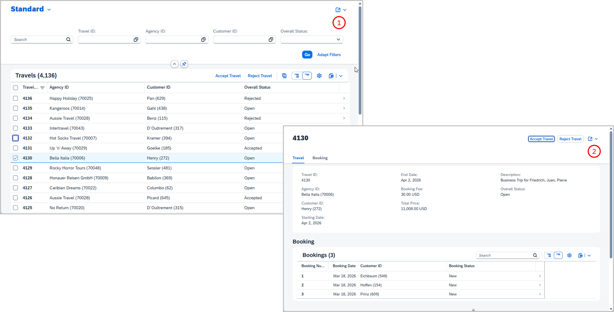
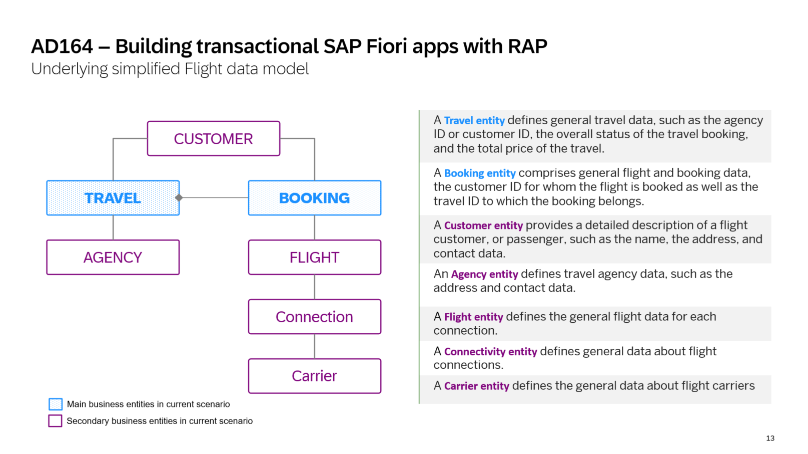
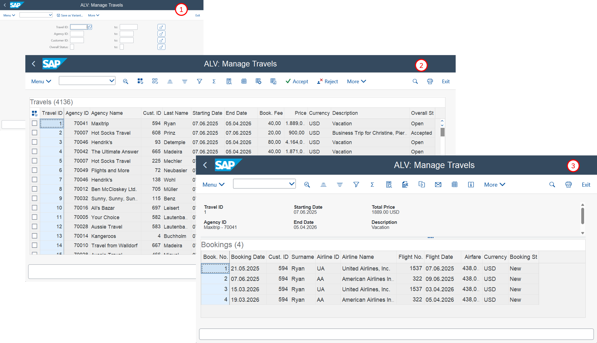

# AD164 - Get started with ABAP Cloud for classic ABAP developers 

## Description

This repository contains the material for the SAP TechEd 2025 session [**AD164 – Get started with ABAP Cloud for classic ABAP developers**](https://www.sap.com/events/teched/berlin/flow/sap/te25/catalog-inperson/page/catalog/session/1749112624677001Rt0T).  

The ABAP Cloud development model (ABAP Cloud) is the development model to build business apps, services, and extensions that follow the clean core principles by default on SAP BTP, SAP S/4HANA Cloud, and SAP S/4HANA as of release 2022. It is an integral part of SAP Build.

In this workshop, you’ll get hands-on experience with ABAP Cloud and grasp how the new concepts work. Building on your knowledge of classic ABAP, you’ll learn how to develop cloud-ready business apps and services. You'll use the ABAP RESTful application programming model (RAP) which is used for building transactional scenarios. Based on a practical scenario, you will rebuild an existing ALV-based app as an a modern SAP Fiori app with RAP, and extend it further with new capabilities. 

**The business context for the scenario is as follows:**     
The department responsible for managing worldwide Travels for multiple Agencies is requesting you to build a new SAP Fiori app, Manage Travels, with different capabilities to process travel bookings. More information on the scenario and the app will be given throughout the exercises.
  
**Resulting app:**   

Click to expand!

Below is an illutrastion of the RAP-based _Manage Travels_ app built with **ABAP Cloud**:
    

    
🖼️Click to expand!

     
    

The OData service you are going to implement is based on the simplified _Flight_ data model below.
    

    
🖼️Click to expand!

     
    

 

> [!NOTE]  
> Please note that the focus of this hands-on workshop is on backend development – specifically, developing OData UI services, including the UI semantics for the SAP Fiori elements UI – rather than on SAP Fiori UI development.  

<!--

#### Table of Content

- [Requirements for attending this workshop](#requirements-for-attending-this-workshop)
- [Business scenario](#business-scenario) 
- [Exercises](#exercises)
- [Solution Package](#solution-package) 
- [Contributing](#contributing)
- [How to obtain support](#how-to-obtain-support) 
- [Further Information](#further-information)
- [License](#license)

-->

## Requirements for attending this workshop
[^Top of page](#)

<!--
To complete the practical exercises in this repository, you need the **latest _ABAP Development Tools for Eclipse_** (ADT) on your laptop or PC, and the access to a **suitable ABAP system**, namely at least release 2023 of SAP S/4HANA or SAP S/4HANA Cloud Private Edition, SAP BTP ABAP Environment, or SAP S/4HANA Cloud Public Cloud. In addition, the appropriate version of the [**ABAP Flight Reference Scenario**](https://github.com/SAP-samples/abap-platform-refscen-flight) (package `/DMO/FLIGHT`) must be imported into the system.
-->

> [!IMPORTANT]  
> **For attendees of on-site SAP TechEd 2025 event**:  
> Please note that appropriate **backend systems** will be provided by SAP for the hands-on worskops offered at one of the **on-site** SAP TechEd events in 2025 – i.e., SAP TechEd Berlin 2025, ASUG Tech Connect 2025, and SAP TechEd Bangalore 2025.
>  
> **Laptops** with the required ADT installation will also be provided to attendees of **SAP TechEd Berlin 2025** and **SAP TechEd Bangalore 2025**.

<!--
If you do not have access to SAP-owned systems and laptops, please follow the steps below.

🔵Click to expand!

 

Before completing the exercises in this repository, you need to:

**Frontend:**
1. [Install the latest Eclipse platform and the latest ABAP Development Tools (ADT) plugin](https://developers.sap.com/tutorials/abap-install-adt.html)
2. Adapt the Web Browser settings in your ADT installation:   
    i) Choose _Window_ > _Preferences_ in the menu bar.   
    ii) Navigate to _General_ > _Web Browser_.  
    iii) Activate the radio button _Use external web browser_.   
    iv) Select one of the listed external web browsers that are available, e.g. _Default system web browser_.    
        ❗Make sure that _Internet Explorer_ is not selected.

**Backend:**
1. In case you don't have access to one of the supported systems you can either use the _SAP BTP ABAP Environment Trial_ or the _ABAP Cloud development Trial_
    - [Create an user on the SAP BTP ABAP Environment Trial](https://developers.sap.com/tutorials/abap-environment-trial-onboarding.html) (_recommended_)
    - [Install the ABAP Cloud Developer Trial 2023](https://community.sap.com/t5/technology-blog-posts-by-sap/abap-cloud-developer-trial-2023-available-now/ba-p/14057183) if you do not have access to an appropriate ABAP system.
2. Create an _ABAP Project_ or an _ABAP Cloud Project_ * to connect ADT to the ABAP system.
    > (*)  An _ABAP Cloud Project_ is needed to connect ADT to an SAP BTP ABAP Environment or SAP S/4HANA Cloud Public Edition system.
4. If not yet done, import the appropriate version of the _[ABAP Flight Reference Scenario](https://github.com/SAP-samples/abap-platform-refscen-flight)_ (package `/DMO/FLIGHT`) into the system.      PS: It is already part of the SAP BTP trial   
-->

<!--

## Business scenario
In this hands-on workshop, we'll guide you through the development of a transactional OData service of a SAP Fiori elements-based app with ABAP Cloud using the ABAP RESTful Application Programming Model (RAP). 

ℹ️Click to expand!

 
    
**The business context for the scenario is as follows:**     

The department responsible for managing worldwide Travels for multiple Agencies is requesting you to build a new SAP Fiori app, _Manage Travels_, with different capabilities to process travel bookings. More information on the scenario and the app will be given throughout the exercises. 

✈️ **Starting point:**     
Below is an illutrastionn of the ALV-based _Manage Travels_ app built with **classic ABAP**:  

Click to expand!

 

 

🏁 **Resulting app:**     
Below is an illutrastion of the RAP-based  _Manage Travels_ app built with **ABAP Cloud**:
    

    
Click to expand!

     
    

The OData service you are going to implement is based on the simplified _Flight_ data model below.
    

    
Click to expand!

     
    

-->

## Exercises
[^Top of page](#)

Follow the steps below to build the _Travel_ app based on an OData service on top of a draft-enabled RAP Business Object (BO) to develop a transactional Fiori elements List Report app from scratch using RAP. 

> [!NOTE]  
> Instead of using existing ABAP Cloud generators to generate all basic ABAP development artifacts required for building the _Manage Travels_ app, you'll build them step by step to better understand the ABAP Cloud development model, especially the ABAP RESTful Application Programming Model (RAP) in this workshop. The _Block B_ below contains demo videos on the existing classic and AI-based ABAP Cloud generators.

#### Exercise Block A 

Exercises 1-7 provided in the block are the main focus of this hands-on workshop.

| Main exercises | -- |
| ------------- |  -- |
| [Getting Started – Connect and logon](exercises/ex0/README.md) | -- |
| [Exercise 1 – Define the base BO data model](exercises/ex01/README.md) | -- |
| [Exercise 2 – Define the data model of the BO projection](exercises/ex02/README.md) | -- |
| [Exercise 3 – Create the OData UI service](exercises/ex03/README.md) | -- |
| [Exercise 4 – Define the UI layout of SAP Fiori elements App](exercises/ex04/README.md) | -- |
| [Exercise 5 – Add read authorization checks](exercises/ex05/README.md)  | -- |
| [Exercise 6 – Add quick actions](exercises/ex06/README.md) | -- |
| [Exercise 7 – Add business events](exercises/ex07/README.md) | -- |

#### Block B 

The ABAP development tools for Eclipse provide various standard and AI-based ABAP Cloud generators to create all required development artifacts – from the database table and the CDS objects to the RAP BO and OData service – that you've created manually for learning purposes in this hands-on workshop. See how to use them in the demo provided.

| Demos | -- |
| ------------- |  -- |
| [Demo – Using the ABAP Cloud generators to create RAP-based UI services](exercises/demo/README.md)| -- |

#### Exercise Block C (Optional)

The exercises below are optional and can be completed by participants if time permits. They extend the application scope covered in the main exercises (1–7) by adding _modify_ authorization checks and full transactional enablement of the Travel BO — that is, create, update, and delete operations. This also includes the opportunity to explore the Entity Manipulation Language (EML).

| Optional exercises | -- |
| ------------- |  -- |
| [Exercise 8 – Add modify authorization checks](exercises/ex08/README.md) | -- |  
| [Exercise 9 – Full transactional enablement of the _Travel_ BO](exercises/ex09/README.md) | -- |
| [Exercise 10 – Exploring the Entity Manipulation Language (EML)](exercises/ex10/README.md) | -- |

## Solution Package
[^Top of page](#)

-/-

## Contributing
[^Top of page](#)

Please read the [CONTRIBUTING.md](./CONTRIBUTING.md) to understand the contribution guidelines.

## Code of Conduct
[^Top of page](#)

Please read the [SAP Open Source Code of Conduct](https://github.com/SAP-samples/.github/blob/main/CODE_OF_CONDUCT.md).

<!--
## Known Issues
[^Top of page](#)
No known issues.
-->

## How to obtain support
[^Top of page](#)

Support for the content in this repository is available during the actual time of the online session for which this content has been designed. Otherwise, you may request support via the [Issues](../../issues) tab.

## Further Information
[^Top of page](#)

You can find further information on the ABAP Cloud and the ABAP RESTful Application Programming Model (RAP) here:
 - [ABAP Development at SAP Community](https://pages.community.sap.com/topics/abap) | SAP Community page
 - [ABAP Extensibility Guide – Clean Core for SAP S/4HANA Cloud - August 2025 Update](https://community.sap.com/t5/technology-blog-posts-by-sap/abap-extensibility-guide-clean-core-for-sap-s-4hana-cloud-august-2025/ba-p/14175399) | SAP Blogs
 - [ABAP Cloud development guide](https://help.sap.com/docs/abap-cloud) | SAP Help
 - [State-of-the-Art ABAP Development with RAP](https://community.sap.com/topics/abap/rap) | SAP Community page
 - [RAP100 Tutorials Mission on SAP Developers Center](https://developers.sap.com/mission.sap-fiori-abap-rap100.html) | SAP Learning
 - SAP Fiori: [Develop and Run a Fiori Application with SAP Business Application Studio (optional)](https://developers.sap.com/tutorials/abap-environment-deploy-cf-production.html) | SAP Learning

## License
Copyright (c) 2024 SAP SE or an SAP affiliate company. All rights reserved. This project is licensed under the Apache Software License, version 2.0 except as noted otherwise in the [LICENSE](LICENSES/Apache-2.0.txt) file.
