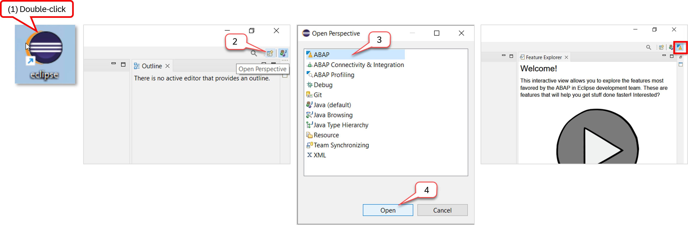
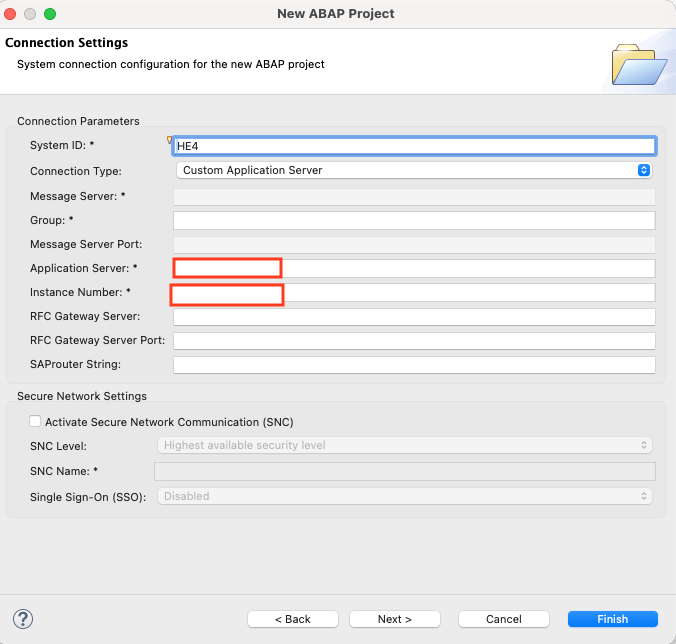
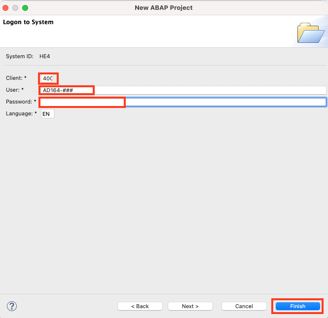
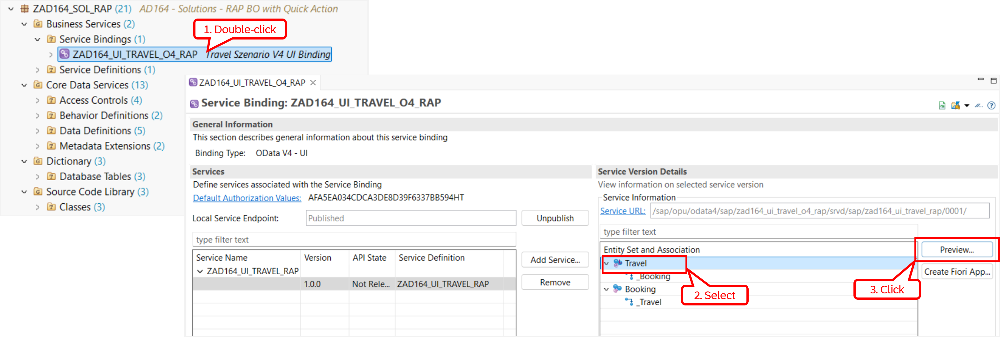
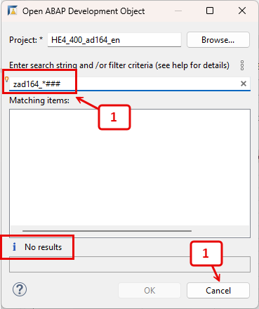
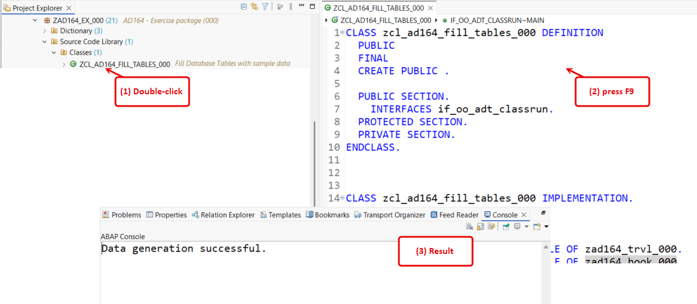
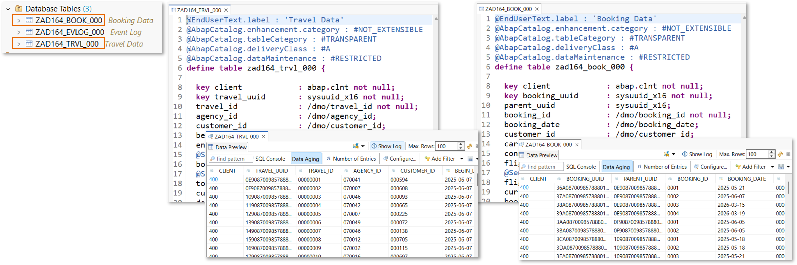
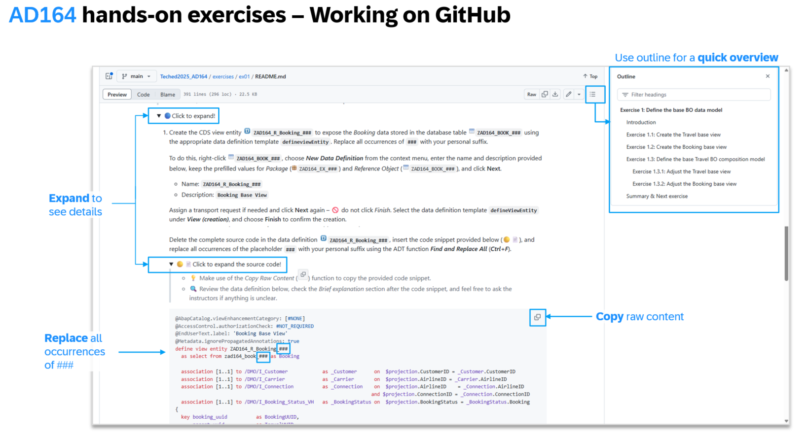

[Home - AD164@SAP TechEd 2025](../../#exercises)

# Getting Started

## Overview 

**Table of content***
- [Create a connection to the ABAP system in ADT](#create-a-connection-to-the-abap-system-in-adt)
- [Solution Packages](#solution-packages)
- [Group ID (Suffix)](#group-id-suffix)
- [Your Exercise Package](#your-exercise-package)
- [Helpful Information](#helpful-information)
- [Summary & Next exercise](#summary--next-exercise)

> [!NOTE]    
> The screenshots in this document have been taken using the suffix or assigned suffix  **`810`** and the system **`D23`**.  
> We **do not recommend** using assigned suffix **`810`** or **`000`**.
> 
> <!-- Please note that ADT dialogs and views as well as SAP Fiori UIs may change in upcoming releases. -->

> [!CAUTION]    
> We’ve got sessions running in several locations → please pick the one that’s right for you!   
> The placeholder **`###`** is used throughout this exercise as your personal suffix to create all artefacts.
> 
> **📌 Depending on the event you're attending, replace the last two digits to get your personal suffix for this exercise:**
>
> - **SAP TechEd Berlin 2025** (**`1##`**): User AD164-**101** to  AD164-**140**  (e.g. Table seat `19` → Suffix **`119`**)
>   
> - **ASUG Tech Connect 2025** (**`2##`**): User AD164-**201** to  AD164-**299**  (e.g. Table seat `19` → Suffix **`219`**)

<!--
## 🔐 System and Logon Information

<table>
  <tr>
    <th>Key</th>
    <th>Value (<i>SAP S/4HANA 2023 system</i>)</th>
  </tr>
  <tr>
    <td>SAP SYSTEM ID</td>
    <td> <b>HE4</b></td>
  </tr>  
  <tr>
    <td>SERVER</td>
    <td><i>Info will be provided by your instructors</i></td>
  </tr>
  <tr>
    <td>INSTANCE</td>
    <td><b>00</b></td>
  </tr>  
  <tr>
    <td>CLIENT</td>
    <td><b>400</b></td>
  </tr>   
  <tr>
    <td>User</td>
    <td><b>AD164-###</b> (<i>where `###` is your location-based suffix</i>)</td>
  </tr>
  <tr>
    <td>Password</td>
    <td><i>Info will be provided by your instructors</i></td>
  </tr>
  <tr>
    <td>Exercise Package</td>
    <td><b>ZAD164_EX_###</b> (<i>where `###` is your location-based suffix</i>)</td>
  </tr>
</table>
-->

   
## Create a connection to the ABAP system in ADT

> Create an **ABAP Project** to connect your ADT client to the **SAP S/4HANA** or **SAP S/4HANA Cloud Private Edition** system.

  
🔵 Click to expand!

   
1. Go to ADT and open the **ABAP** perspective as shown in the screenshot below if not yet done.

   

2. If not done already, now create the **ABAP Project** as shown in the screenshots below. 
  
   Maintain the required system info and click **Next >**:
   - System ID: **HE4**
   - Server: _Info provided by instructor_
   - System instance: **00**

    
   

   Now provide the system client and user credentials:
   - Client **400**
   - User: **AD164-###**
   - Password: _Info provided by instructor_
       
   You can keep the default **_Project name_** and click **Finish** to create the new ABAP Cloud Project in the **_Project Explorer_** view. 

    
   

 

## Solution Packages
[^Top of page](#)

> Participants of SAP-led events, such as on-site SAP TechEd 2025 events, will find the solution packages **`ZAD164_SOL_ALV`** and **`ZAD164_SOL_RAP`** in the dedicated SAP S/4HANA system provided by SAP.

  
🔵 Click to expand!

 

If you are attending one of the on-site SAP TechEd 2025 events, you can take a short look at the apps in the ABAP system, before you start with the implementation in your assigned exercise package. 
 

### ✈️ **Starting point:**     

**Classic ABAP: Classic ALV-based _Manage Travels_ app:**

- Package name: **`ZAD164_SOL_ALV`**
- Program (Report): **`ZAD164_REPORT_CLASSIC_ALV`**

🖼️Click to expand!

    
  
    

 

### 🏁 **Resulting app:**   

**ABAP Cloud: Fiori elements-based _Manage Travels_ app built with RAP:**

- Package name: **`ZAD164_SOL_RAP`**
- Service binding: **`ZAD164_UI_TRAVEL_O4_RAP`**

🖼️Click to expand!

    

    

<!--
**ABAP Cloud: RAP-based _Manage Travels_ app (extended version):**

This version of the _Manage Travels_ app includes various RAP capabilities, that are not covered in the exercises due to time restrictions.

- Package name: **`ZAD164_SOL_RAP_EXT`**
- Service binding: **`ZAD164_UI_TRAVEL_O4_EXT`**
-->

 

## Group ID (Suffix)
[^Top of page](#)

You've been assigned a unique, 3-digit group ID, which you will use as **suffix** throughout the exercises to replace all occurrences of **`###`** in development artifact names and provided code snippets.
 
The suffix is used to uniquely identify your repository artefacts and distinguish them from those of other users working on the same system. 

> [!NOTE]  
> In the course of these exercises you will frequently see the task to "_replace the placeholder **`###`** with your personal suffix_", where *###* is your assigned suffix.
> 
> For this it's recommended to make use of the **Find/Replace** feature of the Eclipse Editor. It can be opened either via the menu (**_Edit -> Find/Replace..._**) or via **Ctrl+F**.   
> 
   
<!--
## Group ID (Suffix)
[^Top of page](#)

In this exercise step, you will define a group ID, which will be use as **suffix** throughout this workshop to uniquely identify your repository artefacts and distinguish them from those of other users working on the same system. 

> [!NOTE]  
> Attendees of **on-site SAP-led events**, such as SAP TechEd 2025, will be assigned a group ID by the SAP team, which should be used as **suffix**. They can therefore skip this section and proceed directly with the next one: _Your Exercise Package_.

  
Click to expand!

   
As the ABAP environment is used by many people, we've defined a naming pattern for each artefact you are going to create to make sure it doesn't conflict with other ones. 
  
For this, you'll find the placeholder **`###`** used in object names that must be replaced with the group ID of your choice during the exercises. 
  
The group ID can contain **a maximum of 3 characters (numbers and/or letters)** - e.g. `123`, `XY1`, or `ABC`. 

You can check for **already used group IDs** by choosing **Open ABAP Development Object**  or pressing **Ctrl+Shift+A**, and searching for e.g. **`zad164_*###`**, where **`###`** is your chosen suffix. All artefacts fitting that pattern will be listed.  

Try to add e.g. your initials, followed by a number to verify nobody else is already using this group ID. 

In the screenshot below, we're checking to see if the suffix **`###`** is still available, so we enter **`zad164_*###`** as search string.

_**No results**_ means this group ID  seems to be available. You can note it as your group ID somewhere and use it in the next exercises.

Once you've found an available group ID, choose **Cancel**.

-->

 

## Your Exercise Package
[^Top of page](#)

> **For on-site attendees of SAP TechEd 2025 events and ASUG Tech Connect 2025**:    
> You'll use the development package **`ZAD164_EX_###`**, where **`###`** is your personal suffix (_group ID_), to complete the exercises of this hands-on workshop. 

  
🔵Click to expand!

   
  
  Due to time constraints, **attendees of on-site SAP TechEd 2025 events or ASUG Tech Connect 2025** will use pre-generated exercise packages and database tables for storing travel data (`ZAD164_TRVL_###`), booking data (`ZAD164_BOOK_###`), and event data (`ZAD164_EVLOG_###`). These development objects provide the starting points of the exercises.  

  _Travel_ and _booking_ demo data can be filled in the relevant tables by executing (**F9**) the class **`ZCL_AD164_FILL_TABLES_###`** which is also provided. 
  
1. Generate _Travel_ and _Booking_ demo data in the database tables **`ZAD164_TRVL_###`** and **`ZAD164_BOOK_###`**, respectively.

   To do this, open the ABAP class **`ZCL_AD164_FILL_TABLES_###`**, where **`###`** is your personal suffix, and execute the class by pressing **F9**.

   As a result, the message *`Data generation successfull`* will appear in the ADT **_Console_** view. 

     

<!--   
2. You can check the result of the class run for the database tables **`ZAD164_TRVL_###`** and **`ZAD164_BOOK_###`**.

   To do this, simply open each database table by double clicking on it and press **F8** to start the **_Data Preview_**.

    
-->
 

<!--
> [!IMPORTANT] 
> **FOR THE SELF-PACE MODE**:    
> If you don't have access to a prepared ABAP system provided by SAP, you'll need to **create your own exercise package and a few development objects** before starting with the first exercise. Follow the instructions provided below to do so.
> 

> 
Click to expand!

>     
> Create the development objects below in your system. 
>  
> Replace all occurrences of the placeholder **`###`** in the provided source code with your personal suffix. 
> You can make use of _**Find and Replace**_ feature (**Ctrl+F**) in ADT to do this.
>    
> 1. Create the development package **`ZAD164_EX_###`** with **`ZLOCAL`** as super package ("_ABAP for Cloud development_" as language version). 
> 2. Create the database table **`ZAD164_TRVL_###`** in package **`ZAD164_EX_###`** – for storing the travel data ([📄source code](images/ex0_tabl_zad164_trvl.txt)).
> 3. Create the database table **`ZAD164_BOOK_###`** in package **`ZAD164_EX_###`** – for storing the booking data ([📄source code](images/ex0_tabl_zad164_book.txt)).
> 4. Create the database table **`ZAD164_EVLOG_###`** in package **`ZAD164_EX_###`** – for storing the event data ([📄source code](images/ex0_tabl_zad164_evlog.txt)).
> 5. Create the global class **`ZCL_AD164_FILL_TABLES_###`** in package **`ZAD164_EX_###`** – for generating demo travel and booking data ([📄source code](images/ex0_class_zcl_ad164_fill_tables.txt)).
> 

-->

 

## Helpful Information
[^Top of page](#)

This section contains some helpful information for the exercises: _Find/Replace_ functionality, modern ABAP syntax, and useful ADT shortcuts.

  
🔵 Click to expand!

### Working with Github

Here are a few tips to complete this exercise on GitHub.

  
🔵 Click to expand!

  
   

 
### Find/Replace
In the course of these exercises you will frequently see the task to "_replace the placeholder **`###`** with your assigned suffix_", where *###* is your assigned suffix. 

For this it's recommended to make use of the **Find/Replace** feature of the Eclipse Editor. It can be opened either via the menu (**_Edit -> Find/Replace..._**) or via **Ctrl+F**.
  

   
Choosing **Replace All** allows you to replace all occurrences of **`###`** with your assigned suffix.

### ABAP Pretty Printer (ABAP Formatter)

You can make use of the shortcut **`Shift + F1`** to format your source code. You may need to configure on first use.

### Modern ABAP Syntax
The modern, declarative, and expression-oriented ABAP language syntax will be used in the different exercises. It allows developers to write more simple and concise source code using new language features like inline declarations, constructor expressions.

> **Find more information in the ABAP Keyword Documentation**: [ABAP - Programming Language](https://help.sap.com/doc/abapdocu_cp_index_htm/CLOUD/en-US/index.htm?file=abenabap_reference.htm) 
  
### Useful ADT Shortcuts
Below are some useful ADT keyboard shortcuts for the ABAP development in Eclipse. More useful ADT shortcuts can be found on the [SAP Help Portal documentation](https://help.sap.com/docs/abap-cloud/abap-development-tools-user-guide/keyboard-shortcuts-for-abap-development).

When working in the ABAP Development Tools for Eclipse, you can display the full list of available shortcuts in the **Show Key Assit** in ADT by pressing **Ctrl+Shift+L**.

> [!NOTE]  
> When working on a Mac notebooks, use the **_Command_** (**Cmd**) instead of the **_Control_** key (**Ctrl**) used on Windows devices.

 

 

## Summary & Next exercise
[^Top of page](#)

Now you've familiarized yourself with the solutions and your exercise package `ZAD164_EX_###`, where `###` is your personal suffix.

Continue with the next exercise — **[Exercise 1: Define the base BO data model](../ex01/README.md)**.

---
