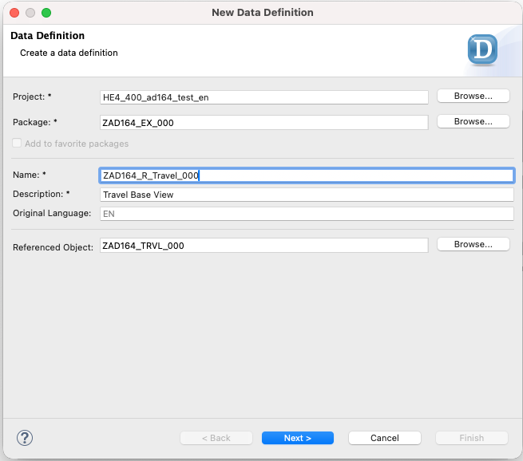
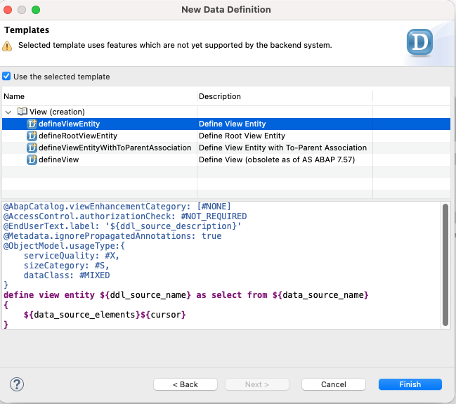
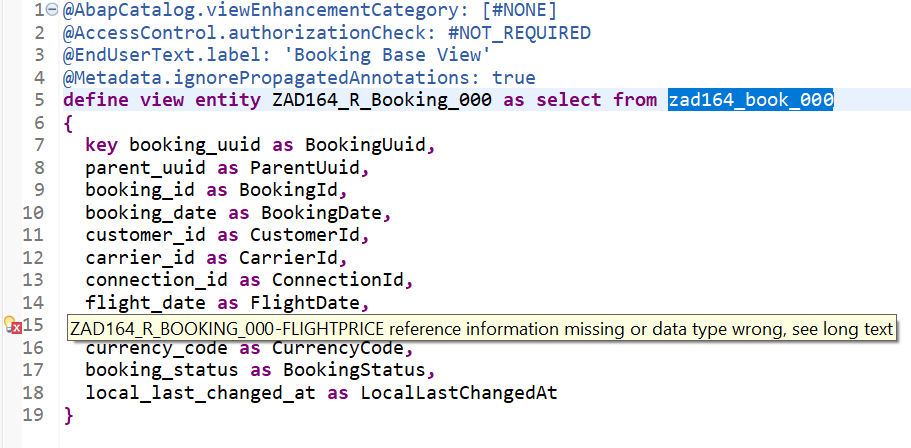
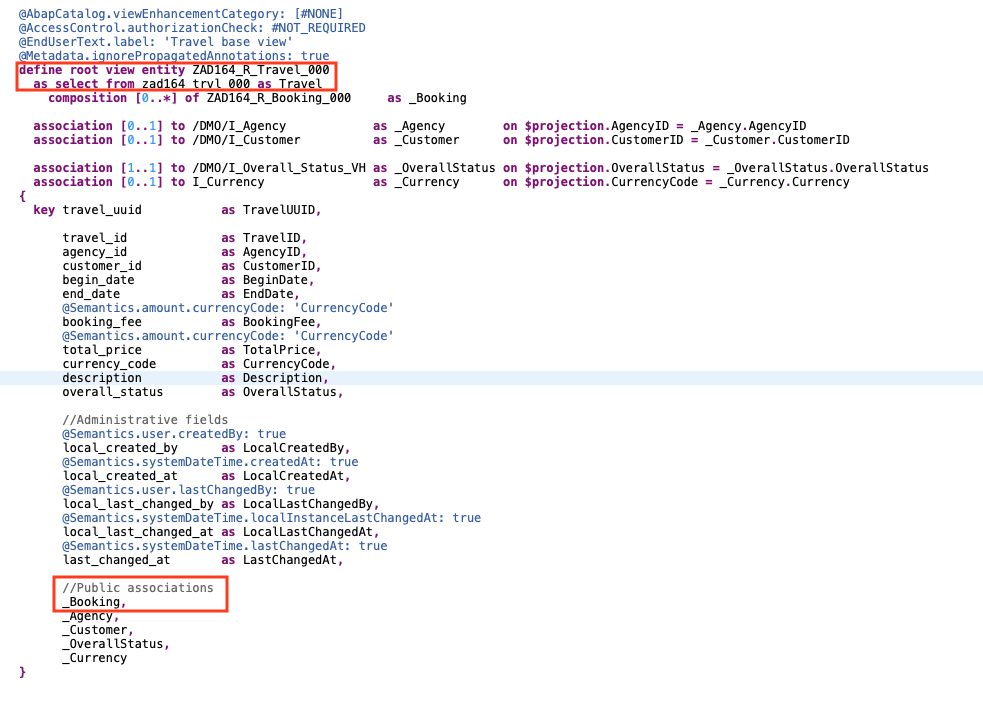
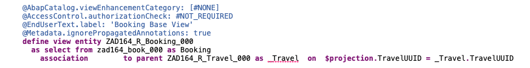

# Exercise 1:	Define the base BO data model

## Introduction

In the _[Getting Started](../ex0/README.md)_, you familiarized yourself with your exercise package `ZAD164_EX_###`, where `###` is your personal suffix (or _Group ID_).

In the first exercise, you'll use the ABAP Core Data Services (CDS) to define the composition data model of the base _Travel_ business object (BO). The base BO data model (aka _composition model_) in this scenario consists of two (2) entities, _Travel_ (the _root_ entity) and _Booking_. The CDS view entities used to define the base BO data model are commonly referred to as **_base view entities_** or simply **_base views_**.

To do this, you will first define the data model of the _Travel_ and _Booking_ entities in the CDS view entities `ZAD164_R_TRAVEL_###` and `ZAD164_R_BOOKING_###`, and then define the composition tree of the _Travel_ BO with these business entities, with the _Travel_ entity being the root entity.

**Exercise steps:**  
- [Exercise 1.1:	Create the _Travel_ base view](#exercise-11create-the-travel-base-view)
- [Exercise 1.2:	Create the _Booking_ base view](#exercise-12create-the-booking-base-view)
- [Exercise 1.3:	Define the base _Travel_ BO composition model](#exercise-13define-the-base-travel-bo-composition-model)
- [Summary & Next exercise](#summary--next-exercise)

> [!TIP]
> - Always replace all occurrences of the placeholder **`###`** in the provided code snippets with your personal suffix.
> - Use the ADT function _**Find and Replace All**_ (**Ctrl+F**) to quickly replace text in the source code.
> - Use the ADT function _**Quick Fix**_ (**Ctrl+1**), aka _Quick Assist_, on an erroneous element to get help with resolving the issue.
> - Use the **Show ABAP element info** view (**F2**) to inspect an element in ADT editors.
> - [Useful Keyboard Shortcuts for ABAP Development](https://help.sap.com/docs/ABAP_PLATFORM_NEW/c238d694b825421f940829321ffa326a/4ec299d16e391014adc9fffe4e204223.html?version=latest) (ADT shortcuts)

> [!NOTE]
> **About the naming conventions used in this workshop**   
> The main aspects of the naming conventions in the [Virtual Data Model (VDM) of SAP S/4HANA](https://help.sap.com/docs/SAP_S4HANA_CLOUD/0f69f8fb28ac4bf48d2b57b9637e81fa/8a8cee943ef944fe8936f4cc60ba9bc1.html) are applied in this workshop, for example:
> - `<namespace>R_`: Prefix used for CDS artifacts of the base BOs (restricted reuse layer)
> - `<namespace>C_`: Prefix used for CDS artifacts of the BO projections (consumption layer)

---

## Exercise 1.1:	Create the _Travel_ base view
[^Top of page](#Introduction)

> Define the data model of the _Travel_ entity in the CDS view entities `ZAD164_R_TRAVEL_###`.
> 
> To achieve this, you'll expose the fields of the database table `ZAD164_TRVL_###` and enrich the data model with aliases, metadata information, and associations to relevant business data.

  
🔵Click to expand!

1. Create the CDS view entity **`ZAD164_R_TRAVEL_###`** to expose the travel data stored in the database table **`ZAD164_TRVL_###`** using the appropriate data definition template **`defineviewEntity`**. Replace all occurrences of **`###`** with your personal suffix.

   To do this, right-click **`ZAD164_TRVL_###`**, choose _**New Data Definition**_ from the context menu, enter the name and description provided below, keep the prefilled values for _Package_ (`ZAD164_EX_###`) and _Reference Object_ (`ZAD164_TRVL_###`), and click **Next**. 
   - Name: **`ZAD164_R_Travel_###`** 
   - Description: **`Travel Base View`**
  
     

   Assign a transport request if needed and click **Next** again – 🚫 do not click *Finish*. Select the data definition template **`defineViewEntity`** under _**View (creation)**_, and choose **Finish** to confirm the creation.
   
   
   
   The skeleton data definition view is created and now shown in the editor. All database fields have been automatically exposed with _CamelCase_ aliases in the **`select`** list.
      
2. Now, adjust the generated data definition. A code snippet is provided below to speed up the process. All adjustments are highlighted in the screenshot and explained directly below the code snippet (_Brief Explanation_).

   Delete the complete source code in the data definition **`ZAD164_R_Travel_###`**, insert the code snippet provided below (🟡📄), and replace all occurrences of the placeholder **`###`** with your personal suffix using the ADT function _**Replace All**_ (_**Ctrl+F**_).
     
   

     
🟡📄Click to expand the source code!

   > - 💡 Make use of the _Copy Raw Content_ () function to copy the provided code snippet.
   > - 🔍 Review the data definition below, check the _Brief explanation_ section after the code snippet, and feel free to ask the instructors if anything is unclear.

   <pre lang="ABAP CDS">
   @AbapCatalog.viewEnhancementCategory: [#NONE]
   @AccessControl.authorizationCheck: #NOT_REQUIRED
   @EndUserText.label: 'Travel base view'
   @Metadata.ignorePropagatedAnnotations: true 
   define view entity ZAD164_R_Travel_###
     as select from zad164_trvl_### as Travel
    
     association [0..1] to /DMO/I_Agency            as _Agency        on $projection.AgencyID = _Agency.AgencyID
     association [0..1] to /DMO/I_Customer          as _Customer      on $projection.CustomerID = _Customer.CustomerID
    
     association [1..1] to /DMO/I_Overall_Status_VH as _OverallStatus on $projection.OverallStatus = _OverallStatus.OverallStatus
     association [0..1] to I_Currency               as _Currency      on $projection.CurrencyCode = _Currency.Currency        
   {
     key travel_uuid           as TravelUUID,
    
         travel_id             as TravelID,
         agency_id             as AgencyID,
         customer_id           as CustomerID,
         begin_date            as BeginDate,
         end_date              as EndDate,
         @Semantics.amount.currencyCode: 'CurrencyCode' 
         booking_fee           as BookingFee,
         @Semantics.amount.currencyCode: 'CurrencyCode' 
         total_price           as TotalPrice,
         currency_code         as CurrencyCode,
         description           as Description,
         overall_status        as OverallStatus,
   
         //Administrative fields
         @Semantics.user.createdBy: true 
         local_created_by      as LocalCreatedBy,
         @Semantics.systemDateTime.createdAt: true 
         local_created_at      as LocalCreatedAt,
         @Semantics.user.lastChangedBy: true 
         local_last_changed_by as LocalLastChangedBy,
         @Semantics.systemDateTime.localInstanceLastChangedAt: true 
         local_last_changed_at as LocalLastChangedAt,
         @Semantics.systemDateTime.lastChangedAt: true 
         last_changed_at       as LastChangedAt,
    
         //Public associations
         _Agency,
         _Customer,
         _OverallStatus,
         _Currency        
    }
    </pre>
     
    **ℹ️Brief explanation of the adjustments:**   
    > - (1) `Travel` is specified as the alias for the data source `zad164_trvl_###` using the keyword `as` to improve the readability.
    > - (2) Associations to related business entities and useful data have been defined, and then exposed in the **`select`** list, that is inside the curly brackets (`{ }`), to make them public for external consumers:    
    >    - `_Agency` – describing the relation to agency data
    >    - `_Customer` – describing the relation to customer data
    >    - `_Overall_Status` – describing the relation to overall status data (value help) 
    >    - `_Currency` – describing the relation to currency data (value help)
    > - (3) Curency code `CurrencyCode` is specified as reference field for amount fields `BookingFee` and `TotalPrice` in the `select` list by adding the element annotation `@Semantics.amount.currencyCode: 'CurrencyCode` directly before these elements:  
    > - (4) To allow the RAP frameworks to fully managed the administrative fields at runtime, appropriate `@Semantics` annotations are specified before them: `LocalCreatedBy`, `LocalCreatedAt`, `LocalLastChangedBy`, `LocalLastChangedAt`, and `LastChangedAt`.   
       
   

   
3. Save (**Ctrl+S**) and activate (**Ctrl+F3**) the changes.

   💡 As a test, you can execute (**F8**) the data definition to preview the _Travel_ data and navigate through the defined associations in the _Data Preview_ editor.   

## Exercise 1.2:	Create the _Booking_ base view
[^Top of page](#Introduction)

> Now, define the data model of the _Booking_ entity in the CDS view entities `ZAD164_R_Booking_###`.
> 
> To do this, you'll expose the fields of the database table `ZAD164_BOOK_###`, and enrich the data model with aliases, metadata information, and associations to relevant business entities and help data.

  
🔵Click to expand!

1. Create the CDS view entity **`ZAD164_R_Booking_###`** to expose the _Booking_ data stored in the database table **`ZAD164_BOOK_###`** using the appropriate data definition template **`defineviewEntity`**. Replace all occurrences of **`###`** with your personal suffix.

   To do this, right-click **`ZAD164_BOOK_###`**, choose _**New Data Definition**_ from the context menu, enter the name and description provided below, keep the prefilled values for _Package_ (`ZAD164_EX_###`) and _Reference Object_ (`ZAD164_BOOK_###`), and click **Next**.
   - Name: **`ZAD164_R_Booking_###`** 
   - Description: **`Booking Base View`**   

   Assign a transport request if needed and click **Next** again – 🚫 do not click *Finish*. Select the data definition template **`defineViewEntity`** under _**View (creation)**_, and choose **Finish** to confirm the creation.
   
   The skeleton data definition view is created and now shown in the editor. All database fields have been automatically exposed with _CamelCase_ aliases in the **`select`** list. The appearing warning message will be tackled in the next step.
   
    
   
2. Now, adjust the generated data definition. A code snippet is provided below to speed up the process. All adjustments are highlighted in the screenshot and explained directly below the code snippet (_Brief Explanation_).

   Delete the complete source code in the data definition **`ZAD164_R_Booking_###`**, insert the code snippet provided below (🟡📄), and replace all occurrences of the placeholder **`###`** with your personal suffix using the ADT function _**Find and Replace All**_ (_**Ctrl+F**_).

   

     
🟡📄Click to expand the source code!

     > - 💡 Make use of the _Copy Raw Content_ () function to copy the provided code snippet.   
     > - 🔍 Review the data definition below, check the _Brief explanation_ section after the code snippet, and feel free to ask the instructors if anything is unclear.

   <pre lang="ABAP CDS">
   @AbapCatalog.viewEnhancementCategory: [#NONE]
   @AccessControl.authorizationCheck: #NOT_REQUIRED
   @EndUserText.label: 'Booking Base View'
   @Metadata.ignorePropagatedAnnotations: true
   define view entity ZAD164_R_Booking_###
     as select from zad164_book_### as Booking
  
     association [1..1] to /DMO/I_Customer            as _Customer      on  $projection.CustomerID = _Customer.CustomerID
     association [1..1] to /DMO/I_Carrier             as _Carrier       on  $projection.AirlineID = _Carrier.AirlineID
     association [1..1] to /DMO/I_Connection          as _Connection    on  $projection.AirlineID    = _Connection.AirlineID
                                                                       and $projection.ConnectionID = _Connection.ConnectionID
     association [1..1] to /DMO/I_Booking_Status_VH   as _BookingStatus on  $projection.BookingStatus = _BookingStatus.BookingStatus
   {
     key booking_uuid          as BookingUUID,
         parent_uuid           as TravelUUID,
  
         booking_id            as BookingID,
         booking_date          as BookingDate,
         customer_id           as CustomerID,
         carrier_id            as AirlineID, 
         connection_id         as ConnectionID,
         flight_date           as FlightDate,
         @Semantics.amount.currencyCode: 'CurrencyCode' 
         flight_price          as FlightPrice,
         currency_code         as CurrencyCode,
         booking_status        as BookingStatus,

         //Admin field: local ETag field (OData ETag)
         @Semantics.systemDateTime.localInstanceLastChangedAt: true
         local_last_changed_at as LocalLastChangedAt,  //local ETag field (OData ETag)
  
         //Public associations
         _Customer,
         _Carrier,
         _Connection,
         _BookingStatus
   }
   </pre>
     
     **ℹ️ Brief explanation of the adjustments:**
     > - (1) **`Booking`** is specified as the alias for the data source `zad164_book_###` using the keyword `as` to improve the readability.
     > - (2) Associations to related business entities and useful data have been defined, and then exposed in the **`select`** list to make them public for external consumers:   
     >    - **`_Customer`** – describing the relation to customer data
     >    - **`_Carrier`** – describing the relation to carrier data       
     >    - **`_Connection`** – describing the relation to connection data, e.g. country, city, etc.     
     >    - **`_BookingStatus`** – describing the relation to booking status data (value help) 
     > - (3) The default alias of the field `carrier_id` has been changed from **`CarrierID`** to **`AirlineID`**. 
     > - (4) Currency code **`CurrencyCode`** is specified as reference field for amount field **`FlightPrice`**.    
     > - (5) To allow the RAP frameworks to fully managed the admininistrative field **`LocalLastChangedAt`** at runtime, the annotation `@Semantics.systemDateTime.localInstanceLastChangedAt: true` is specified before it.
         
   

     
3. Save (**Ctrl+S**) and activate (**Ctrl+F3**) the changes.

   > 💡 As a test, you can execute (**F8**) the data definition to preview the _Booking_ data and navigate through the defined associations in the _Data Preview_ editor.

## Exercise 1.3:	Define the base _Travel_ BO composition model
[^Top of page](#Introduction)

> Define the composition tree of the _Travel_ BO, which consists of the _Travel_ and the _Booking_ BO nodes.
>
> To achieve this, define the _Travel_ node entity as the _root_ entity of the the _Travel_ BO and establish the _parent-child_ relationship between the two entities, with the _Travel_ entity as the _parent_ entity of the _Booking_ entity.

### Exercise 1.3.1:	Adjust the _Travel_ base view

  
🔵Click to expand!

1. Specify the _Travel_ entity as root BO node.

   To do so, open the data definition **`ZAD164_R_Travel_###`** and add the keyword **`root`** directly after the keyword **`define`** as shown on the screenshot below:
   
   <pre lang="ABAP CDS">
     define root view entity ZAD164_R_Travel_###
   </pre>

 2. Specify the _Booking_ entity as child node of the _Travel_ BO node, with a 0-to-many cardinality between _parent_ and _child_ entities, by defining the _composition_ association **`_Booking`** using the code snippet provided below. Replace **`###`** with your personal suffix.

    <pre lang="ABAP CDS">
      composition [0..*] of ZAD164_R_Booking_###     as _Booking
    </pre>

 3. Now, expose the composition **`_Booking`** in the **`select`** list as shown in the screenshot.
    
    

    You can take a look at the adjusted _Travel_ base view below.
    

      
📄Click to expand!

      
    <pre lang="ABAP CDS">
    @AbapCatalog.viewEnhancementCategory: [#NONE]
    @AccessControl.authorizationCheck: #NOT_REQUIRED
    @EndUserText.label: 'Travel base view'
    @Metadata.ignorePropagatedAnnotations: true
    define root view entity ZAD164_R_Travel_###
      as select from zad164_trvl_### as Travel
      composition [0..*] of ZAD164_R_Booking_###     as _Booking
    
      association [0..1] to /DMO/I_Agency            as _Agency        on $projection.AgencyID = _Agency.AgencyID
      association [0..1] to /DMO/I_Customer          as _Customer      on $projection.CustomerID = _Customer.CustomerID
      association [1..1] to /DMO/I_Overall_Status_VH as _OverallStatus on $projection.OverallStatus = _OverallStatus.OverallStatus
      association [0..1] to I_Currency               as _Currency      on $projection.CurrencyCode = _Currency.Currency
    
    {
      key travel_uuid           as TravelUUID,
          travel_id             as TravelID,
          agency_id             as AgencyID,
          customer_id           as CustomerID,
          begin_date            as BeginDate,
          end_date              as EndDate,
          @Semantics.amount.currencyCode: 'CurrencyCode'
          booking_fee           as BookingFee,
          @Semantics.amount.currencyCode: 'CurrencyCode'
          total_price           as TotalPrice,
          currency_code         as CurrencyCode,
          description           as Description,
          overall_status        as OverallStatus,
    
          //Administrative fields
          @Semantics.user.createdBy: true
          local_created_by      as LocalCreatedBy,
          @Semantics.systemDateTime.createdAt: true
          local_created_at      as LocalCreatedAt,
          @Semantics.user.lastChangedBy: true
          local_last_changed_by as LocalLastChangedBy,
          @Semantics.systemDateTime.localInstanceLastChangedAt: true
          local_last_changed_at as LocalLastChangedAt,
          @Semantics.systemDateTime.lastChangedAt: true
          last_changed_at       as LastChangedAt,
    
          //Public associations
          _Booking,
          _Agency,
          _Customer,
          _OverallStatus,
          _Currency
    
    }
    </pre>    
    

 4. Save (**Ctrl+S**) the changes, but **DO NOT** activate the view entity yet.

    > ⚠️ Please note that you **cannot** yet activate the _Travel_ base view because of its dependency to the _Booking_ base view, which has not yet been adjusted to reflect the _child-parent_ relationship between the two entities.

### Exercise 1.3.2:	Adjust the _Booking_ base view

  
🔵Click to expand!

 1. Now define the _to-parent_ association in the _Booking_ BO node

    To do so, open the data definition **`ZAD164_R_Booking_###`** and specify the to-parent association **`_Travel`** shown on the screenshot below using the provided code snippet. Also add the composition association **`_Travel`** at the end in the public association section. 
    
    <pre lang="ABAP CDS">
      association        to parent ZAD164_R_Travel_### as _Travel  on  $projection.TravelUUID = _Travel.TravelUUID
    </pre>
    
    

    You can take a look at the adjusted _Booking_ base view below.
    

      
📄Click to expand!

      
    <pre lang="ABAP CDS">
    @AccessControl.authorizationCheck: #CHECK
    @EndUserText.label: 'Booking'
    define view entity ZAD164_R_Booking_###
      as select from zad164_book_###
      association        to parent ZAD164_R_Travel_### as _Travel        on  $projection.TravelUUID = _Travel.TravelUUID
    
      association [1..1] to /DMO/I_Customer            as _Customer      on  $projection.CustomerID = _Customer.CustomerID
      association [1..1] to /DMO/I_Carrier             as _Carrier       on  $projection.AirlineID = _Carrier.AirlineID
      association [1..1] to /DMO/I_Connection          as _Connection    on  $projection.AirlineID    = _Connection.AirlineID
                                                                         and $projection.ConnectionID = _Connection.ConnectionID
      association [1..1] to /DMO/I_Booking_Status_VH   as _BookingStatus on  $projection.BookingStatus = _BookingStatus.BookingStatus
    
    {
      key booking_uuid          as BookingUUID,
          parent_uuid           as TravelUUID,
          booking_id            as BookingID,
          booking_date          as BookingDate,
          customer_id           as CustomerID,
          carrier_id            as AirlineID,
          connection_id         as ConnectionID,
          flight_date           as FlightDate,
          @Semantics.amount.currencyCode: 'CurrencyCode'
          flight_price          as FlightPrice,
          currency_code         as CurrencyCode,
          booking_status        as BookingStatus,
    
          //Admin field: local ETag field (OData ETag)
          @Semantics.systemDateTime.localInstanceLastChangedAt: true
          local_last_changed_at as LocalLastChangedAt, //local ETag field (OData ETag)
    
          //Public associations
          _Travel,
          _Customer,
          _Carrier,
          _Connection,
          _BookingStatus      
    }      
    </pre>    
    
    
    
 2. Save (**Ctrl+S**) the changes.
     
 3. Now **activate both inactive data definitions at the same time** to resolve any dependency during the activation. 

     Click the matches icon () in ADT or press the shortcut **Ctrl+Shift+F3** on your keyboard, select both data definitions **`ZAD164_R_Travel_###`** and **`ZAD164_R_Booking_###`** in the dialog, and press **_Activate_** to confirm the activation. 

## Summary & Next exercise
[^Top of page](#Introduction)

Now you've defined the data model of the _Travel_ base BO, also called _composition model_.

Continue with the next exercise – **[Exercise 2: Define the data model of the BO projection](../ex02/README.md)**.

---
