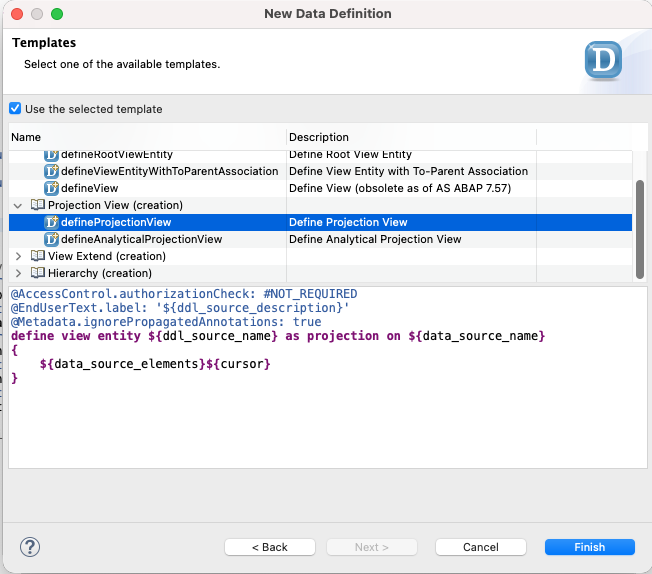
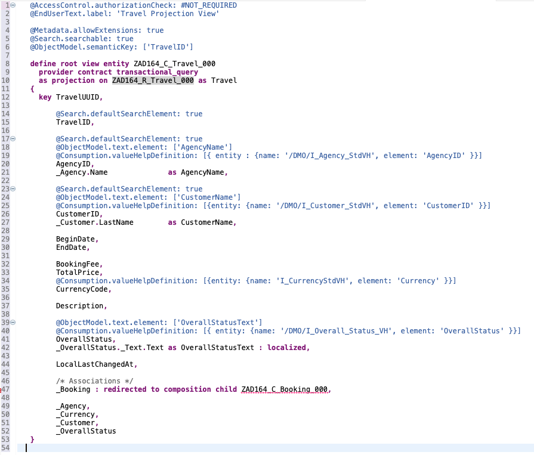
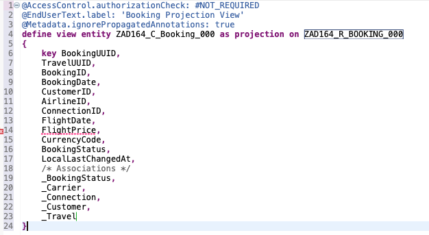

[Home - AD164](../../README.md)

# Exercise 2:	Define the data model of the BO projection

## Introduction

In the previous exercise you've defined the data model (or _composition model_) of the base _Travel_ BO (_[Exercise 1](../ex01/README.md)_).

In this exercise, you'll define the consumption layer of the use-case-specific BO projection (aka _service projection_) by projecting the part of the _Travel_ base BO data model (_Travel_ and _Booking_ entities) that is relevant for this scenario — namely the _Manage Travels_ app —, and enrich it as needed - e.g., with additional elements, value helps, enterprise search enablement, and more. The CDS projection views used to define the BO projection data model are commonly referred to as **_projection views_**.

To do this, you'll create two CDS projection view entities – `ZAD164_C_Travel_###` for the _Travel_ entity and `ZAD164_C_Booking_###` for the _Booking_ entity – for the specific use case on top of the respective base BO view entities created in the previous exercise, i.e. `ZAD164_C_Travel_###` and `ZAD164_R_Booking_###`, where `###` is your personal suffix. 

**Exercise steps:**
- [Exercise 2.1:	Create the _Travel_ projection view](#exercise-21create-the-travel-projection-view)
- [Exercise 2.2:	Create the _Booking_ projection view](#exercise-22create-the-booking-projection-view)
- [Summary & Next exercise](#summary--next-exercise)

**Helpful information:**  
> [!TIP]
> - Always replace all occurrences of the placeholder **`###`** in the provided code snippets with your personal suffix.
> - Use the ADT function _**Find and Replace All**_ (**Ctrl+F**) to quickly replace text in the source code.
> - Use the ADT function _**Quick Fix**_ (**Ctrl+1**), aka _Quick Assist_, on an erroneous element to get help with resolving the issue.
> - Use the **Show ABAP element info** view (**F2**) to inspect an element in ADT editors.
> - [Useful Keyboard Shortcuts for ABAP Development](https://help.sap.com/docs/ABAP_PLATFORM_NEW/c238d694b825421f940829321ffa326a/4ec299d16e391014adc9fffe4e204223.html?version=latest) (ADT shortcuts)

> [!NOTE]
> **About the naming conventions used in this workshop:**    
> The main aspects of the naming conventions in the [Virtual Data Model (VDM) of SAP S/4HANA](https://help.sap.com/docs/SAP_S4HANA_CLOUD/0f69f8fb28ac4bf48d2b57b9637e81fa/8a8cee943ef944fe8936f4cc60ba9bc1.html) are applied in this workshop, for example:
> - `<namespace>R_`:  Prefix used for CDS artifacts of the base BOs (restricted reuse layer)
> - `<namespace>C_`: Prefix used for CDS artifacts of the BO projections (consumption layer)  
---

## Exercise 2.1:	Create the _Travel_ projection view 
[^Top of page](#Introduction)

> Define the data model of the projected _Travel_ entity in the CDS projection view `ZAD164_C_TRAVEL_###`.
> 
> You will expose the fields of the base _Travel_ view entity `ZAD164_R_TRAVEL_###` that are relevant for this scenario, and enrich the projected data model by adding new view fields and metadata as needed. 

  
🔵Click to expand!

1. Create the CDS projection view **`ZAD164_C_Travel_###`**. 

   To do this, right-click the data definition **`ZAD164_R_Travel_###`**, choose _**New Data Definition**_ from the context menu, enter the name and description provided below in the creation dialog:    
   - Name: **`ZAD164_C_Travel_###`** – where `###` is your personal suffix
   - Description: **`Travel Projection View`**.
  
   Keep the prefilled values for _Package_ (`ZAD164_EX_###`) and _Reference Object_ (`ZAD164_R_Travel_###`), and click **Next**.

   Assign a transport request if needed, and click **Next** again – 🚫 do not click *Finish*. Select the data definition template **`defineProjectionView`** under the folder _Projection View (creation)_, and click **Finish** to confirm the creation.

   The skeleton data definition of the projection view is now displayed in the editor. All fields of the underlying base view have been automatically exposed in the **`select`** list.
   
   

   Now proceed to adjust the generated data definition.

3. Now, adjust the generated data definition. A code snippet is provided below to speed up the process. All adjustments are highlighted in the screenshot and explained directly below the code snippet (_Brief Explanation_).

   Delete the complete source code in the data definition **`ZAD164_C_Travel_###`**, insert the code snippet provided below (🟡📄), and replace all occurrences of the placeholder **`###`** with your personal suffix using the ADT function _**Find and Replace All**_ (_**Ctrl+F**_).
     
   

      
🟡📄Click to expand!

   > - 💡 Make use of the _Copy Raw Content_ function () to copy the provided code snippet.
   > - 🔍 Review the data definition below, check the _Brief explanation_ section after the code snippet, and feel free to ask the instructors if anything is unclear.  
     
   <pre lang="ABAP CDS">
   @AccessControl.authorizationCheck: #NOT_REQUIRED
   @EndUserText.label: 'Travel Projection View'
    
   @Metadata.allowExtensions: true
   @Search.searchable: true
   @ObjectModel.semanticKey: ['TravelID']
    
   define root view entity ZAD164_C_Travel_###
     provider contract transactional_query
     as projection on ZAD164_R_Travel_### as Travel
   {
     key TravelUUID,
    
         @Search.defaultSearchElement: true
         TravelID,
    
         @Search.defaultSearchElement: true
         @ObjectModel.text.element: ['AgencyName']
         @Consumption.valueHelpDefinition: [{ entity : {name: '/DMO/I_Agency_StdVH', element: 'AgencyID' }}]
         AgencyID,
         _Agency.Name              as AgencyName,
    
         @Search.defaultSearchElement: true
         @ObjectModel.text.element: ['CustomerName']
         @Consumption.valueHelpDefinition: [{entity: {name: '/DMO/I_Customer_StdVH', element: 'CustomerID' }}]
         CustomerID,
         _Customer.LastName        as CustomerName,
    
         BeginDate,
         EndDate,
    
         BookingFee,
         TotalPrice,
         @Consumption.valueHelpDefinition: [{entity: {name: 'I_CurrencyStdVH', element: 'Currency' }}]
         CurrencyCode,
    
         Description,
    
         @ObjectModel.text.element: ['OverallStatusText']
         @Consumption.valueHelpDefinition: [{ entity: {name: '/DMO/I_Overall_Status_VH', element: 'OverallStatus' }}]
         OverallStatus,
         _OverallStatus._Text.Text as OverallStatusText : localized,
    
         LocalLastChangedAt,
    
         /* Associations */
         _Booking : redirected to composition child ZAD164_C_Booking_###,
    
         _Agency,
         _Currency,
         _Customer,
         _OverallStatus
   }        
   </pre>
     
   **ℹ️Brief explanation of the adjustments:**   
   > 1. The keyword **`root`** in the `define` statement is used to specified the projected _Travel_ entity as the root node of the BO projection
   > 2. **_Travel_** is assigned as the alias for the data source (`ZAD164_R_Travel_###`) using the keyword **`as`**.
   > 3. Addition of `@ObjectModel.semanticKey: ['TravelID'] ` to specify the field/element `TravelID` as the semantic key of the _Travel_ entity.
   > 4. The CDS provider contract for transactional queries (`transactional_query`) is specified with the addition `provider contract transactional_query`.
   > 5. The view annotation `@Metadata.ignorePropagatedAnnotations: true` was removed to allow the annotations defined in the base view to propagate in the consumption layer, that is here projection view.
   > 6. The view annotation `@Metadata.allowExtensions: true` was inserted to allow modification-free extension of the projection view at the metadata level using a separate CDS metadata extension.
   > 7. The view annotation `@Search.searchable: true` was added to enable free-text search on the projection view.
   > 8. The view fields `AgencyID` and `CustomerID` were specified as searchable (i.e., enabled for free-text search) using the element annotation `@Search.defaultSearchElement: true`.
   > 9. Value helps were defined for the view fields `AgencyID`, `CustomerID`, and `OverallStatusText` using the element annotation `@Consumption.valueHelpDefinition`.
   > 10. New view fields were added: `AgencyName`, `CustomerName`, and `OverallStatusText` — from the respective associations `_Agency`, `_Customer`, and `_OverallStatus._Text`.
   > 11. To always retrieve the overall status text in the current system language (or fallback language) the key word `localized` was specified for the element `OverallStatusText`.
   > 12. The elements `AgencyName` and `CustomerName` were specified as associated texts for the elements `AgencyID` and `CustomerID`, respectively, using the annotation `@ObjectModel.text.element`.
   > 13. Following administrative fields that are not needed in the field catalog on the UI were removed: `LocalCreatedBy`, `LocalCreatedAt`, `LocalLastChangedBy`, and `LastChangedAt`
   > 14. The child composition **`_Booking`** from the _Booking_ base view was redirected to the  _Booking_ projection view, by using the `redirected to composition child` statement: `_Booking : redirected to composition child ZAD164_C_Booking_###`. 
             
   

       

12. Save (**Ctrl+S**) the changes.
        
    > ⚠️ Please note that you will **not** be able to activate your changes at this stage. You first need to create the _Booking_ projection view.
   

## Exercise 2.2:	Create the _Booking_ projection view
[^Top of page](#Introduction)

> Define the data model of the _Booking_ entity in the CDS projection view `ZAD164_C_Booking_###`.
> 
> You will expose the fields of the base _Booking_ view entity `ZAD164_R_Booking_###` that are relevant for this scenario, and enrich the projected data model by adding new view fields and metadata as needed. 

  
🔵Click to expand!

1. Create the CDS projection view entity **`ZAD164_C_Booking_###`**.

   To do this, right-click on **`ZAD164_R_Booking_###`**, choose _**New Data Definition**_ from the context menu, enter the name and description provided below, keep the prefilled values for _Package_ (`ZAD164_EX_###`) and _Reference Object_ (`ZAD164_R_Booking_###`), and click **Next**.   
   - Name: **`ZAD164_C_Booking_###`** 
   - Description: **`Booking Projection View`**.

   Assign a transport request if needed, and click **Next** again, _🚫 do not click **Finish** yet_. Select the data definition template **`defineProjectionView`**, and choose **Finish** to confirm the creation.

   The skeleton data definition view is created and now shown in the editor. All database fields have been automatically exposed with _CamelCase_ aliases in the **`select`** list.
   
       

2. Now, adjust the generated data definition. A code snippet is provided below to speed up the process. All adjustments are highlighted in the screenshot and explained directly below the code snippet (_Brief Explanation_).
   
   Delete the complete source code in the data definition **`ZAD164_C_Booking_###`**, insert the code snippet provided below (🟡📄), and replace all occurrences of the placeholder **`###`** with your personal suffix using the ADT function _**Find and Replace All**_ (_**Ctrl+F**_).

   

     
🟡📄Click to expand!
 
     
   > - 💡 Make use of the _Copy Raw Content_ function () to copy the provided code snippet.
   > - 🔍 Review the data definition below, check the _Brief explanation_ section after the code snippet, and feel free to ask the instructors if anything is unclear.  
   
   <pre lang="ABAP CDS">
   @EndUserText.label: 'Booking Projection View'
   @AccessControl.authorizationCheck: #CHECK
  
   @Metadata.allowExtensions: true
   @Search.searchable: true
   @ObjectModel.semanticKey: ['BookingID']
  
   define view entity ZAD164_C_Booking_###
     as projection on ZAD164_R_Booking_###
   {
     key BookingUUID,
     
         TravelUUID,

         @Search.defaultSearchElement: true
         BookingID,     
         BookingDate,    
     
         @ObjectModel.text.element: ['CustomerName']
         @Search.defaultSearchElement: true
         @Consumption.valueHelpDefinition: [{entity: {name: '/DMO/I_Customer_StdVH', element: 'CustomerID' }}]
         CustomerID,
         _Customer.LastName        as CustomerName,
  
         @ObjectModel.text.element: ['CarrierName']
         @Consumption.valueHelpDefinition: [
            { entity: {name: '/DMO/I_Flight_StdVH', element: 'AirlineID'},
              additionalBinding: [ { localElement: 'FlightDate',   element: 'FlightDate',   usage: #RESULT},
                                   { localElement: 'ConnectionID', element: 'ConnectionID', usage: #RESULT},
                                   { localElement: 'FlightPrice',  element: 'Price',        usage: #RESULT},
                                   { localElement: 'CurrencyCode', element: 'CurrencyCode', usage: #RESULT } ],
              qualifier: 'FlightVH1',
              label: 'Flights' }
          ]
         AirlineID,
         _Carrier.Name             as CarrierName,
  
         @Consumption.valueHelpDefinition: [
            { entity: {name: '/DMO/I_Flight_StdVH', element: 'ConnectionID'},
              additionalBinding: [ { localElement: 'FlightDate',   element: 'FlightDate',   usage: #RESULT},
                                   { localElement: 'AirlineID',    element: 'AirlineID',    usage: #FILTER_AND_RESULT},
                                   { localElement: 'FlightPrice',  element: 'Price',        usage: #RESULT},
                                   { localElement: 'CurrencyCode', element: 'CurrencyCode', usage: #RESULT } ],
              qualifier: 'FlightVH2',
              label: 'Flights' }
           ]
         ConnectionID,    
  
         @Consumption.valueHelpDefinition: [
            { entity: {name: '/DMO/I_Flight_StdVH', element: 'FlightDate'},
              additionalBinding: [ { localElement: 'AirlineID',    element: 'AirlineID',    usage: #FILTER_AND_RESULT},
                                   { localElement: 'ConnectionID', element: 'ConnectionID', usage: #FILTER_AND_RESULT},
                                   { localElement: 'FlightPrice',  element: 'Price',        usage: #RESULT},
                                   { localElement: 'CurrencyCode', element: 'CurrencyCode', usage: #RESULT } ],
              label: 'Flights' }
           ]
         FlightDate,
  
         @Consumption.valueHelpDefinition: [
            { entity: {name: '/DMO/I_Flight_StdVH', element: 'Price'},
              additionalBinding: [ { localElement: 'FlightDate',   element: 'FlightDate',   usage: #FILTER_AND_RESULT},
                                   { localElement: 'AirlineID',    element: 'AirlineID',    usage: #FILTER_AND_RESULT},
                                   { localElement: 'ConnectionID', element: 'ConnectionID', usage: #FILTER_AND_RESULT},
                                   { localElement: 'CurrencyCode', element: 'CurrencyCode', usage: #RESULT } ],
              label: 'Flights' }
           ]
         FlightPrice,
  
         @Consumption.valueHelpDefinition: [{entity: {name: 'I_CurrencyStdVH', element: 'Currency' }}]
         CurrencyCode,
  
         @ObjectModel.text.element: ['BookingStatusText']
         @Consumption.valueHelpDefinition: [{entity: {name: '/DMO/I_Booking_Status_VH', element: 'BookingStatus' }}]
         BookingStatus,
         _BookingStatus._Text.Text as BookingStatusText : localized,
  
         LocalLastChangedAt,
  
        /* Associations */
        _Travel : redirected to parent ZAD164_C_Travel_###,    
     
        _BookingStatus,
        _Carrier,
        _Connection,
        _Customer
   }
   </pre>
     
   

      
3. Save (**Ctrl+S**) the changes.

4. Now **activate both inactive projection view at the same time** to resolve any dependency during the activation.

    To do so, press the shortcut **Ctrl+Shift+F3** on your keyboard or choose the matches icon () in ADT, select both data definitions **`ZAD164_C_Travel_###`** and **`ZAD164_C_Booking_###`** in the appearing dialog, and press **_Activate_** to confirm the activation.

    > 💡As a test, you can execute (**F8**) the projection views `ZAD164_C_Travel_###` and `ZAD164_C_Booking_###` to preview the projected _Travel_ and _Booking_ data, and navigate through the defined associations in the _Data Preview_ editor.

## Summary & Next exercise
[^Top of page](#Introduction)

Now you've defined the data model (aka _composition model_) of the use-case specific _Travel_ BO projection (aka _service projection_) by exposing the relevant part of the underlying base BO data model and enriching it as needed for the _Manage Travel_ app.

Continue with the next exercise – **[Exercise 3: Create the OData UI service](../ex03/README.md)**.

---
