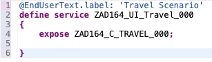
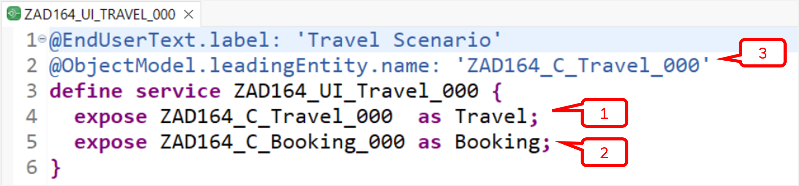
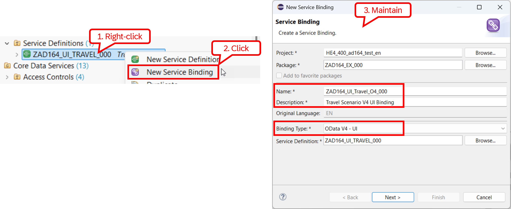
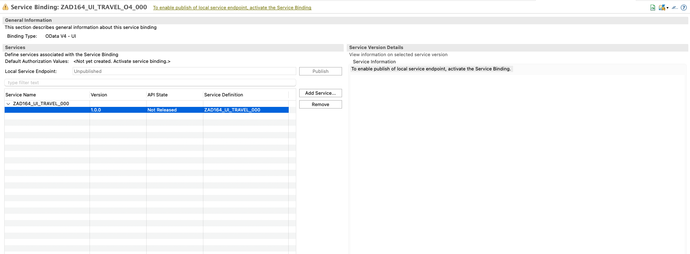
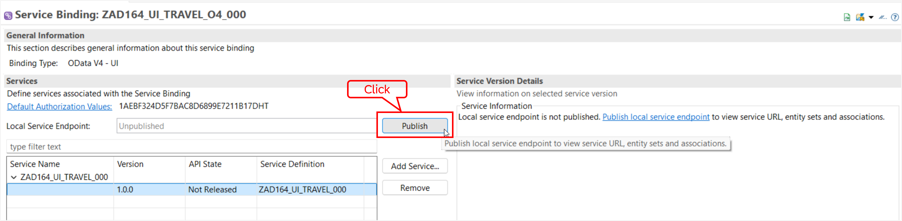
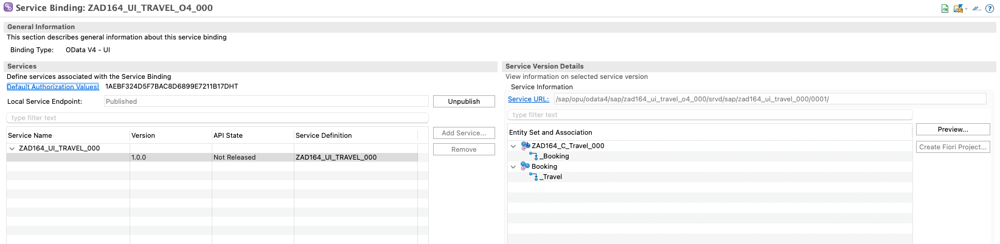
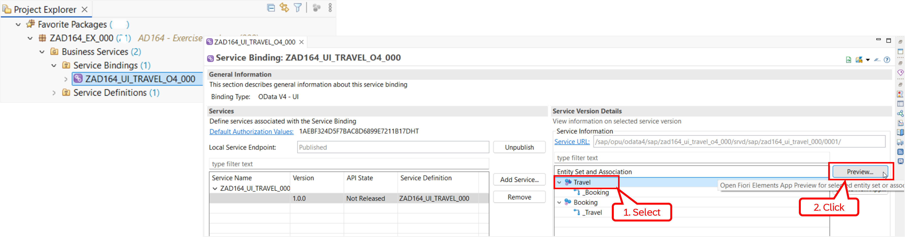
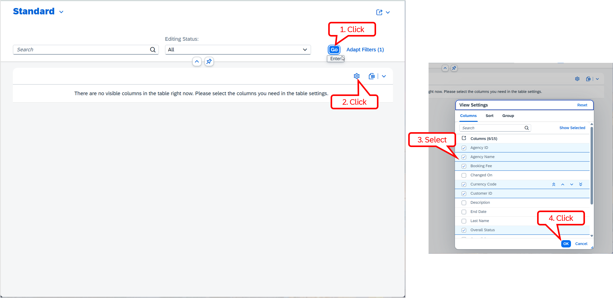
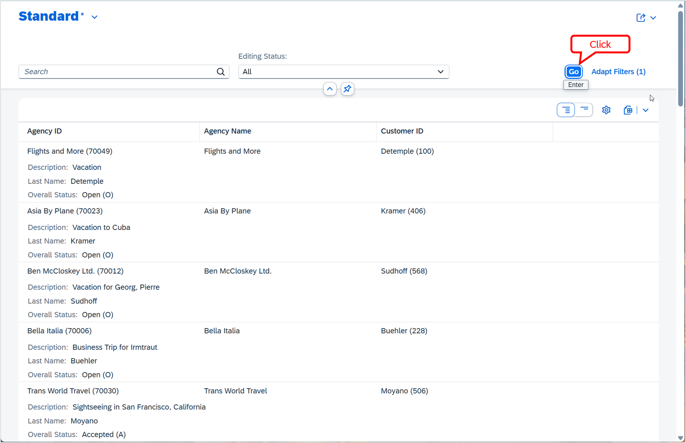

[Home - AD164](../../README.md)

# Exercise 3: Create the OData UI service

## Introduction

In the previous exercise, you've defined the data model of the _Travel_ BO projection (_[Exercise 2](../ex02/README.md)_).

In this exercise, you'll expose your projected BO data model as OData service using a business service to expose data for consumption by SAP and non-SAP clients, and preview it.

To do this, you'll create the service definition `ZAD164_UI_Travel_###` to define the service scope, meaning the entity sets to be exposed, and the service binding `ZAD164_UI_Travel_O4_###` to bind the service definition to a protocol and scenario, that is `OData V4 - UI` in this  scenario.

**Exercise steps:**
- [Exercise 3.1:	Create the service definition](#exercise-31-create-the-service-definition)
- [Exercise 3.2:	Create the service binding](#exercise-32-create-the-service-binding)
- [Exercise 3.3:	Preview and test the _Manage Travels_ app](#exercise-33-preview-and-test-the-manage-travels-app)
- [Summary & Next exercise](#summary--next-exercise)

> [!TIP]
> - Always replace all occurrences of the placeholder **`###`** in the provided code snippets with your personal suffix.
> - Use the ADT function _**Find and Replace All**_ (**Ctrl+F**) to quickly replace text in the source code.
> - Use the ADT function _**Quick Fix**_ (**Ctrl+1**), aka _Quick Assist_, on an erroneous element to get help with resolving the issue.
> - Use the **Show ABAP element info** view (**F2**) to inspect an element in ADT editors.
> - [Useful Keyboard Shortcuts for ABAP Development](https://help.sap.com/docs/ABAP_PLATFORM_NEW/c238d694b825421f940829321ffa326a/4ec299d16e391014adc9fffe4e204223.html?version=latest) (ADT shortcuts)

> [!NOTE]  
> A **business service** consists of a service definition and a service binding. It is the way how to build OData services, as well as, e.g., SQL and [InA (SAP Information Access)](https://help.sap.com/docs/SAP_HANA_PLATFORM/4505d0bdaf4948449b7f7379d24d0f0d/b927adfbde28407396312ecf41f42388.html) services in ABAP Cloud. For OData services, the business service approach is the successor of the SAP Gateway Service Builder (`SEGW`).
---

## Exercise 3.1: Create the service definition
[^Top of page](#Introduction)

> Create the service definition `ZAD164_UI_Travel_###` to define the service scope, specifying the relevant entity sets to be exposed in this scenario – namely the _Travel_ and the _Booking_ entities.

  
🔵Click to expand!

  1. In the ***Project Explorer*** view, right-click on the _Travel_ BO projection view **`ZAD164_C_Travel_###`**, choose **New Service Definition** from the context menu to start the creation wizard. The project, the package, and the source type are automatically prefilled in the creation wizard. 
    
     Enter the name and description provided below, and click **Next**.     
     - Name: **`ZAD164_UI_Travel_###`** 
     - Description: **`Travel Scenario`**.
     
     Assign a transport request if needed, click **Next**, select the template **`defineService`**, and click **Finish** to confirm the creation.

     The skeleton service definition is now shown in the editor. It exposes the referenced entity **`ZAD164_C_Travel_###`**.
     
     

  2. Now assign **`Travel`** as alias for the exposed _Travel_ projection view **`ZAD164_C_Travel_###`** using the keyword **`as`**.

     <pre lang="ABAP CDS">
       expose ZAD164_C_Travel_### as Travel;
     </pre>

  3. Expose the _Booking_ projection view in the service definition and assign **`Booking`** as its alias.

     <pre lang="ABAP CDS">
       expose ZAD164_C_Booking_### as Booking;
     </pre>

  4. Specify the _Travel_ entity, which is the root BO node, as the leading entity  by using the view annotation below. This will have an impact on the display of the entity set in the service binding editor later.

     <pre lang="ABAP CDS">
       @ObjectModel.leadingEntity.name: 'ZAD164_C_Travel_###'
     </pre>    

     The complete source code of the service definition looks at the end as follows.

      

     

       
Click to expand!
    
     
     <pre lang="ABAP CDS">
     @EndUserText.label: 'Travel Scenario'
     @ObjectModel.leadingEntity.name: 'ZAD164_C_Travel_###'
     define service ZAD164_UI_Travel_### {
       expose ZAD164_C_Travel_###  as Travel;
       expose ZAD164_C_Booking_### as Booking;
     }
     </pre>
     

  5. Save  (**Ctrl+S**) and activate  (**Ctrl+F3**) the changes.

## Exercise 3.2: Create the service binding
[^Top of page](#Introduction)

> Create the service binding `ZAD164_UI_Travel_O4_###` to bind your previously created service definition to the OData V4 protocol and the UI scenario. By choosing the UI scenario, SAP Fiori-specific metadata is generated in the OData service.

  
🔵Click to expand!

  1. In the _Project Explorer_ view, right-click your service definition **`ZAD164_UI_Travel_###`** and choose **New Service Binding** from the context menu to start the creation wizard. The project, the package, and the service definition are automatically assigned in the creation wizard.

     Maintain the name, description, and binding type indicated below . Replace **`###`** with your personal suffix.
     - Name: **`ZAD164_UI_Travel_O4_###`** 
     - Description: **`Travel Scenario V4 UI Binding`**
     - Binding Type: **`OData V4 - UI`**
     
      

     Assign a transport request if needed, and click **Finish** to create the service binding. It is now open in the editor.    

     

  3. Save  and activate  the changes.
     
  4. Publish the local service endpoint of your service binding by pressing **Publish** in the service binding editor.

          

     The local service endpoint is now activated and ready for consumption through an OData client. The relative service URL and the exposed entity sets _**Travel**_ and _**Booking**_ are displayed in the _**Service Version Details**_ area on the right-hand side of the editor.

     

## Exercise 3.3: Preview and test the _Manage Travels_ app
[^Top of page](#Introduction)

> Now you can preview and play around with the app.
>
> Due to time constraints, we will not generate the productive app with the SAP Fiori tools in _SAP Build Code_. Instead, you will use the _Fiori elements App Preview_ function in ADT to preview the resulting app. 

  
🔵Click to expand!

  1. In the service binding **`ZAD164_UI_Travel_O4_###`**, select the leading entity (), _Travel_ in the ***Entity Set and Association*** area, and either right-click it and choose _Open Fiori elements App preview_ from the context menu, or choose the Preview button, simply double-click it to start the Fiori elements app preview in the browser.
     
     
    
  2. Click the **Go** button () to load the data and check the result.
    
     Unfortunately, no data is displayed in the Fiori app. The reason behind this is that no column from the UI field catalog is currently selected for display. A corresponding message appears in the empty Fioi app.

     To fix this, click on the _gear_ icon (), select some columns, for example, **_Travel ID_** , **_Agency ID_**, **_Customer ID_**, **_Starting Date_**, and **_Booking Fee_**, then click **OK** to confirm and close the dialog.
     
         

     Now, click  or press **Enter** to load the data and check the result.

     > ℹ️ In case no data is displayed in the app, open the ABAP class **`ZCL_AD164_FILL_TABLES_###`** in your exercise package and execute it by pressing **F9** to generate demo _travel_ and _booking_ data in the respective database tables `ZAD164_TRVL_###` and `ZAD164_BOOK_###`.

     

     💡 In the next exercise, you will learn how to define the UI of your application in the ABAP backend by providing the appropriate UI semantics for the projected data model.

## Summary & Next exercise
[^Top of page](#Introduction)

Now you've exposed your the data model of the BO projection as an OData UI service by creating a service definition and a service binding with the `OData V4 – UI` binding type, making the data and its metadata available for consumption. 

Continue with the next exercise – **[Exercise 4: Define the UI layout of the SAP Fiori elements app](../ex04/README.md)**.

---
