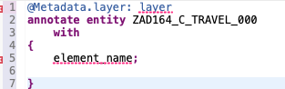
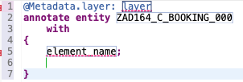
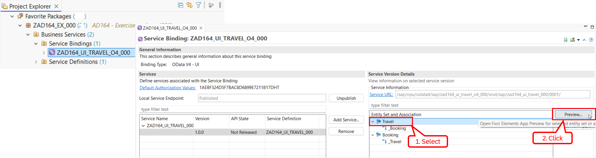
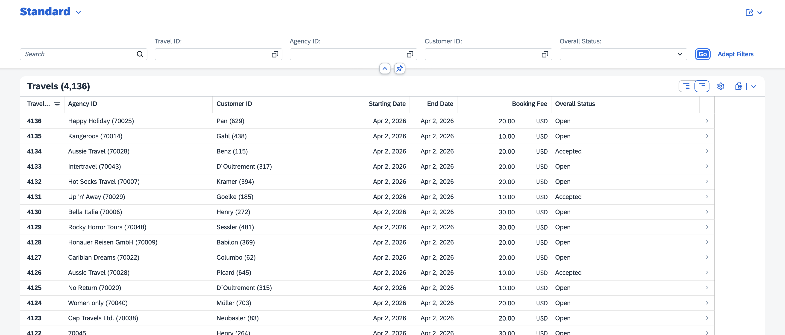

[Home - AD164](../../README.md)

# Exercise 4: Define the UI layout of the SAP Fiori elements app

## Introduction

In the previous exercise, you've created an UI service to expose the data from the _Travel_ BO projection an OData-based UI service (_[Exercise 3](../ex03/README.md)_).

In this exercise, you will enrich your projected _Travel_ BO data model with UI-related metadata to enable a proper rendering of the SAP Fiori elements-based _Managed Travels_ app. The app mainly consists of two main SAP Fiori page layouts: a _**List Report**_, which serves as entry point and displays the _Travel_ records in a table, and an _**Object Page**_, which shows the details of the selected _Travel_ records along with a table of the related _Booking_ records. The details of a selected _Booking_ record is displayed on a object page.

To do this, you'll create two CDS metadata extensions – `ZAD164_C_Travel_###` for the projected _Travel_ entity and `ZAD164_C_Booking_###` for the projected _Booking_ entity – to enrich the respective CDS projection views `ZAD164_C_Travel_###` and `ZAD164_C_Booking_###`, where `###` is your personal suffix. 

**Exercise steps:**
- [Exercise 4.1:	Define the UI semantics for the _Travel_ entity](#exercise-41define-the-ui-semantics-for-the-travel-entity)
- [Exercise 4.2:	Define the UI semantics for the _Booking_ entity](#exercise-42define-the-ui-semantics-for-the-booking-entity)
- [Exercise 4.3: Preview and test the enhanced app](#exercise-43-preview-and-test-the-enhanced-app)
- [Summary & Next exercise](#summary--next-exercise)

> [!TIP]
> - Always replace all occurrences of the placeholder **`###`** in the provided code snippets with your personal suffix.
> - Use the ADT function _**Find and Replace All**_ (**Ctrl+F**) to quickly replace text in the source code.
> - Use the ADT function _**Quick Fix**_ (**Ctrl+1**), aka _Quick Assist_, on an erroneous element to get help with resolving the issue.
> - Use the **Show ABAP element info** view (**F2**) to inspect an element in ADT editors.
> - [Useful Keyboard Shortcuts for ABAP Development](https://help.sap.com/docs/ABAP_PLATFORM_NEW/c238d694b825421f940829321ffa326a/4ec299d16e391014adc9fffe4e204223.html?version=latest) (ADT shortcuts)

> [!NOTE]   
>  When building **SAP Fiori elements-based apps with ABAP Cloud**, you can provide the UI semantics either in the backend using ABAP CDS or using the SAP Fiori tools (_Annotation Modeler_) in SAP Build Code. In this workshop, we'll focus on the backend and use ABAP CDS to define the UI semantics.
> 
> Learn more: [ABAP CDS Annotations](https://help.sap.com/docs/abap-cloud/abap-rap/cds-annotations?version=sap_btp) |
> [Framework-specific ABAP CDS Annotations, incl. UI](https://help.sap.com/doc/abapdocu_cp_index_htm/CLOUD/en-US/abencds_frmwrk_annos.html) |
> [About SAP Fiori List Report and Object Page](https://sapui5.hana.ondemand.com/sdk/#/topic/c0eec49db81a441e878f528c8f3d28de)

---

## Exercise 4.1:	Define the UI semantics for the _Travel_ entity 
[^Top of page](#Introduction)

> Create the CDS metadata extensions `ZAD164_C_Travel_###` for the _Travel_ projection view `ZAD164_C_Travel_###`. Both artifacts have the same name.

  
🔵Click to expand!

1.	Right-click the _Travel_ projection view **`ZAD164_C_Travel_###`** in the _**Project Explorer**_, and choose **New Metadata Extension** from the context menu to start the creation wizard. The project, the package, and the extended entity are automatically prefilled in the creation wizard.

    Maintain the required information and click **Next >** to continue.   
    - Name: **`ZAD164_C_Travel_###`** 
    - Description: _**`MDE for Travel projection view`**_
   
    Assign a transport request if required, then click **Next >** – _🚫 do **not** click *Finish* yet_. Select the metadata extension template **`annotateEntity`** under _Annotate Entity (creation)_, and click **Finish** to confirm the creation.
   
    The skeleton metadata extension is now displayed in the editor. The dummy element **`element_name`** is automatically inserted into the `annotate` list between the curly brakets (`{ }`). You can now go ahead and provide the UI semantics of the Fiori elements-based _**Manage Travels**_ app
   
     

2.	Define the UI semantics for the data of the _Travel_ entity (root entity) that will be displayed on the SAP Fiori List Report which is the entry point of the _Manage Travels_ app by enriching the _Travel_ projection view with appropriate `@UI` annotations. The List Report will be used to display the data of the _Travel_ root entity 

    The _Travel_ data is displayed on the _Travel_ List Report (the entry point) and Object Page in the following ways:
  	
  	

      
Click to expand!

      
     - **Filter bar**: A filter bar with selection criteria for following fields using the element annotation _`@UI.selectionField`_: `TravelID`, `AgencyID`, `CustomerID`, and `OverallStatus`.
     - **_Travel_ List report table**: Following fields should be displayed on the list report table using the element annotation _`@UI.lineItem`_: `TravelID`, `AgencyID`, `CustomerID`, and `OverallStatus`.
     - **_Travel_ Object page**: Following fields should be displayed on the object page using the element annotation _`@UI.identification`_: `TravelID`, `AgencyID`, `CustomerID`, `BeginDate`, `EndDate`, `BookingFee`, `TotalPrice`, `Description`, and `OverallStatus`.
     - **Hidden data**: Following fields should be removed from the field catalog on the UI using the element annotation _`@UI.hidden: true`_: `TravelUUID`, `OverallStatusText`, and `LocalLastChangedAt`.
     - **Associated data**: The currency code will be displayed automatically alongside the amount values of `BookingFee` and `TotalPrice` on the UI. This is enabled by the `@Semantics.amount.currencyCode: `CurrencyCode` annotation specified for these fields in the _Travel_ base view.
  	
  	
  	
       
  	Due to time constraints, delete the complete source code in the metadata extension **`ZAD164_C_Travel_###`**, insert the code snippet provided below (🟡📄), and replace all occurrences of **`###`** with your personal suffix.
  	       
    

      
🟡📄Click to expand!
    

    > - 💡 Make use of the _Copy Raw Content_ () function to copy the provided code snippet.  
    > - 🔍 Review the source code and feel free to ask the instructors if anything is unclear. You can find explanations of the different UI annotations in the [documentation](https://help.sap.com/doc/abapdocu_cp_index_htm/CLOUD/en-US/ABENCDS_UI_F.html).
      
    <pre lang="ABAP CDS">
    @Metadata.layer: #CORE       
      
    @UI: { headerInfo: { typeName: 'Travel',
                         typeNamePlural: 'Travels',
                         title: { type: #STANDARD, value: 'TravelID' } },
           presentationVariant: [{ sortOrder: [{ by: 'TravelID', direction: #DESC }], visualizations: [{type: #AS_LINEITEM}]  }] }
    
    annotate entity ZAD164_C_Travel_### with
    {
     @UI.facet: [{ id:            'Travel',
                   purpose:       #STANDARD,
                   type:          #IDENTIFICATION_REFERENCE,
                   label:         'Travel',
                   position:      10 },
                 { id:            'Booking',
                   purpose:       #STANDARD,
                   type:          #LINEITEM_REFERENCE,
                   label:         'Booking',
                   position:      20,
                   targetElement: '_Booking'}]
     @UI.hidden: true
     TravelUUID;
  
     @UI: { lineItem:       [{ position: 10, importance: #HIGH }],
     identification: [{ position: 10 } ],
     selectionField: [{ position: 10 }]}
     TravelID;
    
     @UI: { lineItem:       [{ position: 20, importance: #HIGH }],
            identification: [{ position: 20 }],
            selectionField: [{ position: 20 }]}
     AgencyID;
    
     @UI: { lineItem:       [{ position: 30 }],
            identification: [{ position: 30 }],
            selectionField: [{ position: 30 }]}
     CustomerID;
    
     @UI: { lineItem:       [{ position: 40 }],
            identification: [{ position: 40 }]}
     BeginDate;
    
     @UI: { lineItem:       [{ position: 50 }],
            identification: [{ position: 50 }]}
     EndDate;
    
     @UI: { lineItem:       [{ position: 60 }],
            identification: [{ position: 60 }]}
     BookingFee;
    
     @UI: { lineItem:       [{ position: 70 }],
            identification: [{ position: 70 }]}
     TotalPrice;
    
     @UI: { //lineItem:       [{ position: 80 }],
            identification: [{ position: 80 }]}
     Description;
    
     @UI: { lineItem:       [{ position: 90, importance: #HIGH }],
            identification: [{ position: 90 }],
            selectionField: [{ position: 40 }],
            textArrangement: #TEXT_ONLY }            
     OverallStatus;
    
     @UI.hidden: true
     OverallStatusText;
    
     @UI.hidden: true
     LocalLastChangedAt;        
    }
    </pre>  
      
    
     

3.	Save  and activate  the changes.
   

## Exercise 4.2:	Define the UI semantics for the _Booking_ entity 
[^Top of page](#Introduction)

> Create the CDS metadata extensions `ZAD164_C_Booking_###` for the _Booking_ projection view `ZAD164_C_Booking_###`. Both artifacts have the same name.

  
🔵Click to expand!

1. Right-click the _Booking_ projection view **`ZAD164_C_Booking_###`** in the _Project Explorer_, and choose **New Metadata Extension** from the context menu.

   Maintain the required information and click **Next >**.   
   - Name: **`ZAD164_C_Booking_###`** 
   - Description: _**`MDE for Booking projection view`**_
  
   Assign a transport request if required, then click **Next >** – _🚫 do **not** click *Finish* yet_. Select the metadata extension template **`annotateEntity`** under _Annotate Entity (creation)_, and click **Finish** now to confirm the creation.

   The skeleton metadata extension is now displayed in the editor.
   
    

2.	Now, define the UI semantics for displaying the data of the _Booking_ entity on the _Travel_ object page and the _Booking_ object page.

    The _Booking_ data will be displayed in the following ways:
  	
  	

      
Click to expand!

    - **Table of Bookings on the _Travel_ Object pagee**: Following fields of the _Booking_ entity should be displayed on the table using the element annotation _`@UI.lineItem`_: `BookingID`, `BookingDate`, `CustomerId`, `AirlineID`, `ConnectionID`, `FlightDate`, `FlightPrice`, and `BookingStatus`.
    - **_Booking_ Object page**: Following fields should be displayed on the _Booking_ object page using the element annotation _`@UI.identification`_: `BookingID`, `BookingDate`, `CustomerID`, `AirlineID`, `ConnectionID`, `FlightDate`, `FlightPrice`, and `BookingStatus`.
    - **Hidden data**: Following fields should be removed from the field catalog on the UI using the element annotation _`@UI.hidden: true`_: `BookingUUID`, `TravelUUID`, `BookingStatusText`, and `LocalLastChangedAt`.
    - **Associated data**: The currency code will be displayed automatically alongside the amount values of `FlightPrice` on the UI. This is enabled by the `@Semantics.amount.currencyCode: `CurrencyCode` annotation specified this field in the _Booking_ base view.
      
  	

      
  	To speed up the implementation of these adjustments, simply delete the complete source code in the metadata extension **`ZAD164_C_Booking_###`**, insert the code snippet provided below (🟡📄), and replace all occurrences of **`###`** with your personal suffix.
  	       
    

      
🟡📄Click to expand the source code!
   
      
    > - 💡 Make use of the _Copy Raw Content_ () function to copy the provided code snippet.    
    > - 🔍 Review the source code and feel free to ask the instructors if anything is unclear. You can find explanations of the different UI annotations in the [documentation](https://help.sap.com/doc/abapdocu_cp_index_htm/CLOUD/en-US/ABENCDS_UI_F.html).
      
    <pre lang="ABAP CDS">
    @Metadata.layer: #CORE      
      
    @UI: { headerInfo: { typeName: 'Booking',
                          typeNamePlural: 'Bookings',
                          title: { type: #STANDARD, value: 'BookingID' } } }    
      
    annotate entity ZAD164_C_Booking_### with
    {
      @UI.facet: [{ id:       'Booking',
                    purpose:  #STANDARD,
                    type:     #IDENTIFICATION_REFERENCE,
                    label:    'Booking',
                    position: 10 }]
      @UI.hidden: true
      BookingUUID;
    
      @UI.hidden: true
      TravelUUID;
    
      @UI: { lineItem:       [{ position: 20, importance: #HIGH }],
             identification: [{ position: 20 }]}
      BookingID;
    
      @UI: { lineItem:       [{ position: 30 }],
             identification: [{ position: 30 }]}
      BookingDate;
    
      @UI: { lineItem:       [{ position: 40 }],
             identification: [{ position: 40 }]}
      CustomerID;
    
      @UI: { lineItem:       [{ position: 50 }],
             identification: [{ position: 50 }]}
      AirlineId;
    
      @UI: { lineItem:       [{ position: 60 }],
             identification: [{ position: 60 }]}
      ConnectionID;
    
      @UI: { lineItem:       [{ position: 70 }],
             identification: [{ position: 70 }]}
      FlightDate;
     
      @UI: { lineItem:       [{ position: 80 }],
             identification: [{ position: 80 }]}
      FlightPrice;
    
      @UI: { lineItem:       [{ position: 90, importance: #HIGH }],
             identification: [{ position: 90 }],
             textArrangement: #TEXT_ONLY }
      BookingStatus;
    
      @UI.hidden: true
      BookingStatusText;
    
      @UI.hidden: true
      LocalLastChangedAt;
     }
     </pre>
    
     

4. Save  and activate  the changes.
         

   

## Exercise 4.3: Preview and test the enhanced app
[^Top of page](#Introduction)

> You can now preview and play around with the enhanced _Manage Travels_ app. 

  
🔵Click to expand!

  1. In the service binding **`ZAD164_UI_Travel_O4_###`**, select the leading entity (), _Travel_ in the ***Entity Set and Association*** area, and click **Preview...** on the left-hand side, or simply double-click it to start the Fiori elements app preview in the browser.
     
      
    
  2. Click  to load the data and now check the result.

     This time, the data is displayed properly, according to the layout defined in the CDS metadata extensions.

      
     

   

## Summary & Next exercise
[^Top of page](#Introduction)

Now you've defined the UI semantics of the SAP Fiori elements-based List _**Manage Travels**_ app in the backend using UI-specific ABAP CDS annotations provided in CDS metadata extensions (MDEs) for the _Travel_ and _Booking_ projection views.

you can continue with the next exercise - **[Exercise 5: Add read authorization checks](../ex05/README.md)**.

---
