[Home - AD164](../../README.md)

# Exercise 5: Add read authorization checks

## Introduction

In the previous exercise, you defined the UI layout of your SAP Fiori elements-based _Manage Travels_ app in the backend using ABAP CDS metadata extensions (_[Exercise 4](../ex04/README.md)_).

In this exercise, you'll define authorization checks for read access to the _Travel_ and _Booking_ data. This is done by defining access rules – consisting of access conditions – for the respective base and projection views using CDS access control entities. These authorizations ensure that business data is protected against unauthorized access. 

To do this, you'll first create two CDS access control objects – `ZAD164_R_Travel_###` for the base _Travel_ view entity and `ZAD164_R_Booking_###` for the base _Booking_ view entity – with the same name. The access rules will be based on the authorization object `/DMO/TRVL`. Then you will create two CDS access control objects – `ZAD164_C_Travel_###` and `ZAD164_C_Booking_###` – for the _Travel_ and _Booking_ projection views. These access controls will inherit the access rules defined in the access control objects of the respective base view entities.

**Exercise steps**
- [Exercise 5.1: Understand the read authorization scenario](#exercise-51-understand-the-read-authorization-scenario)
- [Exercise 5.2: Define read authorization for the base _Travel_ BO data model](#exercise-52-define-read-authorization-for-the-base-travel-bo-data-model)
- [Exercise 5.3: Define read authorizations for the _Travel_ BO projection data model](#exercise-53-define-read-authorizations-for-the-travel-bo-projection-data-model)
- [Exercise 5.4: Preview and test the enhanced app](#exercise-54-preview-and-test-the-enhanced-app)
- [Summary & Next exercise](#summary--next-exercise)

> [!TIP]
> - Always replace all occurrences of the placeholder **`###`** in the provided code snippets with your personal suffix.
> - Use the ADT function _**Find and Replace All**_ (**Ctrl+F**) to quickly replace text in the source code.
> - Use the ADT function _**Quick Fix**_ (**Ctrl+1**), aka _Quick Assist_, on an erroneous element to get help with resolving the issue.
> - Use the **Show ABAP element info** view (**F2**) to inspect an element in ADT editors.
> - [Useful Keyboard Shortcuts for ABAP Development](https://help.sap.com/docs/ABAP_PLATFORM_NEW/c238d694b825421f940829321ffa326a/4ec299d16e391014adc9fffe4e204223.html?version=latest) (ADT shortcuts)

**ℹ️ Note: About Authorization control in RAP**

  
Click to expand!

  
> Authorization control in RAP protects your business object against unauthorized access to data.
> 
> - **Authorization Checks for Read Operations** (🎯 _Focus of this exercise_)   
>   To protect data from unauthorized read access, the ABAP CDS provides its own authorization concept based on a data control language (DCL). To restrict read access to RAP business objects, it's sufficient to model DCL for the CDS entities used in RAP business objects.
>    
> - **Authorization Checks for Modify Operations**    
>   In RAP business objects, modifying operations, such as standard operations and actions can be checked against unauthorized access during runtime. To retrieve user authorizations for incoming requests, authorization objects are included in the behavior implementation for your business objects. Authorization objects return authorization values.
>   
> Learn more: [Authorization Control in RAP](https://help.sap.com/docs/abap-cloud/abap-rap/authorization-control?)

---

## Exercise 5.1: Understand the read authorization scenario
[^Top of page](#Introduction)

> Understand the read authorization rules of this exercise and check out the relevant _PFCG_ authorization object `/DMO/TRVL`.

  
🔵Click to expand!

  
  An access rule is a component of a CDS role that is defined for a CDS entity. Access rules can define conditions to either restrict or allow full access to data.
  
  1. **Access rules of this scenario**
     
     In the current scenario, end users are only allowed to access data from the specific country codes assigned to their role, that is **`ZAD164`**.

     End users with this role (_like you in this workshop_) are allowed to ...
     - Perform all activities – that is, add or create, change, display, and delete – on _Travel_ records with the country codes **`DE`** (Germany) and **`US`** (United States of America)
     - Only display _Travel_ records with the country code `GB` (Great Britain).
     
  2. **Inspect the _PFCG_ authorization object `/DMO/TRVL`**

     1. Press the shortcut **Ctrl+Shift+A** to start the **Open ABAP Development Object** dialog.

     2. Search for `/DMO/TRVL`, select the entry **`/DMO/TRVL (Authorization Object)...`** in the _Matching items_ area, and click **OK** to confirm. 
     
        The authorization object is now open in the editor, and you can see that it comprises of two authorization fields:
        
        - **`/DMO/CNTRY`** – field for the authorized country/region codes
        - **`ACTVT`** – field for the possible permitted activities (`01`: Add or create, `02`: Change, `03`: Display, and `06`: Delete are permitted)
          
          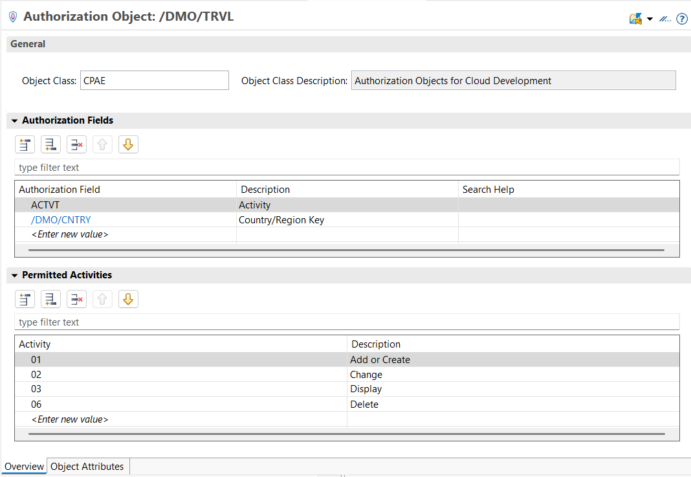
          
           

  3. **Inspect the _PFCG_ role **`ZAD164`****
          
     1. Open SAP GUI using the short cut **Ctrl+6** or by clicking the *Open SAP GUI* icon () in the ADT toolbar.

     2. Enter **`/npfcg`** in the transaction code, and confirm.

     3. Enter the role name, **`ZAD164`**, and click the _Display_ icon ().
        
     4. Go to the **Authorizations** tab, and click  to display Authorization data, confirm the appearing dialog, and open the folder **Object class CPAE** > **Authorization Object /DMO/TRVL**.

        <!--
            You can see under *📂Authorizat. 00* and *📂Authorizat. 01* that users with this role (like you in this workshop) are allowed to perform all activities – that is add or create, change, display, and delete – on records with the country codes `DE` (Germany) and `US` (United States of America). They are also only allowed to display records with the country code `GB` (Great Britain).
        -->

        - Under **📂Authorizat. 00**:
          - `ACTVT`: _All activities_  (permitted activities = _01_: Add or create, _02_: Change, _03_: Display, and _06_: Delete)
          - `/DMO/CNTRY`: _DE_, _US_  (permitted country codes)           
        - Under **📂Authorizat. 01**:
          - `ACTVT`: _Display_ (`03`) (permitted activity)
          - `/DMO/CNTRY`: _GB_ (permitted country codes )           

         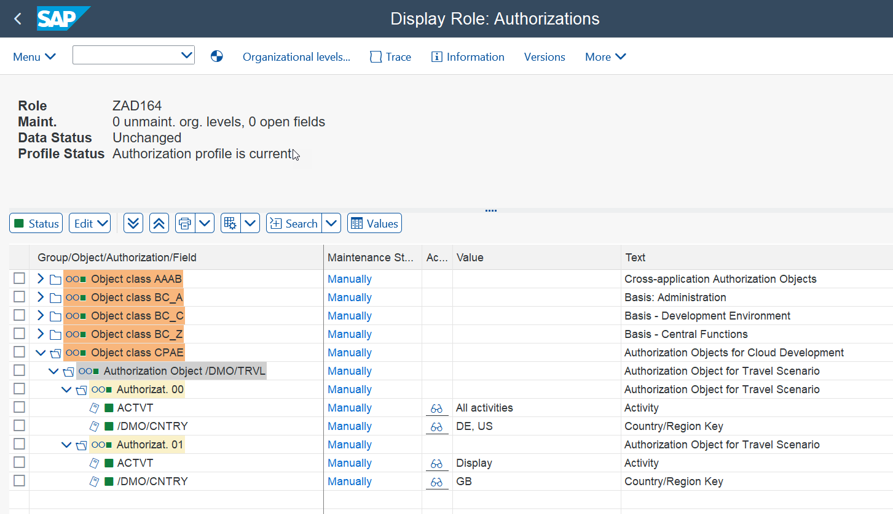
                
           
  4. **Check the number of displayed entries**

     Start the data preview for the CDS view entities and CDS projection views to see the current number of _Travel_ and _Booking_ data records.
     
     To do this open the relevant CDS entity and press **F8**. Then press "Number of entries" in the toolbar of the *Data Preview*. You can, for example, write down this number.
     
     Number of entries for the base view entities  – `ZAD164_R_Travel_###` and `ZAD164_R_Booking_###`:
     
     > PS: Your number of entries may differ from the one in the screenshot. You can also preview the data stored in the database tables `zad164_trvl_###` and `zad164_book_###` (F8).
     
     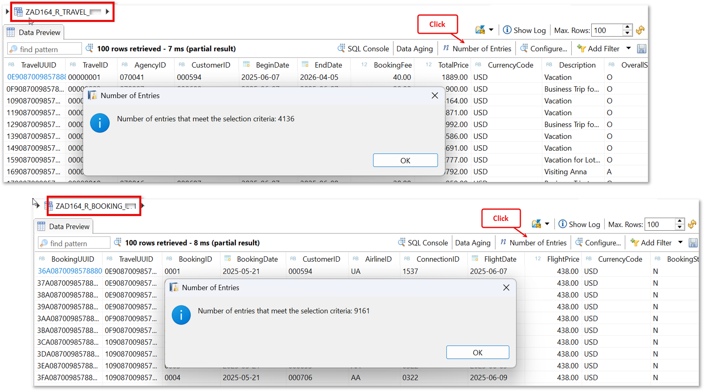
      

     You'll get the same number of entries for the respective CDS projection views  `ZAD164_C_Travel_###` and `ZAD164_C_Booking_###`:
   

## Exercise 5.2: Define read authorization for the base _Travel_ BO data model
[^Top of page](#Introduction)

> Define the read access authorizations for the base _Travel_ BO data model, that is to the _Travel_ and _Booking_ base views.
> The access rules are based on the country code of the associated agency.
>
> To do this, create the CDS access controls `ZAD164_R_Travel_###` and `ZAD164_R_Booking_###`, for the _Travel_ and _Booking_ base view entities. Use the authorization object `/DMO/TRVL` to define the access rules.

### Exercise 5.2.1: Define access conditions for the _Travel_ base view

> Define the CDS access control `ZAD164_R_Travel_###` for the _Travel_ base view `ZAD164_R_Travel_###` based on the authorization field `/DMO/CNTRY` of the _PFCG_ authorization object `/DMO/TRVL`, and the display access (`ACTVT = 03`).

  
🔵Click to expand!

1.	Right-click the base CDS data definition **`ZAD164_R_Travel_###`** in the _Project Explorer_ and choose **New Access Control** from the context menu to start the creation wizard. Keep the prefilled values for _Package_ (`ZAD164_EX_###`) and _Protected Entity_ (`ZAD164_R_Travel_###`) as they are.
 
    Maintain the information provided below, , and click **Next >** to continue.      
    - Name: **`ZAD164_R_Travel_###`** 
    - Description: _**`Access Control for Travel Base View`**_
     
    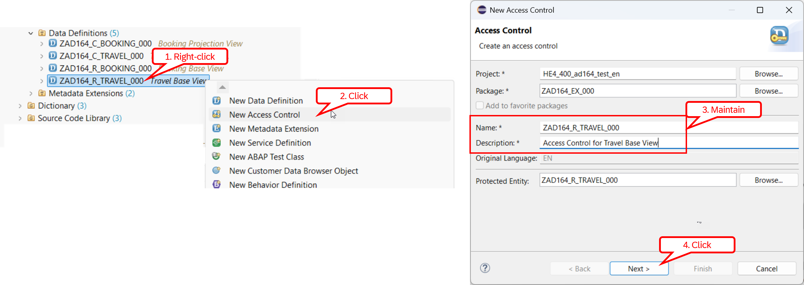  
    
  	Assign a transport request if needed, click **Next >**, choose the access control template **`defineRoleWithPFCGAspect`** under _Access Control (creation)_, and click **Finish** to confirm the creation of a role with _PFCG_ aspect. This template defines access rules based on _PFCG_ authorization objects.

    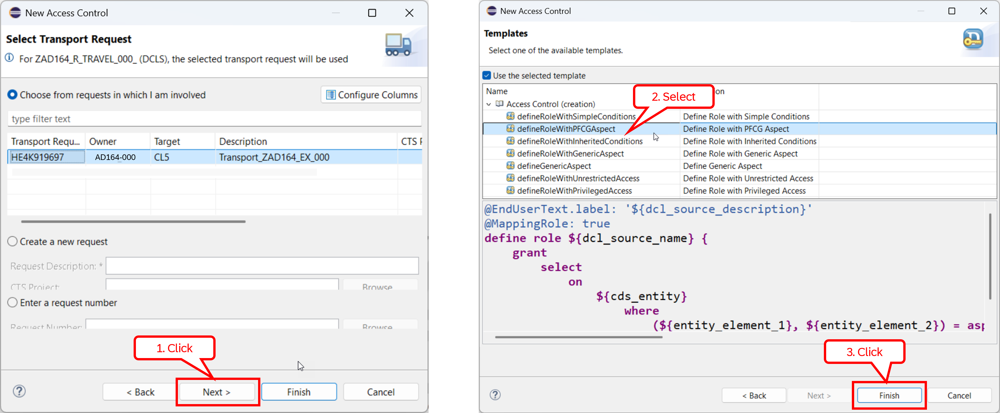  
     
    The skeleton access control definition is now displayed in the editor.
     
    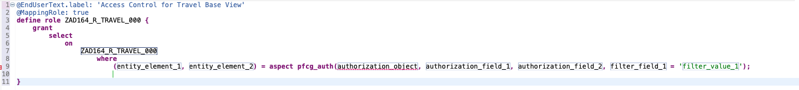   

3.  Replace the condition specified in the **`where`** clause with the following code snippet. 

    <pre lang="ABAP CDS">
    (_Agency.CountryCode) = aspect pfcg_auth(/DMO/TRVL, /DMO/CNTRY, ACTVT = '03');                    
    </pre>  

    The access control source now looks like follows.
     
    <pre lang="ABAP CDS">
    @MappingRole: true
    define role ZAD164_R_Travel_### {
      grant 
        select
          on
            ZAD164_R_Travel_###
              where
                (_Agency.CountryCode) = aspect pfcg_auth(/DMO/TRVL, /DMO/CNTRY, ACTVT = '03');                
    }
    </pre>
    
4. Save  and activate  the changes.

5. Now, check the current number of retrieved data records from the _Travel_ view entity **`ZAD164_R_Travel_###`**.
     
   To do this, press **F8**, and then press the "**Number of entries**" in the toolbar of the _Data Preview_ editor.

   You should now have less data displayed.

   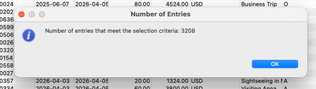   
   
    
   

### Exercise 5.2.2: Define access conditions for the _Booking_ base view

> Define the CDS access control `ZAD164_R_Booking_###` for the _Booking_ base view `ZAD164_R_Booking_###` based on the authorization field `/DMO/CNTRY` of the _PFCG_ authorization object `/DMO/TRVL`, and the display access (`ACTVT = 03`).

  
🔵Click to expand!

1. Right-click the CDS data definition **`ZAD164_R_Booking_###`** in the _Project Explorer_, and choose **New Access Control** from the context menu to start the creation dialog. Keep the prefilled values for _Package_ (`ZAD164_EX_###`) and _Protected Entity_ (`ZAD164_R_Booking_###`) as they are.

   Maintain the required name and description, and click **Next >** to continue.    
   - Name: **`ZAD164_R_Booking_###`** 
   - Description: _**`Access Control for Booking Base View`**_
   
   Assign a transport request if needed, click **Next >**, select the access control template **`defineRoleWithPFCGAspect`**, and click **Finish** to confirm the creation. 
   
   The skeleton access control rule is now displayed in the editor.

   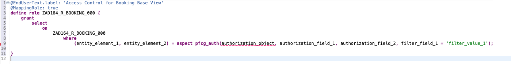 
   
2. Replace the dummy condition specified after in the **`where`** clause with the following line: 

   <pre lang="ABAP CDS">
   (_Travel._Agency.CountryCode) = aspect pfcg_auth(/DMO/TRVL, /DMO/CNTRY, ACTVT = '03');                    
   </pre>  

   The access control source now looks like follows.
     
   <pre lang="ABAP CDS">
   @EndUserText.label: 'Access Control for Booking Base View'
   @MappingRole: true
   define role ZAD164_R_Booking_### {
     grant 
       select
         on
           ZAD164_R_Booking_###
             where
               (_Travel._Agency.CountryCode) = aspect pfcg_auth(/DMO/TRVL, /DMO/CNTRY, ACTVT = '03');                
   }
   </pre>
    
3. Save  and activate  the changes.

4. Now, check the number of retrieved data records from the _Booking_ view entity **`ZAD164_R_Booking_###`**.
     
   To do this, press **F8**, and then press the **Number of entries** button in the toolbar of the _Data Preview_ editor.
   
   You should now have less data displayed.

   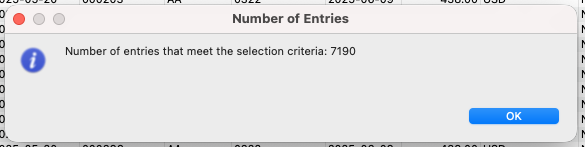   
   

## Exercise 5.3: Define read authorizations for the _Travel_ BO projection data model 
[^Top of page](#Introduction)

> We apply the same access rules defined on the base Travel BO data model to the Travel data model projection by making use of inheritance.
>
> To do this, create CDS access controls, `ZAD164_C_Travel_###` and `ZAD164_C_Booking_###`, for the _Travel_ and _Booking_ projection views by reusing the access conditions (or rules) defined for the underlying base view entities.

> [!NOTE]
> The access rules defined for a given CDS entity in a CDS access control (aka CDS role) are **not automatically inherited** by consuming CDS entities. If similar or different access conditions are needed, they must be defined explicitly in the CDS role of the consuming CDS entity. CDS provides an inheritance concept, enabling a CDS access control to inherit the access rules of another. [Learn more](https://help.sap.com/doc/abapdocu_cp_index_htm/CLOUD/en-US/ABENCDS_ACCESS_CONTROL.html).  

### Exercise 5.3.1: Define access conditions for the _Travel_ projection view

> Define the CDS access control `ZAD164_C_Travel_###` for the _Travel_ projection view `ZAD164_C_Travel_###` by inheriting the access conditions of the _Travel_ base view. 
> 
> 💡 Before completing this exercises step, you can check how many entries are currently retrieved by the _Travel_ projection view.

  
🔵Click to expand!

1.	Right-click the CDS data definition **`ZAD164_C_Travel_###`** in the _Project Explorer_ and choose **New Access Control** from the context menu.
   
    Maintain the required information below, an click **Next >** to continue.   
    - Name: **`ZAD164_C_Travel_###`** 
    - Description: _**`Access Control for Travel Proj. View`**_  
   
    Assign a transport request if needed, click **Next >**, choose the access control template **`defineRoleWithInheritedConditions`** under _Access Control (creation)_, then click **Finish** to confirm the new role creation.

    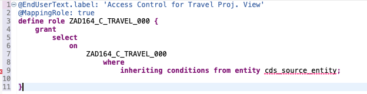 

2.  Replace the dummy entity name **`cds_source_entity`** with the name of the _Travel_ base view **`ZAD164_R_Travel_###`** in the **`where`** clause. 

    The access control source now looks like follows.
     
    <pre lang="ABAP CDS">
    @EndUserText.label: 'Access Control for Travel Proj. View'
    @MappingRole: true
    define role ZAD164_C_Travel_### {
      grant
        select
          on
            ZAD164_C_Travel_###
              where
                inheriting conditions from entity  ZAD164_R_Travel_###;
                
    }
    </pre>
    
4.  Save  and activate  the changes.

5.  You can now check the number of retrieved data records from the _Travel_ projection view **`ZAD164_C_Travel_###`**. You should now have less data displayed.

### Exercise 5.3.2: Define access conditions for the _Booking_ projection view

> Now, define the CDS access control `ZAD164_C_Booking_###` for the _Booking_ projection view `ZAD164_C_Booking_###` by inheriting the access conditions of the _Booking_ base view. 
> 
> 💡Before completing this exercises step, you can also check how many entries are currently retrieved by the _Booking_ projection view.

  
🔵Click to expand!

1. Right-click the CDS data definition **`ZAD164_C_Booking_###`** in the _Project Explorer_, and choose **New Access Control** from the context menu.
 
   Maintain the required information below, and click **Next >** to continue.   
     - Name: **`ZAD164_C_Booking_###`**
     - Description: _**`Access Control for Booking Proj. View`**_  
   
   Assign a transport request if needed, click **Next >**, select the access control template **`defineRoleWithInheritedConditions`** under _Access Control (creation)_, and click **Finish** to confirm the new role creation.

2. Replace the dummy entity name **`cds_source_entity`** with the name of the _Booking_ base view **`ZAD164_R_Booking_###`** in the **`where`** clause. 

   The access control source now looks like follows.
     
   <pre lang="ABAP CDS">
   @EndUserText.label: 'Access Control for Booking Proj. View'
   @MappingRole: true
   define role ZAD164_C_Booking_### {
     grant
       select
         on
           ZAD164_C_Booking_###
             where
               inheriting conditions from entity ZAD164_R_Booking_###;
               
   }
   </pre>
    
3. Save  and activate  the changes.

4.  You can now check the number of retrieved data records from the _Booking_ projection view **`ZAD164_C_Booking_###`** by pressing **F8**. You should now have less data displayed.
.

## Exercise 5.4: Preview and test the enhanced app
[^Top of page](#Introduction)

> You can now preview and play around with the enhanced _Manage Travels_ app. 

  
🔵Click to expand!

  1. Either simply refresh (**F5**) the app in the browser, or go to the **`ZAD164_UI_Travel_O4_###`**, select the leading entity (), _Travel_ in the *Entity Set and Association* area, and simply double-click it to start the Fiori elements app preview in the browser.
     
    
  2. Click the **Go** button to load the data and check the result.

     You should now have less data displayed in the _Manage Travels_ app.

     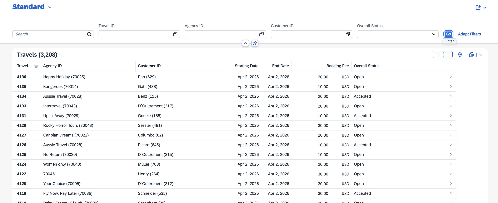
          

   

## Summary & Next exercise
[^Top of page](#Introduction)

Now you've defined read access authorizations for the _Travel_ and _Booking_ data using CDS access control objects to ensure that business data is protected against unauthorized access. 

Continue with the next exercise - **[Exercise 6: Add quick actions](../ex06/README.md)**.

---
