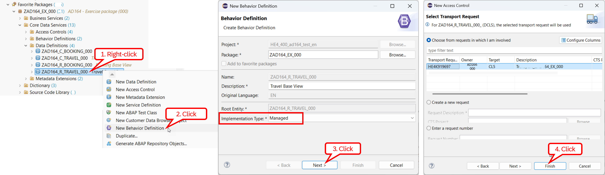
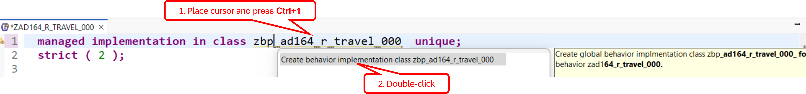
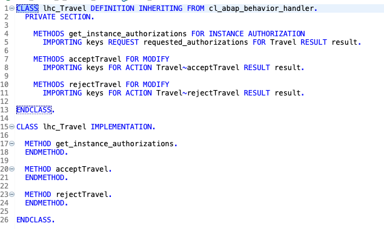
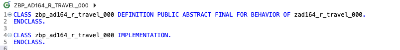
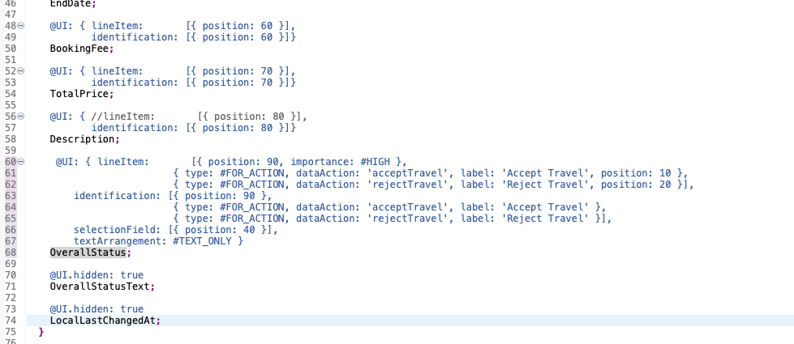
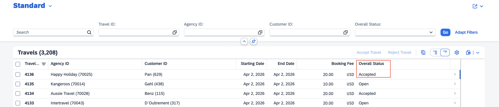
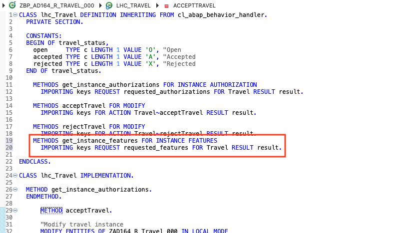
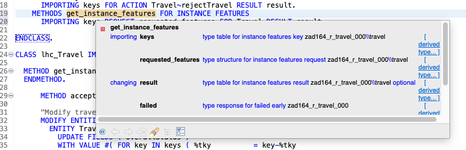
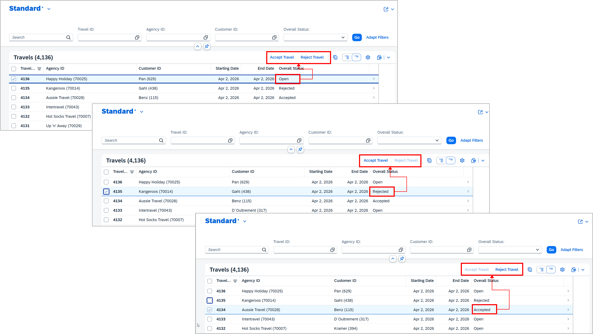

[Home - AD164](../../README.md)

# Exercise 6: Add quick actions

## Introduction

In the previous exercise, you defined read authorizations for the access to the _Travel_ and _Booking_ data (_[Exercise 5](../ex05/README.md)_).

In this exercise, you'll define the first transactional behavior of the _Travel_ BO by adding the quick actions `acceptTravel` (UI: _Accept Travel_) and `rejectTravel` (UI: _Reject Travel_), which allow end users to set the overall status of selected _Travel_ records to _Accepted_ (`A`) or _Rejected_ (`X`) in a single step, that is by clicking a button on the UI. These are non-factory, instance-bound actions (or instance actions). Since this scenario does not require the full transactional enablement of the _Travel_ BO, you'll only add the minimal required transactional behavior to the _Travel_ BO - i.e. no create, full update (for editing other properties), and delete operations.

Additionally, you will implement a toggle behavior - using the so-called _dynamic instance feature control_ in RAP- to enable only meaning full actions on the UI - e.g. `Accept Travel` or `Reject Travel` should only be enable if the travel status is not already  _Accepted_ (`A`) or _Rejected_ (`X`), respectively.

To do this, you'll create two CDS behavior definition objects – `ZAD164_R_Travel_###` and `ZAD164_C_Travel_###` – to define the transactional behavior definition, including the two actions `acceptTravel` and `rejectTravel`, for the _Travel_ base BO and the _Travel_ BO projection, respectively. You'll also create the behavior implementation class (also called _behavior pool_) `ZBP_AD164_R_Travel_###` for the BO node entity _Travel_ to implement the logic for both actions.

**Exercise steps:**
- [Exercise 6.1: Define the transactional behavior of the base _Travel_ BO](#exercise-61-define-the-transactional-behavior-of-the-base-travel-bo)
- [Exercise 6.2: Implement the logic of the base _Travel_ BO behavior](#exercise-62-implement-the-logic-of-the-base-travel-bo-behavior) 
- [Exercise 6.3: Define the transactional behavior of the _Travel_ BO projection](#exercise-63-define-the-transactional-behavior-of-the-travel-bo-projection)
- [Exercise 6.4: Enhance the UI semantics in the _Travel_ metadata extension](#exercise-64-enhance-the-ui-semantics-in-the-travel-metadata-extension)
- [Exercise 6.5: Preview and test the enhanced app](#exercise-65-preview-and-test-the-enhanced-app)
- [Exercise 6.6: Add a toggle behavior to the actions](#exercise-66-add-a-toggle-behavior-to-the-actions)
- [Summary & Next exercise](#summary--next-exercise)

> [!TIP]
> - Always replace all occurrences of the placeholder **`###`** in the provided code snippets with your personal suffix.
> - Use the ADT function _**Find and Replace All**_ (**Ctrl+F**) to quickly replace text in the source code.
> - Use the ADT function _**Quick Fix**_ (**Ctrl+1**), aka _Quick Assist_, on an erroneous element to get help with resolving the issue.
> - Use the **Show ABAP element info** view (**F2**) to inspect an element in ADT editors.
> - [Useful Keyboard Shortcuts for ABAP Development](https://help.sap.com/docs/ABAP_PLATFORM_NEW/c238d694b825421f940829321ffa326a/4ec299d16e391014adc9fffe4e204223.html?version=latest) (ADT shortcuts)

**ℹ️ About actions in RAP**

  
Click to expand!

> Each business object (BO) is characterized by a structure, a behavior and a runtime implementation.
> 
> In the RAP context, an action is a non-standard operation that change the data of a BO instance. 
> 
> Actions are specified in behavior definitions and implemented in ABAP behavior pools. By default, actions are related to instances of a BO entity. The addition `static` allows you to define a static actions that are not bound to any instance but relates to the complete entity.
> 
> Two main categories of actions can be implemented in RAP:  
> - **Non-factory actions**: Defines a RAP action which offers non-standard behavior. The custom logic must be implemented in the RAP handler method `FOR MODIFY`. An action per default relates to a RAP BO entity instance and changes the state of the instance.  An action is related to an instance by default. Non-factory actions can be instance-bound (default) or static.
> - **Factory actions**: Factory actions are used to create RAP BO entity instances. Factory actions can be instance-bound (default) or static. Instance-bound factory actions can copy specific values of an instance. Static factory actions can be used to create instances with prefilled default values.
>
> Learn more: [Actions](https://help.sap.com/viewer/923180ddb98240829d935862025004d6/Cloud/en-US/83bad707a5a241a2ae93953d81d17a6b.html) **|** [CDS BDL - non-standard operations](https://help.sap.com/doc/abapdocu_cp_index_htm/CLOUD/en-US/index.htm?file=abenbdl_nonstandard.htm) **|** [ABAP EML - response_param](https://help.sap.com/doc/abapdocu_cp_index_htm/CLOUD/en-US/index.htm?file=abapeml_response.htm)   

**ℹ️ About Dynamic Feature Control in RAP**

  
Click to expand!

  
> As an application developer you may want to determine based on certain attributes of your business object entity, which fields should be read-only or mandatory or which functionality like update or actions are allowed.  As this property is related to an instance of this business object it is called Dynamic Feature Control.
> 
> Learn more: [Adding Static and Dynamic Feature Control](https://help.sap.com/docs/btp/sap-abap-restful-application-programming-model/adding-static-and-dynamic-feature-control?version=Cloud)

  
---

## Exercise 6.1: Define the transactional behavior of the base _Travel_ BO
[^Top of page](#Introduction)

> Create the CDS behavior definition object `ZAD164_R_Travel_###` and define the custom transactional behavior for the base _Travel_ BO, including the two instance-bound actions `acceptTravel`and `rejectTravel`.

> [!NOTE]  
> Since the present scenario with quick operations do not require full transactional enablement of the _Travel_ BO, you will only add the minimal required transactional behavior – that is without following standard operations: create, delete, and full update (for editing other properties than the overall status `OverallStatus`).

  
🔵Click to expand!

1.	In the _Project Explorer_, right-click the base CDS view of the base _Travel_ BO root node, **`ZAD164_R_Travel_###`**, and choose **New Behavior Definition** in the context menu.
  
    Keep the prefilled values for _Name_, _Description_, _Root Entity_, _Implementation Type_, and _Package_ as they are, and click  **Next >** to continue. Assign a transport request if needed, and click **Finish** to confirm.  

    

    >  ℹ️ **Note**
    > 
  	> - _Name_: **`ZAD164_R_Travel_###`** – must be identical with the name of the base view of the _Travel_ BO root node.
    > - _Root Entity_: **`ZAD164_R_Travel_###`** – must also be identical with the name of the base view of the _Travel_ BO root node.
    > - _Implementation Type_: **`managed`** – The _managed_ implementation type addresses use cases where all essential parts of an application must be developed from scratch.
        
  	A skeleton behavior definition for all BO entities, _Travel_ and _Booking_ entities in this scenario, is now displayed in the editor. Each BO entity get its own separate behavior definition.
  	 
    The default source code looks like follows.
  	
    

      
📄Click to expand!

     
    <pre lang="ABAP CDS">
    managed implementation in class zbp_ad164_r_travel_### unique;
    strict ( 2 );
    
    define behavior for ZAD164_R_Travel_### //alias <alias_name>
    persistent table zad164_trvl_###
    lock master
    authorization master ( instance )
    //etag master <field_name>
    {
      create;
      update;
      delete;
      association _Booking { create; }
    }
    
    define behavior for ZAD164_R_Booking_### //alias <alias_name>
    persistent table zad164_book_###
    lock dependent by _Travel
    authorization dependent by _Travel
    //etag master <field_name>
    {
      update;
      delete;
      field ( readonly ) TravelUUID;
      association _Travel;
    }
    </pre>

    **ℹ️ Brief explanation**:   
    > The statement **`managed implementation in class ClassName unique;`** in the behavior definition indicates the name of the ABAP class, `ClassName`, that will contain the behavior logic of the specific BO node. This class is called _behavior implementation class_ (or _behavior pool_).
    > According to this example, the behavior pool for the _travel_ node is **`zbp_ad164_r_travel_###`**. The behavior pool of the _Booking_ node is not yet specified.
    >  A behavior implementation class (aka _behavior pool_) is a global ABAP class with specific tagging, where the logic for the behavior of the related BO node is implemented.   
    > ⚠️ No behavior implementation class has been created so far.

    
    	

3. Perform the following adjustments to the behavior of the _Travel_ and _Booking_ node entities in the behavior definition (**`ZAD164_R_Travel_###`**) using the provided code snippet to speed up the process.

   Following adjustments of the behavior definition will be implemented:
   
   

     
Click to expand!
      
     
     > 1. Assign  **`Travel`** and **`Booking`** as aliases of the respective BO entities using the **`alias`** keyword as highlighted on the screenshot below.
     > 2. Specify **`LocalLastChangedAt`** as entity tag (ETag) field for the _travel_ and _Booking_ nodes for optimistic concurrency control  using the addition **`etag master LocalLastChangedAt`**.
     > 3. Delete the statements **`create`** and **`delete`** to disable these standard operations.
     > 4. Disable the creation of new _Booking_ entity by removing the **`create;`** addition from the _Booking_ association **`association _Booking { create; }`**.
     > 5. Define the non-factory instance actions **`acceptTravel`** and **`rejectTravel`** in the behavior definition of the Travel entity using the keyword **`action`**. The addition **`result [1] $self;`** indicates that an action returns exactly one instance, namely the instance on which it is executed.
     > 6. Add following line between the curly brackets to allow the RAP framework to automatically set the value for the uuid-based key field **`TravelUUID`**.
     > 7. Enable the RAP framework to generate values for the uuid-based key fields `TravelUuid` and `BookingUuid` at the creation of new _Travel_ and _Booking_ records using the keyword **`numbering : managed`**.
     > 8. Specify the mapping between the name of database table fields and alias of the respective the _Travel_ base view using **`mapping`** addition.
     
   

     
   To do this, simply delete the complete source code and insert the code snippet provided below (🟡📄), and replace all occurrences of **`###`** with your personal suffix.
   
   

     
🟡📄Click to expand!
   
     
   <pre lang="ABAP CDS">
   managed implementation in class zbp_ad164_r_travel_### unique;
   strict ( 2 );
    
   define behavior for ZAD164_R_Travel_### alias Travel
   persistent table zad164_trvl_###
   lock master
   authorization master ( instance )
   etag master LocalLastChangedAt
   {
     field ( numbering : managed, readonly ) TravelUUID;
     association _Booking;
    
     internal update;   
    
     action acceptTravel result [1] $self;
     action rejectTravel result [1] $self;
    
     mapping for zad164_trvl_###
       {
         TravelUUID         = travel_uuid;
         TravelID           = travel_id;
         AgencyID           = agency_id;
         CustomerID         = customer_id;
         BeginDate          = begin_date;
         EndDate            = end_date;
         BookingFee         = booking_fee;
         TotalPrice         = total_price;   
         CurrencyCode       = currency_code;         
         Description        = description;
         OverallStatus      = overall_status;
         LocalCreatedBy     = local_created_by;
         LocalCreatedAt     = local_created_at;
         LocalLastChangedAt = local_last_changed_at;
         LocalLastChangedBy = local_last_changed_by;
         LastChangedAt      = last_changed_at;         
       }
   }
    
   define behavior for ZAD164_R_Booking_### alias Booking
   persistent table zad164_book_###
   lock dependent by _Travel
   authorization dependent by _Travel
   etag master LocalLastChangedAt
   {
     update;
     delete;
     field ( numbering : managed, readonly ) BookingUUID;
     field ( readonly ) TravelUUID;
     association _Travel;
   
     mapping for zad164_book_###
       {
         BookingUUID        = booking_uuid;
         TravelUUID         = parent_uuid;
         BookingID          = booking_id;
         BookingDate        = booking_date;
         CustomerID         = customer_id;
         AirlineID          = carrier_id;
         ConnectionID       = connection_id;  
         FlightDate         = flight_date;
         FlightPrice        = flight_price;
         CurrencyCode       = currency_code;
         BookingStatus      = booking_status;
         LocalLastChangedAt = local_last_changed_at;   
       }
   }
   </pre>
    
   
  
   
4. Save  and activate  the changes.

5. Now, create the behavior implementation class **`zbp_ad164_r_travel_###`** using the *Quick Fix* function (*Ctrl+1*).
  
   To do this, go to the statement **`managed implementation in class ...`** and place the cursor on the class name **`zbp_ad164_r_travel_###`**,
   press **Ctrl+1** to start the _Quick Assist_ view, and double-click the entry Add **`Create behavior implementation class zbp_ad164_r_travel_###`** in the dialog to open the class creation wizard.

   
   
   Keep the prefilled information as they are, click **Next >** to continue, assign a transport if needed, and click **Finish** to confirm the class creation.

   

   The skeleton class now appears in the class editor on the **◇Local Types** tab, where the behavior logic should be implemented in local classes. You can inspect the local class definition – for example, place the cursor on a method name, and press **F2** to view the details in the **Show ABAP element info** view.

   In the **◇Global Class** tab, you can see the addition **`FINAL FOR BEHAVIOR OF`**, which indicates that the class contains the behavior implementation of the specified BO – in this case, **`ZAD164_R_Travel_##`**.

   

6. Save  and activate  the class.

## Exercise 6.2: Implement the logic of the base _Travel_ BO behavior
[^Top of page](#Introduction)

> Implement the logic of the base _Travel_ BO behavior definition, namely the logic of the defined instanced actions `acceptTravel` and `rejectTravel`, in the behavior implementation class (aka _behavior pool_) `ZBP_AD164_R_Travel_###`.

> [!NOTE]
> Do not forget that you can inspect elements and artefacts, by placing the cursor on it and pressing **F2** to view the details in the *Show ABAP element info* view.

  
🔵Click to expand!

  
1. Go to the ABAP class **`ZBP_AD164_R_Travel_###`** and switch to the **◇Local Types** tab to view the local handler class **`lhc_Travel`**.

2. Define the constant structure **`travel_status`**, which contains the allowed values for the overall travel status, in the private section of the class definition of the local handler class **`lhc_Travel`**
  
   To do this, inserting the code snippet after the addition **`PRIVATE SECTION.`** of the class definition.
   
   <pre lang= "ABAP">
   CONSTANTS:
     BEGIN OF travel_status,
       open     TYPE c LENGTH 1 VALUE 'O', "Open
       accepted TYPE c LENGTH 1 VALUE 'A', "Accepted
       rejected TYPE c LENGTH 1 VALUE 'X', "Rejected
     END OF travel_status.
   </pre>
   
3. Implement the action **`Travel~acceptTravel`** in the _modify_ method **`acceptTravel`**.
  
   > 💡 You can make use of the **Show ABAP element info** (**F2**) to inspect the method interface, and **F1 Help** to access more information about EML statements and other ABAP language constructs in the online documentation. 
   
   The logic consists of the following steps:
   1. Implement the custom logic to determine the new values; *Accepted* (`A`) in the present scenario.    
   2. Modify the relevant fields of the travel instances; here only the field `OverallStatus` must be updated.   
   3. Read the whole data of the updated instances from the buffer to fill the action result parameter.   

   To speed up the implementation of these adjustments, simply replace the empty method implementation with the code snippet below (🟡📄), and replace all occurrences of **`###`** with your personal suffix.
   
   

     
🟡📄Click to expand!

       
   <pre lang="ABAP">
     METHOD acceptTravel.
  
       "Modify travel instance
       MODIFY ENTITIES OF ZAD164_R_Travel_### IN LOCAL MODE
         ENTITY Travel
           UPDATE FIELDS ( OverallStatus )
           WITH VALUE #( FOR key IN keys ( %tky          = key-%tky
                                           OverallStatus = travel_status-accepted ) ).
  
       "Read changed data for action result
       READ ENTITIES OF ZAD164_R_Travel_### IN LOCAL MODE
         ENTITY Travel
           ALL FIELDS WITH
           CORRESPONDING #( keys )
         RESULT DATA(travels).
  
       result = VALUE #( FOR travel IN travels ( %tky   = travel-%tky
                                                 %param = travel ) ).
     ENDMETHOD.  
   </pre>    

   **ℹ️Brief explanation**:  
   > - The provided implementation is mass-enabled. This is recommended. 
   > - The EML statement **`MODIFY ENTITIES ... UPDATE FIELDS`** is used to update specific fields of the instances.     
   > - The internal tables are filled inline using the constructor operator **`VALUE`** which made the need for explicit declaration obsolete.       
   > - The EML statement **`READ ENTITIES ... ALL FIELDS WITH CORRESPONDING`** is used to read all fields of the updated instances from the buffer to fill the input paramter `result`.
       
   
  
      
4. Implement the action **`Travel~rejectTravel`** in the `MODIFY` method **`rejectTravel`**. The business logic is similar to the one of the **`acceptTravel`** method.
   
   The logic consists of the following steps:
   1. Implement the custom logic to determine the new values; *Rejected* (`X`) in the present scenario.
   2. Modify the relevant fields of the travel instances; here only the field `OverallStatus` must be updated.
   3. Read the whole data of the updated instances from the buffer to fill the action result parameter.

   To speed up the implementation of these adjustments, simply replace the empty method implementation with the code snippet below (🟡📄), and replace all occurrences of **`###`** with your personal suffix.
   
   

     
🟡📄Click to expand!

       
   <pre lang="ABAP">
     METHOD rejectTravel.
    
       "Modify travel instance
       MODIFY ENTITIES OF ZAD164_R_Travel_### IN LOCAL MODE
         ENTITY Travel
           UPDATE FIELDS ( OverallStatus )
           WITH VALUE #( FOR key IN keys ( %tky          = key-%tky
                                           OverallStatus = travel_status-rejected ) ).
    
       "Read changed data for action result
       READ ENTITIES OF ZAD164_R_Travel_### IN LOCAL MODE
         ENTITY Travel
           ALL FIELDS WITH
           CORRESPONDING #( keys )
         RESULT DATA(travels).
    
       result = VALUE #( FOR travel IN travels ( %tky   = travel-%tky
                                                 %param = travel ) ).
     ENDMETHOD.
   </pre>
    
   
    

5. Save (**Ctrl+S**) and activate (**Ctrl+F3**) the class.    

   > ℹ️ **Note**    
   > There is no need to create the behavior implementation class of the _Booking_ node entity yet, since we've not yet enhanced its standard behavior definition.
  
   The full source code of the adjusted local handler class `lhc_Travel` in `ZBP_AD164_R_Travel_###` now looks as follows.
   
   

     
📄Click to expand!

   <pre lang="ABAP">       
   CLASS lhc_Travel DEFINITION INHERITING FROM cl_abap_behavior_handler.
     PRIVATE SECTION.
   
       CONSTANTS:
         BEGIN OF travel_status,
           open     TYPE c LENGTH 1 VALUE 'O', "Open
           accepted TYPE c LENGTH 1 VALUE 'A', "Accepted
           rejected TYPE c LENGTH 1 VALUE 'X', "Rejected
         END OF travel_status.
   
       METHODS get_instance_authorizations FOR INSTANCE AUTHORIZATION
         IMPORTING keys REQUEST requested_authorizations FOR Travel RESULT result.
   
       METHODS acceptTravel FOR MODIFY
         IMPORTING keys FOR ACTION Travel~acceptTravel RESULT result.
   
       METHODS rejectTravel FOR MODIFY
         IMPORTING keys FOR ACTION Travel~rejectTravel RESULT result.
   
   ENDCLASS.
    
   CLASS lhc_Travel IMPLEMENTATION.
    
     METHOD get_instance_authorizations.
     ENDMETHOD.
    
     METHOD acceptTravel.
    
       "Modify travel instance
       MODIFY ENTITIES OF ZAD164_R_Travel_### IN LOCAL MODE
         ENTITY Travel
           UPDATE FIELDS ( OverallStatus )
           WITH VALUE #( FOR key IN keys ( %tky          = key-%tky
                                           OverallStatus = travel_status-accepted ) ).
    
       "Read changed data for action result
       READ ENTITIES OF ZAD164_R_Travel_### IN LOCAL MODE
         ENTITY Travel
           ALL FIELDS WITH
           CORRESPONDING #( keys )
         RESULT DATA(travels).
   
       result = VALUE #( FOR travel IN travels ( %tky   = travel-%tky
                                                 %param = travel ) ).
     ENDMETHOD.
    
    
     METHOD rejectTravel.
    
       "Modify travel instance
       MODIFY ENTITIES OF ZAD164_R_Travel_### IN LOCAL MODE
         ENTITY Travel
           UPDATE FIELDS ( OverallStatus )
           WITH VALUE #( FOR key IN keys ( %tky          = key-%tky
                                           OverallStatus = travel_status-rejected ) ).
   
       "Read changed data for action result
       READ ENTITIES OF ZAD164_R_Travel_### IN LOCAL MODE
         ENTITY Travel
           ALL FIELDS WITH
           CORRESPONDING #( keys )
         RESULT DATA(travels).
    
       result = VALUE #( FOR travel IN travels ( %tky   = travel-%tky
                                                 %param = travel ) ).
     ENDMETHOD.
   
   ENDCLASS.   
   </pre>
   
   

## Exercise 6.3: Define the transactional behavior of the _Travel_ BO projection
[^Top of page](#Introduction)

> A projection behavior definition provides means to define service-specific behavior for a BO projection.
> 
> Now, create a projection behavior definition for the CDS view projection of the _Travel_ BO projection, `ZAD164_C_Travel_###`. This will be used to expose the two instance actions, `acceptTravel` and `rejectTravel`, which are defined and implemented in the underlying base _Travel_ BO `ZAD164_R_Travel_###`. 
 

  
🔵Click to expand!

1.	In the _Project Explorer_, right-click the CDS projection view **`ZAD164_C_Travel_###`**, and choose _**New Behavior Definition**_ in the context menu.
  
    Keep the prefilled values, choose **Next >** to continue, assign a transport request, and choose **Finish** to confirm.  	
  	         
    > Prefilled values:   
  	> - Name: `ZAD164_C_Travel_###` – must be identical with the name of the projection view  of the _Travel_ BO root node.
    > - Root Entity: `ZAD164_C_Travel_###` – must also be identical with the name of the projection view  of the _Travel_ BO root node.
    > - Implementation Type: `Projection` – The `projection` implementation type is used to expose, limit, or augment the behavior of the given base BO relevant for a specific business service (or use case).
             	
  	A skeleton for the new behavior definition for all BO entities of this scenario – i.e. the _travel_ entity ( `ZAD164_C_Travel_###`) and the _booking_ entity (`ZAD164_C_Booking_###`) – is now displayed in the editor.
  	 
    The default source code of the behavior projection looks as follows.

    

      
📄Click to expand!

      
    <pre lang="ABAP">
    projection;
    strict ( 2 );
    
    define behavior for ZAD164_C_Travel_### alias Travel
    {
    
      use action acceptTravel;
      use action rejectTravel;
    
      use association _Booking;
    }
    
    define behavior for ZAD164_C_Booking_### alias Booking
    {
      use update;
      use delete;
    
      use association _Travel;
    }        
    </pre>
    
    **ℹ️ Brief explanation**:  
    > - The keyword **`projection`** indicates that a behavior projection is defined in this behavior definition object.
    > - The keyword **`use`** is used to expose the transactional behavior from the base _Travel_ BO that is relevant for the given scenario.

    
     

3. Save (**Ctrl+S**) and activate (**Ctrl+F3**) the class.   
 

## Exercise 6.4: Enhance the UI semantics in the _Travel_ metadata extension
[^Top of page](#Introduction)

> Add two buttons *Accept Travel* and *Reject Travel* in the UI of the _Manage Travel_ app to trigger the actions `acceptTravel` and `rejectTravel` on _Travel_ node entities, respectively.
> 
> To do this, enhance the CDS metadata extension `ZAD164_C_Travel_###` with the appropriate `@UI` annotations.  

  
🔵Click to expand!

  
1. Go to the CDS metadata extension **`ZAD164_C_Travel_###`** and replace the comple `@UI` annotation block placed directly before the element **`OverallStatus`** with the one provided below, as shown on the screenshot below.

   <pre lang="ABAP CDS">
    @UI: { lineItem:       [{ position: 90, importance: #HIGH },
                            { type: #FOR_ACTION, dataAction: 'acceptTravel', label: 'Accept Travel', position: 10 },
                            { type: #FOR_ACTION, dataAction: 'rejectTravel', label: 'Reject Travel', position: 20 }],
           identification: [{ position: 90 },
                            { type: #FOR_ACTION, dataAction: 'acceptTravel', label: 'Accept Travel' },
                            { type: #FOR_ACTION, dataAction: 'rejectTravel', label: 'Reject Travel' }],
           selectionField: [{ position: 40 }],
           textArrangement: #TEXT_ONLY }
    OverallStatus;     
   </pre>

   By doing that, you're specifying the availability of the buttons ***Accept Travel*** and ***Reject Travel*** on the _Travel_ list report (`@UI.lineItem`) and the _Travel_ object page (`@UI.identification`).

   

   The full source code of the adjusted metadata definition looks as follows.
   
   

     
📄Click to expand!

         
   <pre lang="ABAP CDS">
   @Metadata.layer: #CORE
    
   @UI: { headerInfo: { typeName: '### - Travel',
                        typeNamePlural: '### - Travels',
                        title: { type: #STANDARD, value: 'TravelID' } },
          presentationVariant: [{ sortOrder: [{ by: 'TravelID', direction: #DESC }], visualizations: [{type: #AS_LINEITEM}]  }] }
    
   annotate entity ZAD164_C_TRAVEL_### with
   {
     @UI.facet: [{ id:            'Travel',
                   purpose:       #STANDARD,
                   type:          #IDENTIFICATION_REFERENCE,
                   label:         'Travel',
                   position:      10 },
                 { id:            'Booking',
                   purpose:       #STANDARD,
                   type:          #LINEITEM_REFERENCE,
                   label:         'Booking',
                   position:      20,
                   targetElement: '_Booking'}]
     @UI.hidden: true
     TravelUUID;
   
     @UI: { lineItem:       [{ position: 10, importance: #HIGH }
                            //,{ type: #FOR_ACTION, dataAction: 'acceptTravel', label: 'Accept Travel' },
                            // { type: #FOR_ACTION, dataAction: 'rejectTravel', label: 'Reject Travel' }
                            ],
            identification: [{ position: 10 }
                            //,{ type: #FOR_ACTION, dataAction: 'acceptTravel', label: 'Accept Travel' },
                            // { type: #FOR_ACTION, dataAction: 'rejectTravel', label: 'Reject Travel' }
                            ],
            selectionField: [{ position: 10 }]}
     TravelID;
   
     @UI: { lineItem:       [{ position: 20, importance: #HIGH }],
            identification: [{ position: 20 }],
            selectionField: [{ position: 20 }]}
     AgencyID;
   
     @UI: { lineItem:       [{ position: 30 }],
            identification: [{ position: 30 }],
            selectionField: [{ position: 30 }]}
     CustomerID;
    
     @UI: { lineItem:       [{ position: 40 }],
            identification: [{ position: 40 }]}
     BeginDate;
    
     @UI: { lineItem:       [{ position: 50 }],
            identification: [{ position: 50 }]}
     EndDate;
    
     @UI: { lineItem:       [{ position: 60 }],
            identification: [{ position: 60 }]}
     BookingFee;
    
     @UI: { lineItem:       [{ position: 70 }],
            identification: [{ position: 70 }]}
     TotalPrice;
    
     @UI: { lineItem:       [{ position: 80 }],
            identification: [{ position: 80 }]}
     Description;
   
     @UI: { lineItem:       [{ position: 90, importance: #HIGH },
                             { type: #FOR_ACTION, dataAction: 'acceptTravel', label: 'Accept Travel', position: 10 },
                             { type: #FOR_ACTION, dataAction: 'rejectTravel', label: 'Reject Travel', position: 20 }
                             ],
            identification: [{ position: 90 },
                             { type: #FOR_ACTION, dataAction: 'acceptTravel', label: 'Accept Travel', position: 10 },
                             { type: #FOR_ACTION, dataAction: 'rejectTravel', label: 'Reject Travel', position: 20 }
                             ],                              
            selectionField: [{ position: 40 }],
            textArrangement: #TEXT_ONLY }
     OverallStatus;
   
     @UI.hidden: true
     OverallStatusText;
    
     @UI.hidden: true
     LocalLastChangedAt;      
   }                
   </pre>

   **ℹ️ Brief explanation**:   ⚠️🚧 provide info...⚠️🚧
   > - `type` – #FOR_ACTION
   > - `dataAction` – 'acceptTravel' or 'acceptTravel'
   > - `label` – 'Accept Travel'
   > - `position` –
     
  
       

2. Save (**Ctrl+S**) and activate (**Ctrl+F3**) the changes.
 

## Exercise 6.5: Preview and test the enhanced app 
[^Top of page](#Introduction)

> You can now preview and play around with the enhanced _Manage Travel_ app. 

  
🔵Click to expand!

1. In the service binding **`ZAD164_UI_Travel_O4_###`**, select the leading entity (), _Travel_ in the ***Entity Set and Association*** area, double-click it to start the Fiori elements app preview in the browser, and click the **Go** button to load the data.
         
2. For example, select an entry with the overall status *Open* (`O`), click on ***Accept Travel*** or ***Reject Travel***, and check the result.

      
     

   

## Exercise 6.6: Add a toggle behavior to the actions
[^Top of page](#Introduction)

> You can now preview and play around with the enhanced _Manage Travel_ app. 

### Exercise 6.6.1:  Define the dynamic instance feature control 

> Define the dynamic instance feature control for the instance actions `acceptTravel` and `rejectTravel` in the behavior definition `ZAD164_R_Travel_###`.

  
🔵Click to expand!

1. Go to the behavior of the _Travel_ entity **`ZAD164_R_Travel_###`** and insert the addition **`( features : instance )`** to definition of both actions as follows.

   <pre lang="ABAP">    
     action ( features : instance ) acceptTravel result [1] $self;
     action ( features : instance ) rejectTravel result [1] $self;       
   </pre>
   
   The full source code of the adjusted behavior definition now looks as follows.

   

     
📄Click to expand!
   
     
   <pre lang="ABAP CDS">
   managed implementation in class zbp_ad164_r_travel_### unique;
   strict ( 2 );
    
   define behavior for ZAD164_R_Travel_### alias Travel
   persistent table zad164_trvl_###
   lock master
   authorization master ( instance )
   etag master LocalLastChangedAt
   {
     field ( numbering : managed, readonly ) TravelUUID;
     association _Booking;
    
     internal update;   
    
     action ( features : instance ) acceptTravel result [1] $self;
     action ( features : instance ) rejectTravel result [1] $self;  
    
     mapping for zad164_trvl_###
       {
         TravelUUID         = travel_uuid;
         TravelID           = travel_id;
         AgencyID           = agency_id;
         CustomerID         = customer_id;
         BeginDate          = begin_date;
         EndDate            = end_date;
         BookingFee         = booking_fee;
         TotalPrice         = total_price;   
         CurrencyCode       = currency_code;         
         Description        = description;
         OverallStatus      = overall_status;
         LocalCreatedBy     = local_created_by;
         LocalCreatedAt     = local_created_at;
         LocalLastChangedAt = local_last_changed_at;
         LocalLastChangedBy = local_last_changed_by;
         LastChangedAt      = last_changed_at;         
       }
   }
    
   define behavior for ZAD164_R_Booking_### alias Booking
   persistent table zad164_book_###
   lock dependent by _Travel
   authorization dependent by _Travel
   etag master LocalLastChangedAt
   {
     update;
     delete;
     field ( numbering : managed, readonly ) BookingUUID;
     field ( readonly ) TravelUUID;
     association _Travel;
   
     mapping for zad164_book_###
       {
         BookingUUID        = booking_uuid;
         TravelUUID         = parent_uuid;
         BookingID          = booking_id;
         BookingDate        = booking_date;
         CustomerID         = customer_id;
         AirlineID          = carrier_id;
         ConnectionID       = connection_id;  
         FlightDate         = flight_date;
         FlightPrice        = flight_price;
         CurrencyCode       = currency_code;
         BookingStatus      = booking_status;
         LocalLastChangedAt = local_last_changed_at;   
       }
   }
   </pre>
    
   
     

2. Save (**Ctrl+S**) and activate (**Ctrl+F3**) the changes.

   > A **warning message** about the missing implementation of the operation `GET_INSTANCE_FEATURES` for the _Travel_ BO entity `ZAD164_R_TRAVEL_###`  is now displayed in the _Problems_ view. 

3. Tackle the warning message by creating the missing method in the behavior implementation class using the **_Quick Fix_** function (**Ctrl+1**).

   To do this, place the cursor on the entity name **`ZAD164_R_Travel_###`** in the behavior definition, press (**Ctrl+1**) to start the **_Quick Assist_** view, and double-click the entry **`Add method for operation get_insteance_features on entry zad164_r_travel_### in ...`** to trigger the adjustment of the behavior pool **`ZBP_AD164_R_TRAVEL_###`**.

            

   The adjusted local class handler **`lhc_Travel`** is now displayed in **◇Local Types** tab of the class editor. You can inspect the interface of the new method **`get_insteance_features ( )`** using the **Show ABAP element info** view (**F2**).

        

   **ℹ️ Brief explanation**
   

     
Click to expand!

      
     > - The addition **`FOR INSTANCE FEATURES`** after the method name indicates that this method provides the implementation of an instance-based dynamic feature control.
     > - Method signature of the instance method `get_instance_features`:
     >   -- `IMPORTING`parameter **`keys`** - a table containing the keys of the instances on which the feature control must be executed.
     >   -- Implicit `IMPORTING`parameter **`requested_features`** - structure reflecting which elements (fields, standard operations, and actions) of the entity are requested for dynamic feature control by the consumer.
     >   -- Implicit `CHANGING` parameters (aka _implicit response parameters_):
     >      * **`result`** - used to store the result of the performed feature control calculation.
     >      * **`failed`** - table with information for identifying the data set where an error occurred.
     >      * **`reported`** - table with data for instance-specific messages.
    
   
      

4. Save (**Ctrl+S**) the changes, and go ahead with the implementation.

   
   

### Exercise 6.6.2:  Implement the dynamic instance feature control 

> Implement the toggle behavior for the instance actions `acceptTravel` and `rejectTravel` in the local class handler `lhc_Travel` of the class editor of the behavior pool `ZBP_AD164_R_TRAVEL_###`.
> 
> By default, the custom buttons _Accept Travel_ and _Reject Travel_ are enabled when selecting a _Travel_ record in the list report. Following dynamic toggle behavior is expected depending on the overall status of the selected _Travel_ instance(s):
> - If the overall status is `Accepted` (**`A`**), then the custom action/button `acceptTravel` / _Accept Travel_  must be disabled.
> - If the overall status is `Rejected` (**`X`**), then the custom action/button `rejectTravel` / _Reject Travel_ must be disabled.

  
🔵Click to expand!

1. Go to the local class handler **`lhc_Travel`** on the **◇Local Types** tab, and replace the empty implementation of the method **`get_insteance_features`** in the class defintition with the code snippet (🟡📄) provided below. Remember to replace **`###`** with your personal suffix.

   

     
🟡📄Click to expand!

   <pre lang="ABAP">
   METHOD get_instance_features.
  
     READ ENTITIES OF ZAD164_R_Travel_### IN LOCAL MODE
       ENTITY Travel
         FIELDS ( OverallStatus )
         WITH CORRESPONDING #( keys )
       RESULT DATA(travels)
       FAILED failed.
  
     result = VALUE #( FOR travel IN travels
                           ( %tky                 = travel-%tky
                             %action-acceptTravel = COND #( WHEN travel-OverallStatus = travel_status-accepted
                                                            THEN if_abap_behv=>fc-o-disabled
                                                            ELSE if_abap_behv=>fc-o-enabled )
                             %action-rejectTravel = COND #( WHEN travel-OverallStatus = travel_status-rejected
                                                            THEN if_abap_behv=>fc-o-disabled
                                                            ELSE if_abap_behv=>fc-o-enabled )
                           ) ).
  
   ENDMETHOD.
   </pre>
   
      

   The full source code of the local handler class `lhc_Travel` in the behavior pool now looks as follows.

   

     
📄Click to expand!

     
   <pre lang="ABAP">
    CLASS lhc_Travel DEFINITION INHERITING FROM cl_abap_behavior_handler.
      PRIVATE SECTION.
    
        CONSTANTS:
          BEGIN OF travel_status,
            open     TYPE c LENGTH 1 VALUE 'O', "Open
            accepted TYPE c LENGTH 1 VALUE 'A', "Accepted
            rejected TYPE c LENGTH 1 VALUE 'X', "Rejected
          END OF travel_status.
    
        METHODS get_instance_authorizations FOR INSTANCE AUTHORIZATION
          IMPORTING keys REQUEST requested_authorizations FOR Travel RESULT result.
    
        METHODS acceptTravel FOR MODIFY
          IMPORTING keys FOR ACTION Travel~acceptTravel RESULT result.
    
        METHODS rejectTravel FOR MODIFY
          IMPORTING keys FOR ACTION Travel~rejectTravel RESULT result.
        METHODS get_instance_features FOR INSTANCE FEATURES
          IMPORTING keys REQUEST requested_features FOR Travel RESULT result.
    
    ENDCLASS.
    
    CLASS lhc_Travel IMPLEMENTATION.
    
      METHOD get_instance_authorizations.
      ENDMETHOD.
    
      METHOD acceptTravel.
    
        "Modify travel instance
        MODIFY ENTITIES OF ZAD164_R_Travel_### IN LOCAL MODE
          ENTITY Travel
            UPDATE FIELDS ( OverallStatus )
            WITH VALUE #( FOR key IN keys ( %tky          = key-%tky
                                            OverallStatus = travel_status-accepted ) ).
    
        "Read changed data for action result
        READ ENTITIES OF ZAD164_R_Travel_### IN LOCAL MODE
          ENTITY Travel
            ALL FIELDS WITH
            CORRESPONDING #( keys )
          RESULT DATA(travels).
    
        result = VALUE #( FOR travel IN travels ( %tky   = travel-%tky
                                                  %param = travel ) ).
      ENDMETHOD.
    
      METHOD rejectTravel.
    
        "Modify travel instance
        MODIFY ENTITIES OF ZAD164_R_Travel_### IN LOCAL MODE
          ENTITY Travel
            UPDATE FIELDS ( OverallStatus )
            WITH VALUE #( FOR key IN keys ( %tky          = key-%tky
                                            OverallStatus = travel_status-rejected ) ).
    
        "Read changed data for action result
        READ ENTITIES OF ZAD164_R_Travel_### IN LOCAL MODE
          ENTITY Travel
            ALL FIELDS WITH
            CORRESPONDING #( keys )
          RESULT DATA(travels).
    
        result = VALUE #( FOR travel IN travels ( %tky   = travel-%tky
                                                  %param = travel ) ).
      ENDMETHOD.
    
      METHOD get_instance_features.
        READ ENTITIES OF ZAD164_R_Travel_### IN LOCAL MODE
          ENTITY Travel
            FIELDS ( OverallStatus )
            WITH CORRESPONDING #( keys )
          RESULT DATA(travels)
          FAILED failed.
    
        result = VALUE #( FOR travel IN travels
                              ( %tky                 = travel-%tky
                                %action-acceptTravel = COND #( WHEN travel-OverallStatus = travel_status-accepted
                                                               THEN if_abap_behv=>fc-o-disabled
                                                               ELSE if_abap_behv=>fc-o-enabled )
                                %action-rejectTravel = COND #( WHEN travel-OverallStatus = travel_status-rejected
                                                               THEN if_abap_behv=>fc-o-disabled
                                                               ELSE if_abap_behv=>fc-o-enabled )
                              ) ).
    
      ENDMETHOD.
    
    ENDCLASS.
 </pre>
   
   
  
   

   

2. Save (**Ctrl+S**) and activate (**Ctrl+F3**) the changes.
   

   

### Exercise 6.6.3:  Preview and test the enhanced app

> Preview and play around with the enhanced app to observe the toggle behavior of the actions `acceptTravel` and `rejectTravel` on the _Manage Travels_ app UI.

  
🔵Click to expand!

1. Refresh the app in the browser or start the app preview from the service binding **`ZAD164_UI_Travel_O4_###`** and click  to load the data.

2. Now select a _Travel_ record with any of the overall statuses (`Accepted`, `Rejected` or `Open`) and check the toolbar.
   
   You should now see the toggle behavior of the **_Accept Travel_** and **_Reject Travel_** buttons on the UI.
   
      
   

## Summary & Next exercise
[^Top of page](#Introduction)

Now, you've defined and implemented the transactional behavior of the _Travel_ BO, including quick actions, and enhanced the UI semantics to display the related buttons on the Fiori elements UI of your _Manage Travel_ app.

Continue with the next exercise - **[Exercise 7: Add business events](../ex07/README.md)**.

---
