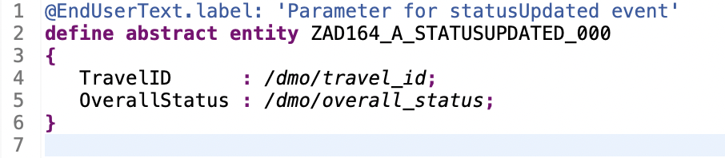
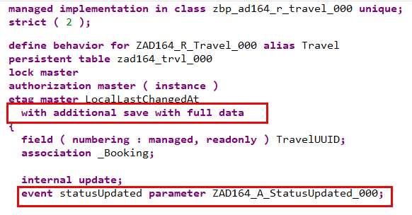
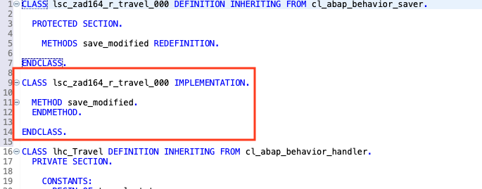
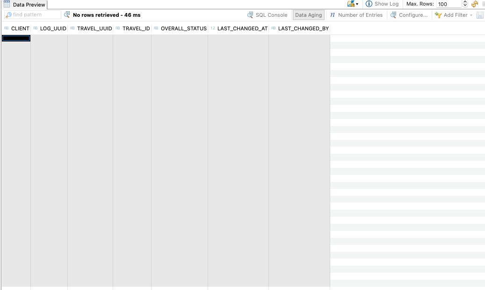
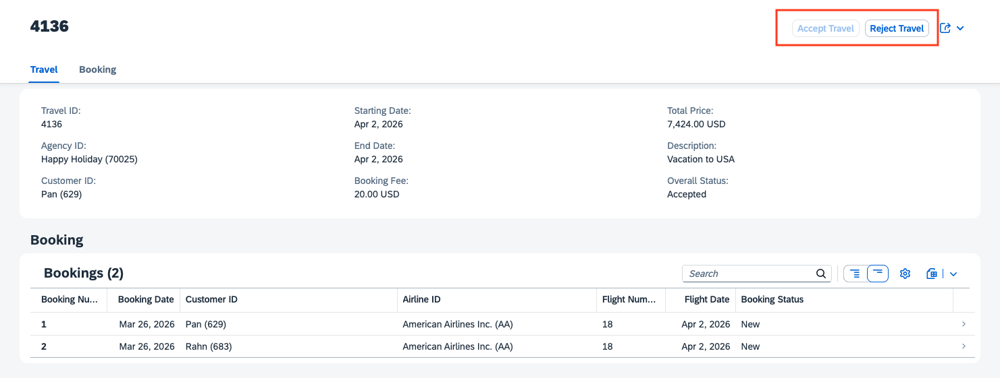
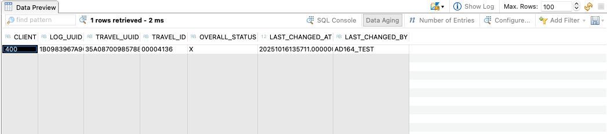

[Home - AD164](../../README.md)

# Exercise 7: Add business events

## Introduction

In the previous exercise, you added two instance-based actions, `acceptTravel` and `rejectTravel`, to the _Travel_ RAP BO to update the overall status of the _Travel_ entity with just one click (_[Exercise 6](../ex06/README.md)_).

In this exercise, you'll add the business event `statusUpdated`, which will be raised whenever one of the instance actions, `acceptTravel` or `rejectTravel`, is triggered – whether from the UI, an OData-based Web API, or via the EML API. This means your RAP BO acts as an _event provider_. The event will have a parameter to transfer specific information to the event consumer.   
You will also implement an simple event handler class for local consumption of the raised events. The local event handler acts as an *event consumer*, listening to and processing events raised by the _Travel_ RAP BO in the same system. The information received by the event handler will be persisted in a database table.

To do this, you will create the CDS abstract entity `ZAD164_A_STATUSUPDATED_RAP_###` and enhance the CDS behavior definition `ZAD164_R_Travel_###` as well as the behavior implementation class `ZBP_AD164_R_TRAVEL_###`. You will also create the event handler class `ZEH_AD164_STATUSUPDATED_###`.

### Exercises:
- [Exercise 7.1 - Define the event parameter](#exercise-71-define-the-event-parameter)
- [Exercise 7.2 - Add the event to the _Travel_ BO behavior](#exercise-72-add-the-event-to-the-travel-bo-behavior)
- [Exercise 7.3 - Raise the event in the _Travel_ BO behavior pool](#exercise-73-raise-the-event-in-the-travel-bo-behavior-pool)
- [Exercise 7.4 - Create an event handler for the local consumption](#exercise-74-create-an-event-handler-for-the-local-consumption)
- [Exercise 7.5 - Test the enhanced app](#exercise-75-test-the-enhanced-app)
- [Summary & Next exercise](#summary--next-exercise)  

> [!TIP]
> - Always replace all occurrences of the placeholder **`###`** in the provided code snippets with your personal suffix.
> - Use the ADT function _**Find and Replace All**_ (**Ctrl+F**) to quickly replace text in the source code.
> - Use the ADT function _**Quick Fix**_ (**Ctrl+1**), aka _Quick Assist_, on an erroneous element to get help with resolving the issue.
> - Use the **Show ABAP element info** view (**F2**) to inspect an element in ADT editors.
> - [Useful Keyboard Shortcuts for ABAP Development](https://help.sap.com/docs/ABAP_PLATFORM_NEW/c238d694b825421f940829321ffa326a/4ec299d16e391014adc9fffe4e204223.html?version=latest) (ADT shortcuts)

**About Business Events in RAP**

  
ℹ️Click to expand the details!
  
  
  > Developers can now define and raise business events in a RAP BO or in a RAP BO behavior extension.  
  > 
  > RAP supports event-driven architecture natively on SAP BTP ABAP environment and SAP S/4HANA in the cloud and on-prem as of release 2022. Event-driven architecture enables asynchronous communication between an event provider and an event consumer in use cases where no direct response from the event consumer is required.
  > 
  > Business events provide the opportunity of light-weight, decoupled process integration based on standardized and stable APIs and they are now a native part of the _ABAP RESTful Application Programming Model (RAP)_. With the _Event Binding_ editor, you can create so-called _event bindings_, which are needed to provide a mapping between the definition of RAP events via behavior definition (BDEF) and the external representation of business events over the SAP event infrastructure, namely, [_SAP Integration Suite, advanced event mesh_](https://www.sap.com/products/technology-platform/integration-suite/advanced-event-mesh.html).
  >  
  > RAP Business events can be consumed in the same system as they are raised (_local consumption_) or in other systems (_remote consumption_).  
  > 
  > Learn more: [About RAP Business Events](https://help.sap.com/docs/btp/sap-abap-restful-application-programming-model/business-events) | [Develop RAP Business Events](https://help.sap.com/docs/abap-cloud/abap-rap/develop-business-events) | [Business Event Consumption](https://help.sap.com/docs/abap-cloud/abap-rap/business-event-consumption) |   
  

## Exercise 7.1: Define the event parameter
[^Top of page](#)

> Define a CDS abstract entity `ZAD164_A_STATUSUPDATED_###` that will be used as parameter for defining the business event `statusUpdated` later. The abstract entity define the interface for the data transfer to the event consumers.

 

  
🔵 Click to expand!

  1. Create the new CDS abstract entity **`ZAD164_A_STATUSUPDATED_###`**.
  
     To do this, go to the _Project Explorer_, navigate to the folder **Core Data Services** > **Data Definition** in your package, right-click on it, and choose **New Data Definition** from the context menu to start the creation wizard.

  2. Maintain name and description, leave the _Reference Object_ field empty, and Click **Next >**.        
     - Name: **`ZAD164_A_STATUSUPDATED_###`** 
     - Description: _**`Parameter for statusUpdated event`**_     
    
     Assign a transport request if needed, click **Next >**, navigate to **Abtract Entity (creation)**, choose the template **`defineAbtractEntityWithParameters`**, and click **Finish** to create the abstract entity. 
 
  
  4. Replace the default data definition with the source code provided below and replace **`###`** with your personal suffix.
        
     <pre lang="ABAP CDS">
     @EndUserText.label: 'Parameter for statusUpdated event'
     define abstract entity ZAD164_A_StatusUpdated_###
     {
        TravelID      : /dmo/travel_id;
        OverallStatus : /dmo/overall_status;          
     }  
     </pre>

      
    
  3. Save  (**Ctrl+S**) and activate  (**Ctrl+F3**) the new abstract entity.
     

## Exercise 7.2: Add the event to the _Travel_ BO behavior
[^Top of page](#)

> Define the business event `statusUpdated` in the behavior definition of the BO node entity _Travel_, `ZAD164_R_Travel_###`.
> The event has a parameter that is used to transfer information to the event consumers.

 

  
🔵 Click to expand!

 1. Open the behavior definition **`ZAD164_R_Travel_###`** in your exercise package, and go to the behavior definition of the _Travel_ entity..
  
 2. Define the event **`statusUpdated`** using the keyword **`event`** in the behavior definition of the _Travel_ entity, and specify the previously created abstract entity as its event parameter using the keyword **`parameter`**.
  
    To do this, insert the code snippet provided below the statement **`internal update;`** in the behavior definition **`ZAD164_R_TRAVEL_###`**, and replace **`###`** with your personal suffix.

    <pre lang="ABAP CDS">
      event statusUpdated parameter ZAD164_A_StatusUpdated_###;  
    </pre>       
      
 3. Add an additional _save_ method to the runtime of BO node _Travel_ using the statement **`with additional save`**, because business events must be raised in the save sequence at runtime.
    Specify the addition **`with full data`** to always have access to all data of a _Travel_ BO entity in the _save_ method.
  
    To do this, insert the code snippet below the **`etag master LocalLastChangedAt`** statement outside the opening curly bracket (`{`).

    <pre lang="ABAP CDS">
      with additional save with full data
    </pre>  
  
        

    The source code in the behavior definition should now looks as follows.
 
    

      
📄 Click to expand!
   
      <pre lang="ABAP CDS">
      managed implementation in class zbp_ad164_r_travel_### unique;
      strict ( 2 );
    
      define behavior for ZAD164_R_Travel_### alias Travel
      persistent table zad164_trvl_###
      lock master
      authorization master ( instance )
      etag master LocalLastChangedAt
      with additional save with full data
      {
        field ( numbering : managed, readonly ) TravelUUID;
        association _Booking;
    
        internal update;
    
        event statusUpdated parameter ZAD164_A_StatusUpdated_###;
    
        action acceptTravel ( features : instance ) result [1] $self;
        action rejectTravel ( features : instance ) result [1] $self;
    
        mapping for zad164_trvl_###
          {
            TravelUUID         = travel_uuid;
            TravelID           = travel_id;
            AgencyID           = agency_id;
            CustomerID         = customer_id;
            BeginDate          = begin_date;
            EndDate            = end_date;
            BookingFee         = booking_fee;
            TotalPrice         = total_price;
            CurrencyCode       = currency_code;
            Description        = description;
            OverallStatus      = overall_status;
            LocalCreatedBy     = local_created_by;
            LocalCreatedAt     = local_created_at;
            LocalLastChangedAt = local_last_changed_at;
            LocalLastChangedBy = local_last_changed_by;
            LastChangedAt      = last_changed_at;
          }
      }
    
      define behavior for ZAD164_R_Booking_### alias Booking
      persistent table zad164_book_###
      lock dependent by _Travel
      authorization dependent by _Travel
      etag master LocalLastChangedAt
      {
        update;
        delete;
        field ( numbering : managed, readonly ) BookingUUID;
        field ( readonly ) TravelUUID;
        association _Travel;
    
        mapping for zad164_book_###
          {
            BookingUUID        = booking_uuid;
            TravelUUID         = parent_uuid;
            BookingID          = booking_id;
            BookingDate        = booking_date;
            CustomerID         = customer_id;
            AirlineID          = carrier_id;
            ConnectionID       = connection_id;
            FlightDate         = flight_date;
            FlightPrice        = flight_price;
            CurrencyCode       = currency_code;
            BookingStatus      = booking_status;
            LocalLastChangedAt = local_last_changed_at;
          }
      }        
      </pre>            
    
 
  
 6. Save  (**Ctrl+S**) and activate  (**Ctrl+F3**) the changes. 
 
    > ℹ️ A warning now appears in the _Problems_ view, indicating that the implementation for local saver method `save_modified` is missing for the logic of the _additional save_. You will tackle this in the next step.

 7. Now, adjust the behavior implementation class (aka _behavior pool_) of the _Travel_ entity, **`zbp_ad164_r_travel_rap`**. It must be enhanced with a local saver class that includes the method **`save_modified`**.
    
    To do this, place the cursor on the statement **`with additional save with full data`**, press **Ctrl+1** to start the _Quick Assist_ view, and double-click the entry **`Add required method save_modified in new local saver class`** in the view to update the _Travel_ behavior pool  accordingly.

    The added local saver class **`LSC_ZAD164_R_Travel_###`** is now open in the **Local Types** tab of the behavior implementation class.
    
     

     
  

## Exercise 7.3: Raise the event in the _Travel_ BO behavior pool
[^Top of page](#)

> Implement the logic for raising the previously defined event `statusUpdated` in the local saver class of the behavior pool of the _Travel_ BO node, `ZBP_AD164_R_TRAVEL_###`.
> The event will be raised everytime one of the two one-click actions `acceptTravel` and `rejectTravel` is triggered. The ID and the overall status of the relevant entities will be sent to the consumer.
 

  
🔵 Click to expand!

  1. Go to the local saver class **`LSC_ZAD164_R_TRAVEL_###`** located on the **Local Types** of the behavior pool **`ZBP_AD164_R_TRAVEL_###`** and add the logic to raise the event **`statusUpdated`** whenever one of the instance actions, `acceptTravel` or `rejectTravel`, is executed on a _Travel_ entity instance.

     To do this, replace the empty method **`save_modified`** with the code snippet provided below, and update **`###`** with your personal suffix (_Ctrl+F_).
  
     <pre lang="ABAP">
       METHOD save_modified.
         IF update-travel IS NOT INITIAL.
           RAISE ENTITY EVENT ZAD164_R_Travel_###~statusUpdated
             FROM VALUE #( FOR travel IN update-travel ( %key   = travel-%key
                                                         %param = CORRESPONDING #( travel ) ) ).
         ENDIF.
       ENDMETHOD.  
     </pre>
     
     > ℹ️ The Modern ABAP language syntax is used throughout this hands-on workshop – e.g., [VALUE, Internal Tables](https://help.sap.com/doc/abapdocu_cp_index_htm/CLOUD/en-US/ABENVALUE_CONSTRUCTOR_PARAMS_ITAB.html) or [FOR, Iteration Expressions](https://help.sap.com/doc/abapdocu_cp_index_htm/CLOUD/en-US/abenfor.html). Use the **F1 help** to access the documentation.

     <!--   -->
     
     The complete source code on the **◇Local Types** tab looks as follows.

     

      
📄Click to expand!

      <pre lang="ABAP">
      CLASS lsc_zad164_r_travel_### DEFINITION INHERITING FROM cl_abap_behavior_saver.
      
        PROTECTED SECTION.
      
          METHODS save_modified REDEFINITION.
      
      ENDCLASS.
      
      CLASS lsc_zad164_r_travel_### IMPLEMENTATION.
      
        METHOD save_modified.
          IF update-travel IS NOT INITIAL.
            RAISE ENTITY EVENT ZAD164_R_Travel_###~statusUpdated
              FROM VALUE #( FOR travel IN update-travel ( %key   = travel-%key
                                                          %param = CORRESPONDING #( travel ) ) ).
          ENDIF.
        ENDMETHOD.
      
      ENDCLASS.
      
      CLASS lhc_Travel DEFINITION INHERITING FROM cl_abap_behavior_handler.
        PRIVATE SECTION.
         CONSTANTS:
           BEGIN OF travel_status,
             open     TYPE c LENGTH 1 VALUE 'O', "Open
             accepted TYPE c LENGTH 1 VALUE 'A', "Accepted
             rejected TYPE c LENGTH 1 VALUE 'X', "Rejected
           END OF travel_status.
      
          METHODS get_instance_authorizations FOR INSTANCE AUTHORIZATION
            IMPORTING keys REQUEST requested_authorizations FOR Travel RESULT result.
      
          METHODS acceptTravel FOR MODIFY
            IMPORTING keys FOR ACTION Travel~acceptTravel RESULT result.
      
          METHODS rejectTravel FOR MODIFY
            IMPORTING keys FOR ACTION Travel~rejectTravel RESULT result.

          METHODS get_instance_features FOR INSTANCE FEATURES
            IMPORTING keys REQUEST requested_features FOR Travel RESULT result.
      
      ENDCLASS.

      CLASS lhc_Travel IMPLEMENTATION.
      
        METHOD get_instance_authorizations.
        ENDMETHOD.
      
           METHOD acceptTravel.
      
             "Modify travel instance
             MODIFY ENTITIES OF ZAD164_R_Travel_### IN LOCAL MODE
               ENTITY Travel
                 UPDATE FIELDS ( OverallStatus )
                 WITH VALUE #( FOR key IN keys ( %tky          = key-%tky
                                                 OverallStatus = travel_status-accepted ) ).
      
             "Read changed data for action result
             READ ENTITIES OF ZAD164_R_Travel_### IN LOCAL MODE
               ENTITY Travel
                 ALL FIELDS WITH
                 CORRESPONDING #( keys )
               RESULT DATA(travels).
      
             result = VALUE #( FOR travel IN travels ( %tky   = travel-%tky
                                                       %param = travel ) ).
           ENDMETHOD.
      
      
         METHOD rejectTravel.
      
           "Modify travel instance
           MODIFY ENTITIES OF ZAD164_R_Travel_### IN LOCAL MODE
             ENTITY Travel
               UPDATE FIELDS ( OverallStatus )
               WITH VALUE #( FOR key IN keys ( %tky          = key-%tky
                                               OverallStatus = travel_status-rejected ) ).
      
           "Read changed data for action result
           READ ENTITIES OF ZAD164_R_Travel_### IN LOCAL MODE
             ENTITY Travel
               ALL FIELDS WITH
               CORRESPONDING #( keys )
             RESULT DATA(travels).
      
           result = VALUE #( FOR travel IN travels ( %tky   = travel-%tky
                                                     %param = travel ) ).
         ENDMETHOD.

         METHOD get_instance_features.
     
           READ ENTITIES OF ZAD164_R_Travel_### IN LOCAL MODE
             ENTITY Travel
               FIELDS ( OverallStatus )
               WITH CORRESPONDING #( keys )
             RESULT DATA(travels)
             FAILED failed.
      
           result = VALUE #( FOR travel IN travels
                                 ( %tky                 = travel-%tky
                                   %action-acceptTravel = COND #( WHEN travel-OverallStatus = travel_status-accepted
                                                                  THEN if_abap_behv=>fc-o-disabled
                                                                  ELSE if_abap_behv=>fc-o-enabled )
                                   %action-rejectTravel = COND #( WHEN travel-OverallStatus = travel_status-rejected
                                                                  THEN if_abap_behv=>fc-o-disabled
                                                                  ELSE if_abap_behv=>fc-o-enabled )
                                 ) ).
      
         ENDMETHOD.     
     
      ENDCLASS.
     </pre>
     
       
  
  3. Save  (**Ctrl+S**) and activate  (**Ctrl+F3**) the changes. 
   
     You can now close the behavior implementation class and continue with the next step, where you will create a simple event handler class to consume the raised events.
       

## Exercise 7.4: Create an event handler for the local consumption
[^Top of page](#)

> Create and implement the event handler class `ZEH_AD164_STATUSUPDATED_###` for local consumption of the raised event `statusUpdated`.
> Your local event handler will store the received event data – namely, the travel ID and the overall status of the relevant travel record – in the database table `ZAD164_EVLOG_###`.

 

  
🔵 Click to expand!

  1. Go to the **Project Explorer**, right-click your exercise package `ZAD164_EX_###`, and choose **New** > **ABAP Class** from the context menu to launch the creation wizard.

     Enter the required information below, click **Next**, assign a transport request if needed, and confirm with **Finish**.
     
       - Name: **`ZEH_AD164_STATUSUPDATED_###`**
       - Description: _**`Local Event Handler`**_      
    
  2. Specify the new created class as an abstract event handler class pool for your RAP BO **`ZAD164_R_Travel_###`** by adjusting the class definition:
     - (1) Add the keyword **`ABSTRACT`** directly before the keyword _`FINAL`_ 
     - (2) Replace the addition _`CREATE PUBLIC`_ with **`FOR EVENTS OF ZAD164_R_Travel_###`**. 
    
     To do this, use the code snippet below to replace the class definition in your class, and replace **`###`** with your personal suffix.
  
     <pre lang="ABAP">
      CLASS zeh_ad164_statusupdated_### DEFINITION
        PUBLIC
        ABSTRACT  
        FINAL
        FOR EVENTS OF ZAD164_R_Travel_###. 
      
        PUBLIC SECTION.
        PROTECTED SECTION.
        PRIVATE SECTION.         
      ENDCLASS.

      CLASS zeh_ad164_statusupdated_### IMPLEMENTATION.
      ENDCLASS.
     </pre>            
   
3. Now, go ahead with the implementation of the local event handler class **`lhe_travel`** in the **◇Local Types** tab.
    
   To do this, simply replace the skeleton code with the code snippet (🟡📄) below and update **`###`** with your personal suffix.
          
   

   
🟡📄 Click to expand the source code!

   > - 💡 Make use of the _Copy Raw Content_ function () to copy code snippets.
   > - 💡You can use the **F1 Help** more details on the classes `cl_abap_behavior_event_handler` and `cl_abap_tx` used in the implementation.

   <pre lang="ABAP">
   *"* use this source file for the definition and implementation of
   *"* local helper classes, interface definitions and type
   *"* declarations
    CLASS lhe_event DEFINITION INHERITING FROM cl_abap_behavior_event_handler ABSTRACT FINAL.

      PRIVATE SECTION.
        METHODS:
          on_status_updated FOR ENTITY EVENT
            IMPORTING entities FOR Travel~statusUpdated.
       
    ENDCLASS.
     
             
    CLASS lhe_event IMPLEMENTATION.
      
      METHOD on_status_updated.        
        DATA eventlog TYPE STANDARD TABLE OF zad164_evlog_###.
      
        LOOP AT entities INTO DATA(travel).
          GET TIME STAMP FIELD DATA(timestamp).
      
          TRY.
              APPEND VALUE #( log_uuid        = cl_system_uuid=>create_uuid_x16_static( )
                              travel_uuid     = travel-traveluuid
                              travel_id       = travel-travelid
                              overall_status  = travel-overallstatus
                              last_changed_at = timestamp
                              last_changed_by = sy-uname ) TO eventlog.
            CATCH cx_uuid_error.
              ASSERT 1 = 1.
          ENDTRY.
        ENDLOOP.
      
        cl_abap_tx=>save( ).
      
        INSERT zad164_evlog_### FROM TABLE @eventlog.
      
      ENDMETHOD.
      
    ENDCLASS.
    </pre>

    > **Brief explanation of the local RAP event handler class `lhe_travel`**
    > 

    >    
ℹ️ Click to expand the details!

    >     
    >    1. A local event handler class must inherit from the superclass **`cl_abap_behavior_event_handler`**.            
    >    2. Your local event handler contains the method **`on_status_updated()`** to handle the event **`statusUpdated`**.        
    >       > 💡 An event can only be handled by one method within an event handler class.          
    >    3. Method signature of `on_status_updated()`: The importing parameter, the entity, as well as the event to be consumed are specified.
    >    4. Method implementation of `on_status_updated()`: 
    >       - You must first conclude the interaction phase of the RAP LUW (Logical Unit of Work) and enter the late save phase before performing database operations. This is done by using the method `cl_abap_tx=>save()`.
    >       - Loop over the transfered event instances and do the needful.
    >       - The method `cl_system_uuid=>create_uuid_x16_static( )` is used to conveniently generate the uuid-based primary key of new log entries in the database table.   
    > 
    > 
    
     
  4. Save  (**Ctrl+S**) and activate  (**Ctrl+F3**) the changes.
          

## Exercise 7.5: Test the enhanced app
[^Top of page](#)

> Check the result of your enhancements in _Manage Travels_ app.

 

  
🔵 Click to expand!

 1. First, start the _Data Preview_ (F8) of the database table **`ZAD164_EVLOG_###`** used by the event handler class `ZEH_AD164_STATUSUPDATED_###` to store the data from received events. No data should currently appear if no new _Travel_ records has been updated in the app so far.
  
        
  
 2. Now, go to your _Manage Travels_ app and, for example, accept or reject a _Travel_ entry using the respective buttons, _Accept Travel_ or _reject Travel_. 
    
           
  
 3. Go back to the _ABAP Development Tools_ and refresh the _Data Preview_ of the database table `ZAD164_EVLOG_###` or press **F8** to restart it.  
  
    A new entry for the newly created _Travel_ record should now be stored in the database table.

          
  
 4. You can repeat the test: Play around in the _Manage Travels_ app and check the new entries in the database table `ZAD164_EVLOG_###`.
   

## Summary & Next Exercise
[^Top of page](#)

Now you've... 
- defined a business event with parameter in the behavior definition,
- raised the event in the behavior implementation class,
- created a local event handler, and
- tested the enhanced Fiori elements-based _Managing Agencies_ App.

Congratulations!🎉 You've completed the main exercise of this hands-on workshop – we hope you enjoyed it and learned a thing or two! 🎉

If time permits, you can continue with one of the following: 
- Watch the **[Demo on ABAP Cloud generators](../demo/README.md)**
- Continue with the **optional** exercise – **[Exercise 8: Add modify authorization checks](../ex08/README.md)**
- Return to **[Home - AD164](../../README.md)**

---
