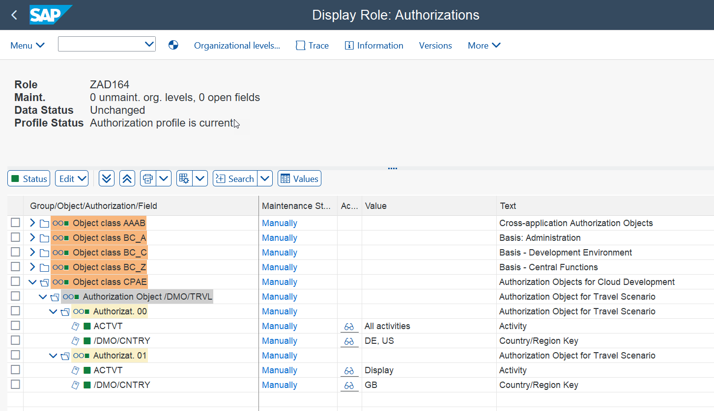
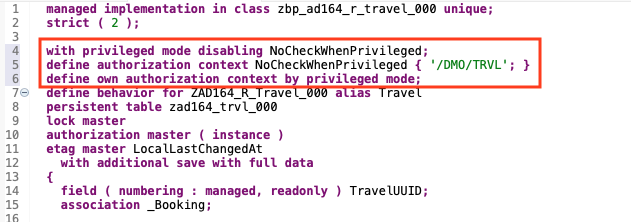
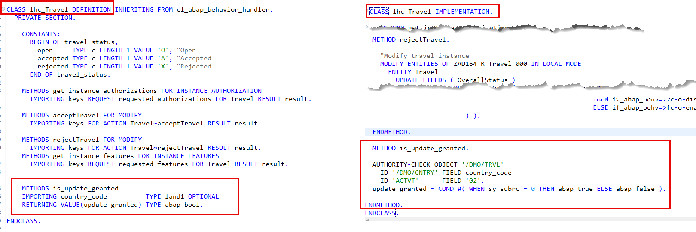

# \[Optional\] Exercise 8 - Add modify authorization checks

## Introduction

In the previous exercise, you added the business event `statusUpdated`, which is raised whenever one of the quick actions, `acceptTravel` or `rejectTravel`, is executed successfully (_[Exercise 7](../ex07/README.md)_).

In this exercise, you'll implement the instance authorization checks for _modify_ access to the _Travel_ and _Booking_ data using the authroization object`/DMO/TRVL`. The instance authorization will ensure that following operations of the entity can be checked against unauthorized access: create-by-association, update, delete, and instance actions.

To do this, you're going the adjust the behavior implementation class (aka _behavior pool_) `ZBP_AD164_R_Travel_###` to implement the authorization master of the base _Travel_ BO root node defined in the behavior definition `ZAD164_R_TRAVEL_###`. The authorization object `/DMO/TRVL` will be used to implement the _modify_ authorization checks.

### Exercise steps
- [Exercise 8.1: Understand the _modify_ authorization scenario](#exercise-81-understand-the-modify-authorization-scenario)
- [Exercise 8.2: Define the _privileged mode_ in the base BO](#exercise-82-define-the-privileged-mode-in-the-base-bo)
- [Exercise 8.3: Implement the modify authorization for the _Travel_ root entity](#exercise-83-implement-the-modify-authorization-for-the-travel-root-entity)
- [Exercise 8.4: Preview and test the enhanced app](#exercise-84-preview-and-test-the-enhanced-app)
- [Summary & Next exercise](#summary--next-exercise)

> [!TIP]
> - Always replace all occurrences of the placeholder **`###`** in the provided code snippets with your personal suffix.
> - Use the ADT function _**Find and Replace All**_ (**Ctrl+F**) to quickly replace text in the source code.
> - Use the ADT function _**Quick Fix**_ (**Ctrl+1**), aka _Quick Assist_, on an erroneous element to get help with resolving the issue.
> - Use the **Show ABAP element info** view (**F2**) to inspect an element in ADT editors.
> - [Useful Keyboard Shortcuts for ABAP Development](https://help.sap.com/docs/ABAP_PLATFORM_NEW/c238d694b825421f940829321ffa326a/4ec299d16e391014adc9fffe4e204223.html?version=latest) (ADT shortcuts)

**ℹ️ Note: About authorization control in RAP**

  
Click to expand!

  
> Authorization control in RAP protects your business object against unauthorized access to data.
> 
> - **Authorization Checks for Read Operations**  
>   To protect data from unauthorized read access, the ABAP CDS provides its own authorization concept based on a data control language (DCL). To restrict read access to RAP business objects, it's sufficient to model DCL for the CDS entities used in RAP business objects.
>   
> - **Authorization Checks for Modify Operations** (🎯 _Focus of this exercise_)    
>   In RAP business objects, modifying operations, such as standard operations and actions can be checked against unauthorized access during runtime. To retrieve user authorizations for incoming requests, authorization objects are included in the behavior implementation for your business objects. Authorization objects return authorization values.
>   
>   An entity is defined as an **authorization master** – using the statement `authorization master (global | instance)`) – if its operations include their own authorization logic. This means that, in the behavior implementation of this entity, the authorization checks must be implemented in the corresponding method for authorization — either global or instance. The authorization master must be defined as global, instance, or both.
>
>   An entity is defined as **authorization dependent** (`authorization dependent by _AssocToMaster`) if the authorization control from the authorization master entity shall also be applied for the operations of this entity. In this case, for the authorization check for the update, the delete, and the create-by-association operation on an authorization dependent entity, the authorization check for the update operation of the authorization master entity is applied.
>      
> Learn more: [Authorization Control in RAP](https://help.sap.com/docs/abap-cloud/abap-rap/authorization-control) | [Authorization Types & Definition](https://help.sap.com/docs/abap-cloud/abap-rap/authorization-definition)

---

## Exercise 8.1: Understand the _modify_ authorization scenario

> This scenario uses _instance authorization_, with _Travel_ entity as master and the _Booking_ entity as dependent.

  
🔵Click to expand!
   

The _modify_ authorization in this scenario is an **instance authorization** specified with the statement **`authorization master ( instance )`** in the behavior of the **_Travel_ root entity** and with the statement **`authorization dependent by _Travel`** in the behavior of the **_Booking_ child entity** in the behavior definition **`ZAD164_R_TRAVEL_###`**.
   
The **instance authorization** ensures that following operations of the entity can be checked against unauthorized access: create-by-association, update, delete, and instance actions.

End user with the authorization object **`/DMO/TRVL`** will be allowed to modify _Travel_ records only if for the allowed country codes maintained in the authorization field **`/DMO/CNTRY`** and the authorization field **`ACTVT`** contain the permitted activity value **`02`** (**_Change_**).

In this scenario, the role **`ZAD164`** contains the authorization object **`/DMO/TRVL`** with following authorizations: 
- `/DMO/CNTRY`: DE, US
- `ACTVT`: All activities (01: _Add or create_, 02: _Change_, 03: _Display_, and 06: _Delete_)

Additionaly, you will define an _authorization context_ (`NoCheckWhenPrivileged`) and the _privileged mode_ for the _Travel_ BO to disable authorization checks for **`/DMO/TRVL`** when it is accessed in privileged mode.

 

> ℹ️ **About _authorization context_**:    
> You can define an **authorization context** with a specific name using the statement **`define authorization context <ContextName>`**. The purpose of an authorization context is to list authorization objects belonging to this context. An authorization context can then, for example, be used to specify the authorization objects that are executed by the current RAP BO (_own context_) and/or that need to be suppressed when the RAP BO is being called in _privileged mode_.

> ℹ️ **About _privileged mode_**:   
> RAP business objects can offer the so called **privileged mode**. With _privileged mode_ in the behavior definition, RAP business object consumers can circumvent authorization checks performed by authorization objects that are called, for instance, by global- and instance authorization handlers. In the next exercise step, you will learn how to use the privileged mode.
> 
> You define privileged mode for the BO by disabling the authorization context using the clause with privileged mode disabling. As a result, authorization objects in this authorization context aren't checked during privileged access. Additional authorization contexts with specific names can be used to disable authorization checks that are performed in legacy code (such as BAPIs or function modules) invoked by the behavior implementation.   
 

 

## Exercise 8.2: Define the _privileged mode_ in the base BO

> Define the _authorization context_ `NoCheckWhenPrivileged` and enable _privileged mode_ in the base _Travel_ BO behavior definition `ZAD164_R_TRAVEL_###` to disable authorization checks for `/DMO/TRVL` when a RAP call is performed in _privileged mode_.

  
🔵Click to expand!
   
 
1. Go to the behavior definition **`ZAD164_R_TRAVEL_###`** and use the code snippet provided below to do following changes:
   - Insert the statement **`define authorization context NoCheckWhenPrivileged { '/DMO/TRVL'; }`** to define the authorization context **_NoCheckWhenPrivileged_** and list the authorization object `/DMO/TRVL` that shouldn’t be checked when an EML call is performed in privileged mode.
   - Insert the statement **`define own authorization context by privileged mode;`** to define the full authorization context. This authorization context is identical to the other one.
   - Insert the statement **`with privileged mode disabling NoCheckWhenPrivileged;`** to enable privileged mode for the authorization context **_NoCheckWhenPrivileged_**.
   
   To do this, insert the code snippet at the top of the behavior definition, directly below the statement **`strict ( 2 );`**.

   <pre lang="ABAP CDS">
     with privileged mode disabling NoCheckWhenPrivileged;
     define authorization context NoCheckWhenPrivileged { '/DMO/TRVL'; }
     define own authorization context by privileged mode;     
   </pre>
   
   

3. Now speficy the authorization checks for the quick actions **`acceptTravel`** and **`rejectTravel`** by replacing their definiton with the code snippet below in the curly brackets (`{...}`).

   The addition **`authorization:update`** delegates the authorization check for both actions to the _update_ operation. This is a common pattern to avoid that individual authorizations need to be implemented for each action, and instead just the check for the update operation needs to be implemented.    

   <pre lang="ABAP CDS">
    action ( features : instance, authorization : update ) acceptTravel result [1] $self;
    action ( features : instance, authorization : update ) rejectTravel result [1] $self;
   </pre>
   
4. Save (**Ctrl+S**) and activate (**Ctrl+F3**) the changes.

   You've defined the _privileged mode_ for the _Travel_ base BO. As a result, all authorization checks for the authorization object `/DMO/TRVL` are successful – irrespective of the actual user’s authorizations – if the RAP BO is called via EML in privileged mode.

   > ℹ️ The _privileged mode_ can be expose in the consumption layer in BO interfaces using the statement `with privileged mode disabling base context;` in the behavior interface. This is not required for the current scenario since Fiori UIs never work in _privileged mode_.
   
   The complete source code📄 of the behavior definition now looks as follows.
   
   

   
📄Click to expand!
  
   <pre lang="ABAP CDS">
    managed implementation in class zbp_ad164_r_travel_### unique;
    strict ( 2 );
    
    with privileged mode disabling NoCheckWhenPrivileged;
    define authorization context NoCheckWhenPrivileged { '/DMO/TRVL'; }
    define own authorization context by privileged mode;
    
    define behavior for ZAD164_R_Travel_### alias Travel
    persistent table zad164_trvl_###
    lock master
    authorization master ( instance )
    etag master LocalLastChangedAt
    with additional save with full data
    {
      field ( numbering : managed, readonly ) TravelUUID;
      association _Booking;
    
      internal update;
    
      event statusUpdated parameter ZAD164_A_StatusUpdated_###;
    
      action ( features : instance, authorization : update ) acceptTravel result [1] $self;
      action ( features : instance, authorization : update ) rejectTravel result [1] $self;
    
      mapping for zad164_trvl_###
        {
          AgencyID           = agency_id;
          BeginDate          = begin_date;
          BookingFee         = booking_fee;
          CurrencyCode       = currency_code;
          CustomerID         = customer_id;
          Description        = description;
          EndDate            = end_date;
          LastChangedAt      = last_changed_at;
          LocalCreatedAt     = local_created_at;
          LocalCreatedBy     = local_created_by;
          LocalLastChangedAt = local_last_changed_at;
          LocalLastChangedBy = local_last_changed_by;
          OverallStatus      = overall_status;
          TotalPrice         = total_price;
          TravelID           = travel_id;
          TravelUUID         = travel_uuid;
        }
    }
    
    define behavior for ZAD164_R_Booking_### alias Booking
    persistent table zad164_book_###
    lock dependent by _Travel
    authorization dependent by _Travel
    etag master LocalLastChangedAt
    {
      update;
      delete;
      field ( numbering : managed, readonly ) BookingUUID;
      field ( readonly ) TravelUUID;
      association _Travel;
    
      mapping for zad164_book_###
        {
          AirlineID          = carrier_id;
          BookingDate        = booking_date;
          BookingID          = booking_id;
          BookingStatus      = booking_status;
          BookingUUID        = booking_uuid;
          ConnectionID       = connection_id;
          CurrencyCode       = currency_code;
          CustomerID         = customer_id;
          FlightDate         = flight_date;
          FlightPrice        = flight_price;
          LocalLastChangedAt = local_last_changed_at;
          TravelUUID         = parent_uuid;
        }
    }
   </pre>
   

        

 

## Exercise 8.3: Implement the modify authorization for the _Travel_ root entity

> Implement the instance authorization in the behavior pool of the _Travel_ root entity `ZBP_AD164_R_TRAVEL_###`. It checks against `/DMO/TRVL` whether the current user is granted _change_ rights for the given _Travel_ records depending on the country code or not.  

### Exercise 8.3.1: Add the help method `is_granted`

> Define and implement the helper method `is_granted` in the local handler class `lhc_Travel` of the behavior pool `ZBP_AD164_R_TRAVEL_###`.

  
🔵Click to expand!
   
   
1. Open the behavior implementation class **`ZBP_AD164_R_TRAVEL_###`**, go to the **◇Local Types**, and add the method **`is_granted`** at the bottom of the private section of the class definition of the local handler class **`lhc_Travel`**.
  
   To do this, insert the code snippet below at the botton of class definition, between `CLASS lhc_Travel DEFINITION INHERITING...` and `ENDCLASS.`. 
  
   <pre lang="ABAP">
   METHODS is_update_granted
    IMPORTING country_code          TYPE land1 OPTIONAL
    RETURNING VALUE(update_granted) TYPE abap_bool.      
   </pre>

2. Add the method implementation **`is_update_granted`** by inserting the code snippet below at the bottom of the class implementation, between `CLASS lhc_Travel IMPLEMENTATION...` and `ENDCLASS.`.

   <pre lang="ABAP">
   METHOD is_update_granted.
  
     AUTHORITY-CHECK OBJECT '/DMO/TRVL'
       ID '/DMO/CNTRY' FIELD country_code
       ID 'ACTVT'      FIELD '02'.
     update_granted = COND #( WHEN sy-subrc = 0 THEN abap_true ELSE abap_false ).  
  
   ENDMETHOD.  
   </pre>   

3. Save (**Ctrl+S**) and activate (**Ctrl+F3**) the changes.

   
           

 

### Exercise 8.3.2: Implement the method `get_instance_authorizations`

> Implement the instance authorization checks in the standard method `get_instance_authorizations` of the local handler class `lhc_Travel` in the behavior pool `ZBP_AD164_R_TRAVEL_###`.

  
🔵Click to expand!
   
 
1. Go to the method **`get_instance_authorizations`** of the local handler class **`lhc_Travel`** located in the **◇Local Types** tab of the behavior implementation class **`ZBP_AD164_R_TRAVEL_###`**. 
   
2. You can take a look at the explicit and implicit interface parameters of the method by placing the cursor on the method name and pressing **F2** to open the **Element Info** dialog.

3. Now, implement the method by replacing the empty method implementation with the code snippet (🟡📄) provided below.

   

     
🟡📄 Click to expand!

     
     > - 💡 Make use of the _Copy Raw Content_ function () to copy the provided code snippet.
     
     <pre lang="ABAP">
     METHOD get_instance_authorizations.
      
        DATA: update_granted TYPE abap_bool.
    
        READ ENTITIES OF ZAD164_R_Travel_### IN LOCAL MODE
          ENTITY Travel
            FIELDS ( AgencyID )
            WITH CORRESPONDING #( keys )
            RESULT DATA(travels)
          FAILED failed.
    
        CHECK travels IS NOT INITIAL.
    
        SELECT FROM zad164_trvl_### AS travel
          INNER JOIN /dmo/i_agency AS agency ON travel~agency_id = agency~AgencyID
          FIELDS travel~travel_uuid , travel~agency_id, agency~CountryCode
          FOR ALL ENTRIES IN @travels
          WHERE travel_uuid EQ @travels-TravelUUID
          INTO  TABLE @DATA(travel_agency_country).
    
        LOOP AT travels INTO DATA(travel).
          READ TABLE travel_agency_country WITH KEY travel_uuid = travel-TravelUUID
            ASSIGNING FIELD-SYMBOL(&lttravel_agency_country_code&gt).
    
          IF sy-subrc EQ 0.
            update_granted = is_update_granted( &lttravel_agency_country_code&gt-CountryCode ).
            IF update_granted = abap_false.
              APPEND VALUE #( %tky              = travel-%tky
                              %msg              = NEW /dmo/cm_flight_messages(
                              textid    = /dmo/cm_flight_messages=>not_authorized_for_agencyid
                              agency_id = travel-AgencyID
                              severity  = if_abap_behv_message=>severity-error )
                              %element-AgencyID = if_abap_behv=>mk-on
                            ) TO reported-travel.
            ENDIF.
          ELSE.
            update_granted = abap_false.
          ENDIF.
    
          APPEND VALUE #( %tky = travel-%tky
                          %update = COND #( WHEN update_granted = abap_true
                                            THEN if_abap_behv=>auth-allowed
                                            ELSE if_abap_behv=>auth-unauthorized )
                        ) TO result.
        ENDLOOP.
    
      ENDMETHOD.     
     </pre>
  
   > **Brief explanation:**   🚧...🚧
   > 

   >    
ℹ️ Click to expand the details!

   >           
   > 
   > 
    
   
   
   
  
4. Save (**Ctrl+S**) and activate (**Ctrl+F3**) the changes.

   The full source code of the local handler class `lhc_Travel` in the behavior pool now looks as follows.

   

     
📄Click to expand!

     
     <pre lang="ABAP">
      CLASS lhc_Travel DEFINITION INHERITING FROM cl_abap_behavior_handler.
        PRIVATE SECTION.
      
          CONSTANTS:
            BEGIN OF travel_status,
              open     TYPE c LENGTH 1 VALUE 'O', "Open
              accepted TYPE c LENGTH 1 VALUE 'A', "Accepted
              rejected TYPE c LENGTH 1 VALUE 'X', "Rejected
            END OF travel_status.
      
          METHODS get_instance_authorizations FOR INSTANCE AUTHORIZATION
            IMPORTING keys REQUEST requested_authorizations FOR Travel RESULT result.
      
          METHODS acceptTravel FOR MODIFY
            IMPORTING keys FOR ACTION Travel~acceptTravel RESULT result.
      
          METHODS rejectTravel FOR MODIFY
            IMPORTING keys FOR ACTION Travel~rejectTravel RESULT result.
       
          METHODS get_instance_features FOR INSTANCE FEATURES
            IMPORTING keys REQUEST requested_features FOR Travel RESULT result.

          METHODS is_update_granted
            IMPORTING country_code          TYPE land1 OPTIONAL
            RETURNING VALUE(update_granted) TYPE abap_bool.       
      
      ENDCLASS.
      
      CLASS lhc_Travel IMPLEMENTATION.
      
        METHOD get_instance_authorizations.
      
           DATA: update_granted TYPE abap_bool.
      
           READ ENTITIES OF ZAD164_R_Travel_### IN LOCAL MODE
             ENTITY Travel
               FIELDS ( AgencyID )
               WITH CORRESPONDING #( keys )
               RESULT DATA(travels)
             FAILED failed.
      
           CHECK travels IS NOT INITIAL.
      
           SELECT FROM zad164_trvl_### AS travel
             INNER JOIN /dmo/i_agency AS agency ON travel~agency_id = agency~AgencyID
             FIELDS travel~travel_uuid , travel~agency_id, agency~CountryCode
             FOR ALL ENTRIES IN @travels
             WHERE travel_uuid EQ @travels-TravelUUID
             INTO  TABLE @DATA(travel_agency_country).
      
           LOOP AT travels INTO DATA(travel).
             READ TABLE travel_agency_country WITH KEY travel_uuid = travel-TravelUUID
               ASSIGNING FIELD-SYMBOL(<travel_agency_country_code>).
      
             IF sy-subrc EQ 0.
               update_granted = is_update_granted( <travel_agency_country_code>-CountryCode ).
               IF update_granted = abap_false.
                 APPEND VALUE #( %tky              = travel-%tky
                                 %msg              = NEW /dmo/cm_flight_messages(
                                 textid    = /dmo/cm_flight_messages=>not_authorized_for_agencyid
                                 agency_id = travel-AgencyID
                                 severity  = if_abap_behv_message=>severity-error )
                                 %element-AgencyID = if_abap_behv=>mk-on
                               ) TO reported-travel.
               ENDIF.
             ELSE.
               update_granted = abap_false.
             ENDIF.
      
             APPEND VALUE #( %tky = travel-%tky
                             %update = COND #( WHEN update_granted = abap_true
                                               THEN if_abap_behv=>auth-allowed
                                               ELSE if_abap_behv=>auth-unauthorized )
                           ) TO result.
           ENDLOOP.
      
         ENDMETHOD.       
      
        METHOD acceptTravel.
      
          "Modify travel instance
          MODIFY ENTITIES OF ZAD164_R_Travel_### IN LOCAL MODE
            ENTITY Travel
              UPDATE FIELDS ( OverallStatus )
              WITH VALUE #( FOR key IN keys ( %tky          = key-%tky
                                              OverallStatus = travel_status-accepted ) ).
      
          "Read changed data for action result
          READ ENTITIES OF ZAD164_R_Travel_### IN LOCAL MODE
            ENTITY Travel
              ALL FIELDS WITH
              CORRESPONDING #( keys )
            RESULT DATA(travels).
      
          result = VALUE #( FOR travel IN travels ( %tky   = travel-%tky
                                                    %param = travel ) ).
        ENDMETHOD.
      
        METHOD rejectTravel.
      
          "Modify travel instance
          MODIFY ENTITIES OF ZAD164_R_Travel_### IN LOCAL MODE
            ENTITY Travel
              UPDATE FIELDS ( OverallStatus )
              WITH VALUE #( FOR key IN keys ( %tky          = key-%tky
                                              OverallStatus = travel_status-rejected ) ).
      
          "Read changed data for action result
          READ ENTITIES OF ZAD164_R_Travel_### IN LOCAL MODE
            ENTITY Travel
              ALL FIELDS WITH
              CORRESPONDING #( keys )
            RESULT DATA(travels).
      
          result = VALUE #( FOR travel IN travels ( %tky   = travel-%tky
                                                    %param = travel ) ).
        ENDMETHOD.
      
        METHOD get_instance_features.
          READ ENTITIES OF ZAD164_R_Travel_### IN LOCAL MODE
            ENTITY Travel
              FIELDS ( OverallStatus )
              WITH CORRESPONDING #( keys )
            RESULT DATA(travels)
            FAILED failed.
      
          result = VALUE #( FOR travel IN travels
                                ( %tky                 = travel-%tky
                                  %action-acceptTravel = COND #( WHEN travel-OverallStatus = travel_status-accepted
                                                                 THEN if_abap_behv=>fc-o-disabled
                                                                 ELSE if_abap_behv=>fc-o-enabled )
                                  %action-rejectTravel = COND #( WHEN travel-OverallStatus = travel_status-rejected
                                                                 THEN if_abap_behv=>fc-o-disabled
                                                                 ELSE if_abap_behv=>fc-o-enabled )
                                ) ).
      
        ENDMETHOD.

        METHOD is_update_granted.
      
          AUTHORITY-CHECK OBJECT '/DMO/TRVL'
            ID '/DMO/CNTRY' FIELD country_code
            ID 'ACTVT'      FIELD '02'.
          update_granted = COND #( WHEN sy-subrc = 0 THEN abap_true ELSE abap_false ).
      
        ENDMETHOD.       
      
      ENDCLASS.
   </pre>
   
   
     
        

 

## Exercise 8.4: Preview and test the enhanced app

> Check the new behavior of your _Manage Travels_ app induced by the implemented _modify_ authorization checks.

>[!NOTE]
> You won't be able to test the _priviliged mode_ in this exercise, as this requires a call via EML APIs outside the _Travel_ BO. This will be done in _Exercise 10_.

  
🔵Click to expand!
   
 
 1. Go to the app in the browser if still open or else, start the app preview again from your service binding  **`ZAD164_UI_Travel_O4_###`**.
    
 2. Now, go to your _Manage Travels_ app and, for example, and accept or reject a _Travel_ entry using the respective buttons, _Accept Travel_ and _reject Travel_. 
    
       
  
 

        

 

## Summary & Next exercise

Now you've implemented the instance authorization for the _Travel_ BO to ensure that the quick actions are checked against unauthorized access. You've also enabled _privileged mode_ to allow consumers to circumvent authorization checks performed by authorization objects.

You can continue with the next **optional** exercise - **[Exercise 9: Full transactional enablement of the _Travel_ BO](../ex09/README.md)**.

---
