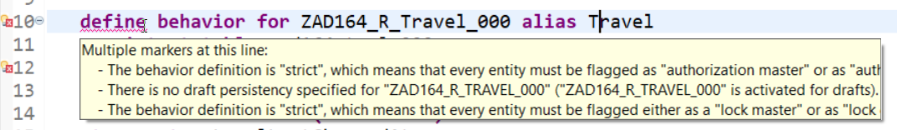
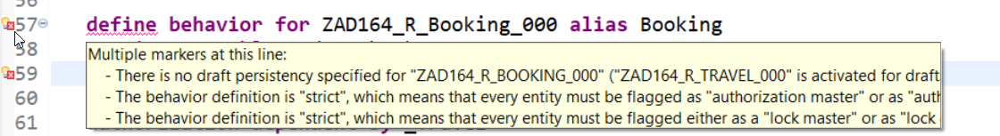
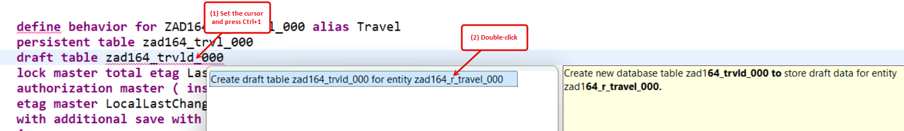
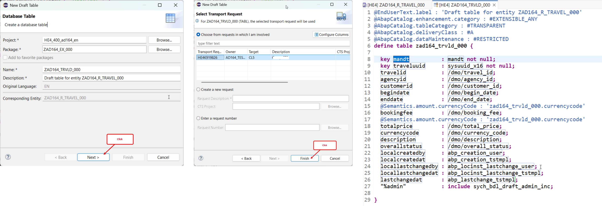
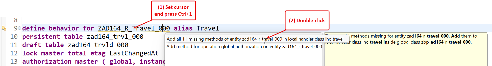
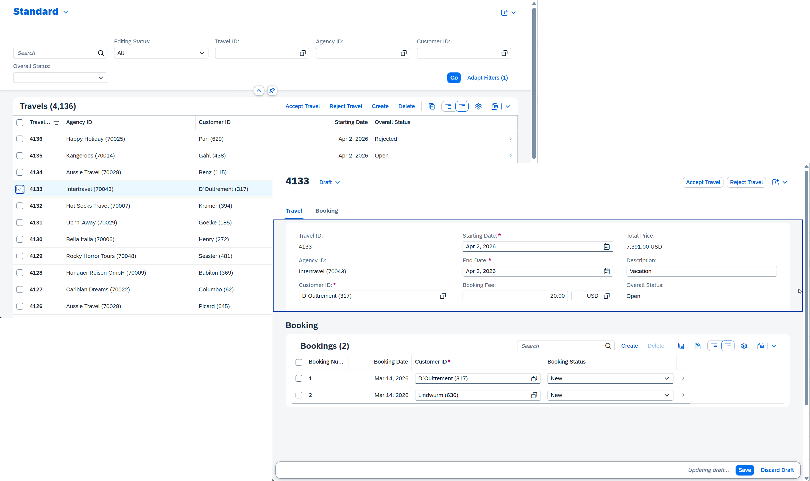

# \[Optional\] Exercise 9: Full transactional enablement of the _Travel_ BO

> [!NOTE] 
> **This exercise is optional.**

## Introduction
You've implemented instance authorization checks for modify operations on the _Travel_ records in the previous exercise - [_Exercise 8_](../ex08/README.md). 

In this exercise, you will enhance the _Travel_ BO to support full transactional behavior – that is full create, update, and delete operations, with draft handling. 
To do this, you will enhance the behavior definition `ZAD164_R_TRAVEL_###` and  the behavior projection `ZAD164_C_TRAVEL_###`, where `###`is your personal suffix.

### Exercise steps
- [Exercise 9.1: Enhance the behavior of the base _Travel_ BO](#exercise-91-enhance-the-behavior-of-the-base-travel-bo)
- [Exercise 9.2: Enhance the base _Travel_ behavior implementation](#exercise-92-enhance-the-base-travel-behavior-implementation)
- [Exercise 9.3: Enhance the behavior of the _Travel_ BO projection](#exercise-93-enhance-the-behavior-of-the-travel-bo-projection)
- [Exercise 9.4: Preview and test the enhanced app](#exercise-94-preview-and-test-the-enhanced-app)
- [Summary & Next exercise](#summary--next-exercise)

<!--
- [Exercise 9.4: Extended _Manage Travels_ app](#exercise-94-extended-manage-travels-app)
-->

> [!TIP]
> - Always replace all occurrences of the placeholder **`###`** in the provided code snippets with your personal suffix.
> - Use the Pretty Printer function in ADT by pressing **Shift+F1** to format your source code. Configure it, if not yet done.
> - Use the ADT function _**Find and Replace All**_ (**Ctrl+F**) to quickly replace text in the source code.
> - Use the ADT function _**Quick Fix**_ (**Ctrl+1**), aka _Quick Assist_, on an erroneous element to get help with resolving the issue.
> - Use the **Show ABAP element info** view (**F2**) to inspect an element in ADT editors.
> - [Useful Keyboard Shortcuts for ABAP Development](https://help.sap.com/docs/ABAP_PLATFORM_NEW/c238d694b825421f940829321ffa326a/4ec299d16e391014adc9fffe4e204223.html?version=latest) (ADT shortcuts)

<!--

**ℹ️ About ...**

  
Click to expand!

  
> ...
> Learn more:

-->

---

## Exercise 9.1: Enhance the behavior of the base _Travel_ BO 

> Enhance the behavior definition `ZAD164_R_Travel_###` to enable the full standard transactional behavior of the base _Travel_ BO – CRUD: create, update, and delete – and activate draft handling to temporarily store transient data until it is persisted in the database.

  
🔵Click to expand!
   
 
1. Open the behavior definition **`ZAD164_R_Travel_###`** in the _Project Explorer_ and start the adjustment.

2. For the full enablement of the _create_, _update_, and _delete_ operations, as well as the draft handling, you need to do following adjustments: 

   - Add the full CUD operations: `Create`, `Update`, `Delete`, _Create-by-association_, etc...
   - Enable the draft handling for the _Travel_ BO, the _create-by-association_ operation, etc...
   - Add the draft actions `Resume`, `Edit`, `Activate`, and `Discard`, and the determine action `Prepare`.  
     Note: These draft actions are fully managed by the RAP application infrastructure

   Due to time constraints, simply replace the complete source code with the one (🟡📄) provided below and replace all occurrences of **`###`** with your personal suffix using the _Replace All_ function (**Ctrl+F**).

   > - 💡 Make use of the _Copy Raw Content_ () function to copy the source code.
   > - 🔍 Review the source code and feel free to ask the instructors if anything is unclear.           
     
   🟡📄 **Source code document**: [Behavior Definition 01: ZAD164_R_Travel_###](images/ex09_bdef_zad164_r_travel_02.txt)

   The changes are highlighted in the screenshot below.

   

     
🖼️Click to expand!

     
   
   

3. Save (**Ctrl+S**) the changes.
   
   > ℹ️ **Note**     
   > You will not be able to activate the changes now because of missing draft persitencies `zad164_trvld_###` and `zad164_bookd_###` and
   > other issues that will be fixed in the next steps.   
   >  <table>
   >   <tr></tr>
   >   <tr> </tr>   
   > </table>   

4. Generate the missing draft table **`zad164_trvld_###`** for storing draft _travel_ data using the ADT _Quick Fix_ function. To do this, perform the steps below.  

   1. Place the cursor on the draft table name **`zad164_travld_###`**, press **Ctrl+1** to open the **Quick Assist** view, and double-click on **`Create draft table zad164_...d_### to store draft data for entity zad164_r_..._###.`** to generate the missing database table.

      
      
   2. Keep the prefilled entries in the appearing dialog and click **Next >**, assign a transport request if needed, and press **Finish** to confirm the creation of the draft table. The generated draft database table is now displayed in the editor.

      

   3. Save (**Ctrl+S**) and activate (**Ctrl+F3**) the new database table.

5. Generate the missing draft table **`zad164_bookd_###`** for storing draft _booking_ data using the ADT _Quick Fix_ function, following the same steps as before.

   1. Place the cursor on the draft table name **`zad164_bookd_###`**, press **Ctrl+1** to open the **Quick Assist** view, and double-click on **`Create draft table zad164_...d_### to store draft data for entity zad164_r_..._###.`** to generate the missing database table.

   2. Keep the prefilled entries in the appearing dialog and click **Next >**, assign a transport request if needed, and press **Finish** to confirm the creation of the draft table. The generated draft database table is now displayed in the editor.

   3. Save (**Ctrl+S**) and activate (**Ctrl+F3**) the new database table.
  
6. You can now go back to the behavior definition **`ZAD164_R_Travel_###`**.

   > ℹ️ **Note:**
   > These are the adjustments you need to specify in the base BO behavior definition for the full CRUD enablement. Now further enhance the base BO behavior.

7. Enhance the base _Travel_ BO behavior definition with validations, determinations, internal actions, and side effects. Also add a precheck for the _create_ and _update_ operations, the global _modify_ authorization, and more.

     For the _Travel_ BO entity:     
   - **Validations**: `validateCustomer`, `validateAgency`, `validateDates`, and `validateCurrencyCode` – to check the values for the entered customer, agency, the dates and currency code, respectively.
   -  **Determinations**: `setTravelNumber`, `setStatusToOpen`, and `calculateTotalPrice` – to set the Travel ID and the initial overal travel status at creation, and calculate the total price at creation or everytime the booking fee and/or currency code are changed.
   -  **Internal actions**: `reCalcTotalPrice` – to re-calculate the total price each time it is called inside the BO.   
   -  **Side effects**: to trigger an update of the total price each time the booking fee changes.
      
     For the _Booking_ BO entity:     
   - **Validations**: `validateCustomer`, `validateConnection`, `validateFlightPrice`, and `validateCurrencyCode` – to check the values for the entered customer, connection, flight price, and currency code, respectively.
   -  **Determinations**: `setBookingNumber`, `setBookingDate`, and `calculateTotalPrice` – to set the booking ID and the booking date at creation, and calculate the total price at creation or everytime the flight price and/or currency code are changed.
   -  **Side effects**: to trigger an update of the total price each time the flight price changes.

   Due to time constraints, simply replace the complete source code with the one (🟡📄) provided below and replace all occurrences of **`###`** with your personal suffix using the _Replace All_ function (**Ctrl+F**).

   > - 💡 Make use of the _Copy Raw Content_ () function to copy the source code.
   > - 🔍 Review the source code and feel free to ask the instructors if anything is unclear.           
     
   🟡📄 **Source code document**: [Behavior Definition 02: ZAD164_R_Travel_###](images/ex09_bdef_zad164_r_travel_02.txt)

8. Save (**Ctrl+S**) and activate (**Ctrl+F3**) the changes.

9. To enhance the behavior implementation class **`zbp_ad164_r_travel_###`**, simply go directly to the next exercise (_Exercise 9.2_) ...
     
   

     
Click to expand!
  
     
     
   ... or first trigger the addition of the missing methods using the *Quick Fix* function (*Ctrl+1*) in the behavior definition  as described below.
   
   For the _Travel_ BO entity, go to the yellow-underlined statement **`define behavior for ZAD164_R_Travel_### alias Travel`**, place the cursor on the behavior name, press **Ctrl+1** to start the _Quick Assist_ view, and double-click the entry Add **`There are 11 methods missing for entity zad164_r_travel_###. Add them to 
local handler class lhc_travel inside global class zbp_ad164_r_travel_###.`** in the dialog to open the class creation wizard. This will trigger an adjustment of the local handler class **`lhc_travel`**.

   
       
   Save (**Ctrl+S**) and go back to the behavior defintiion.
       
   For the _Booking_ BO entity, go to one of the yellow-underlined statements – e.g. **`determination setBookingNumber on save { create; }`** –,  place the cursor on the determination name, press **Ctrl+1** to start the _Quick Assist_ view, and double-click the entry Add **`There are 7 methods missing for entity zad164_r_booking_###. Add them 
within a new local handler class inside global class zbp_ad164_r_travel_###.`** in the dialog to open the class creation wizard. This will trigger the addition of a new local handler class for the booking entity to the the _travel_ behavior pool. This will trigger the addition of the local handler class **`lhc_booking`**

      
      
   Save (**Ctrl+S**) the behavior pool and go ahead with the next exercise.
    
   
  

  

## Exercise 9.2: Enhance the base _Travel_ behavior implementation

> Implement the logic of additional base Travel BO behavior defined in the previous step in the behavior implementation class (aka behavior pool) `ZBP_AD164_R_Travel_###`.

  
🔵Click to expand!
   

1. Open the class (../images/adt_class.png)**`ZBP_AD164_R_Travel_###`** in the _Relation Explorer_ and go to the **◇Local Types** tab.

2. Due to time constraints, simply replace the complete source code with the one provided below (🟡📄) and replace **`###`** with your personal suffix using the _Replace All_ function (**Ctrl+F**).

   > - 💡 Make use of the _Copy Raw Content_ () function to copy the source code.
   > - 🔍 Review the source code and feel free to ask the instructors if anything is unclear.           
     
   🟡📄 **Source code document**: [Behavior Pool: ZBP_AD164_R_Travel_###](images/ex09_class_zbp_ad164_r_travel.txt)

3. Save (**Ctrl+S**) and activate (**Ctrl+F3**) the changes.

   
## Exercise 9.3: Enhance the behavior of the _Travel_ BO projection

> Expose the enhanced transactional behavior to the consumption layer by adjusting the behavior of the _Travel_ BO projection `ZAD164_C_Travel_###`.
> 
> **Note**: Validations and determinations are automatically trigerred by the RAP application infrastructure at the deined time. CUD, draft handling, actions, side effects and other non-standard behavior must be exposed explicitely to the consumption layer, namely the BO projections and BO interfaces..  

  
🔵Click to expand!
   

1. Open the behavior projection **`ZAD164_C_Travel_###`** in the _Relation Explorer_.

2. Now expose the CUD operations, the draft handling, and the side effects to the consumption layer.
       
   Due to time constraints, simply replace the complete source code with the one provided below (🟡📄) and replace **`###`** with your personal suffix.
   
   

   
🟡📄Click to expand!
    
     
   <pre lang="ABAP CDS">
    projection;
    strict ( 2 );
    use draft;
    use side effects;
  
    define behavior for ZAD164_C_Travel_### alias Travel
    {  
      use create;
      use update;
      use delete;
  
      use action acceptTravel;
      use action rejectTravel;
  
      use action Edit;
      use action Activate;
      use action Discard;
      use action Prepare;
      use action Resume;
  
      use association _Booking { create; with draft; }
    }
  
    define behavior for ZAD164_C_Booking_### alias Booking
    {
      use update;
      use delete;
  
      use association _Travel { with draft; }
    }
   </pre>

   
  
     
   The changes are highlighted in the screenshot below.

   

     
🖼️Click to expand!

     
   
  

4. Save (**Ctrl+S**) and activate (**Ctrl+F3**) the changes.
   

 

## Exercise 9.4: Preview and test the enhanced app

> Check the new behavior of your _Manage Travels_ app resulting from the full transactional enablement of the _Travel_ BO.
> You can now create new _travel_ and _booking_ records, and edit or delete existing ones.

  
🔵Click to expand!
   
 
 1. Go to the app in the browser if still open or else, start the app preview again from your service binding  **`ZAD164_UI_Travel_O4_###`**.
    
    The standard **Create**, **Edit**, and **Delete** buttons should appears on the UI. 
   
 2. Now, go ahead and try to create new _travel_ and _booking_ records, and edit or delete existing ones. 
    
     
        

 

## Summary & Next exercise

Now you've enhanced the _Travel_ BO to support full transactional behavior – that is full create, update, and delete operations, with draft handling.

You can continue with the next **optional** exercise - **[Exercise 10: Exploring the Entity Manipulation Language (EML)](../ex10/README.md)**.

---
