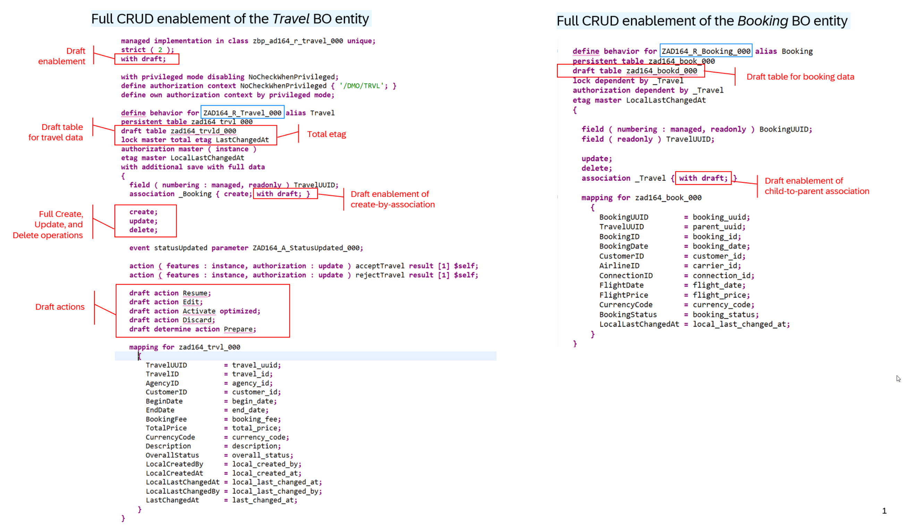

# \[Optional\] Exercise 9: Full transactional enablement of the _Travel_ BO

You've implemented instance authorization checks for modify operations on the _Travel_ records by in the previous exercise - [_Exercise 8_](../ex08/README.md). 

In this exercise, you will enhance the _Travel_ BO to support full transactional behavior – that is full create, update, and delete operations, with draft handling. 
To do this, you will enhance the behavior definition `ZAD164_R_TRAVEL_###` and  the behavior projection `ZAD164_C_TRAVEL_###`, where `###`is your personal suffix.

### Exercise steps
- [Exercise 9.1: Enhance the behavior of the base _Travel_ BO](#exercise-91-enhance-the-behavior-of-the-base-travel-bo)
- [Exercise 9.2: Enhance the behavior of the _Travel_ BO projection](#exercise-92-enhance-the-behavior-of-the-travel-bo-projection)
- [Exercise 9.3: Preview and test the enhanced app](#exercise-93-preview-and-test-the-enhanced-app)
- [Exercise 9.4: Extended _Manage Travels_ app](#exercise-94-extended-manage-travels-app)
- [Summary & Next exercise](#summary--next-exercise)

> [!TIP]
> - Always replace all occurrences of the placeholder **`###`** in the provided code snippets with your personal suffix.
> - Use the Pretty Printer function in ADt by press **Shift+F1** to format your source code. Configure it, if not yet done.
> - Use the ADT function _**Find and Replace All**_ (**Ctrl+F**) to quickly replace text in the source code.
> - Use the ADT function _**Quick Fix**_ (**Ctrl+1**), aka _Quick Assist_, on an erroneous element to get help with resolving the issue.
> - Use the **Show ABAP element info** view (**F2**) to inspect an element in ADT editors.
> - [Useful Keyboard Shortcuts for ABAP Development](https://help.sap.com/docs/ABAP_PLATFORM_NEW/c238d694b825421f940829321ffa326a/4ec299d16e391014adc9fffe4e204223.html?version=latest) (ADT shortcuts)

<!--

**ℹ️ About ...**

  
Click to expand!

  
> ...
> Learn more:

-->

---

## Exercise 9.1: Enhance the behavior of the base _Travel_ BO 

> Enhance the behavior definition `ZAD164_R_Travel_###` to enable the full standard transactional behavior of the base _Travel_ BO – CRUD: create, update, and delete – and activate draft handling to temporarily store transient data until it is persisted in the database.
> 
> To do this, you will enable the standard transactional behavior of the base _Travel_ and _Booking_ BO entities in  the behavior of **`ZAD164_R_Travel_###` and **`ZAD164_R_Booking_###`.

  
🔵Click to expand!
   
 
1. Open the behavior definition **`ZAD164_R_Travel_###`** in the _Project Explorer_ and start the adjustment.

2. Due to time constraints, simply replace the complete source code of with the one (🟡📄) provided below and replace all occurrences of **`###`** with your personal suffix. 

   The changes are explained below.

   

    
🟡📄Click to expand!
 
    
     <pre lang="ABAP CDS"> 
      managed implementation in class zbp_ad164_r_travel_### unique;
      strict ( 2 );
      with draft;
      
      with privileged mode disabling NoCheckWhenPrivileged;
      define authorization context NoCheckWhenPrivileged { '/DMO/TRVL'; }
      define own authorization context by privileged mode;
      
      define behavior for ZAD164_R_Travel_### alias Travel
      persistent table zad164_trvl_###
      draft table zad164_trvld_###
      lock master total etag LastChangedAt
      authorization master ( instance )
      etag master LocalLastChangedAt
      with additional save with full data
      {
        field ( numbering : managed, readonly ) TravelUUID;
        association _Booking { create; with draft; }
      
        create;
        update;
        delete;
      
        event statusUpdated parameter ZAD164_A_StatusUpdated_###;
      
        action ( features : instance, authorization : update ) acceptTravel result [1] $self;
        action ( features : instance, authorization : update ) rejectTravel result [1] $self;
      
        draft action Resume;
        draft action Edit;
        draft action Activate optimized;
        draft action Discard;
        draft determine action Prepare;
      
        mapping for zad164_trvl_###
          {
            TravelUUID         = travel_uuid;
            TravelID           = travel_id;
            AgencyID           = agency_id;
            CustomerID         = customer_id;
            BeginDate          = begin_date;
            EndDate            = end_date;
            BookingFee         = booking_fee;
            TotalPrice         = total_price;
            CurrencyCode       = currency_code;
            Description        = description;
            OverallStatus      = overall_status;
            LocalCreatedBy     = local_created_by;
            LocalCreatedAt     = local_created_at;
            LocalLastChangedAt = local_last_changed_at;
            LocalLastChangedBy = local_last_changed_by;
            LastChangedAt      = last_changed_at;
          }
      }
      
      define behavior for ZAD164_R_Booking_### alias Booking
      persistent table zad164_book_###
      draft table zad164_bookd_###
      lock dependent by _Travel
      authorization dependent by _Travel
      etag master LocalLastChangedAt
      {
      
        field ( numbering : managed, readonly ) BookingUUID;
        field ( readonly ) TravelUUID;
      
        update;
        delete;
        association _Travel { with draft; }
      
        mapping for zad164_book_###
          {
            BookingUUID        = booking_uuid;
            TravelUUID         = parent_uuid;
            BookingID          = booking_id;
            BookingDate        = booking_date;
            CustomerID         = customer_id;
            AirlineID          = carrier_id;
            ConnectionID       = connection_id;
            FlightDate         = flight_date;
            FlightPrice        = flight_price;
            CurrencyCode       = currency_code;
            BookingStatus      = booking_status;
            LocalLastChangedAt = local_last_changed_at;
          }
      }
     </pre>
   

   The changes are highlighted in the screenshot below.

   

     
🖼️Click to expand!

     
   
   

3. Save (**Ctrl+S**) the changes.
   
   > ⚠️ **Note**: You will not be able to activate the changes now because of missing draft tables `zad164_trvld_###` and `zad164_bookd_###`.   

4. Generate the draft database tables **`zad164_trvld_###`** and **`zad164_bookd_###`** using the ADT _Quick Fix_ function.
  
   Perform the steps below for both tables to do so.  
   1) Place the cursor on the table name (`zad164_travld_###` or `zad164_bookd_###`) and press **Ctrl+1** to open the **Quick Assist** view.
   2) Doppel-click on **`Ceate draft table zad164_...d_### to store draft data for entity zad164_r_..._###.`** to generate the missing database table. 
      The generated draft database table is now displayed in the editor.
   3) Save (**Ctrl+S**) and activate (**Ctrl+F3**) the new database table.
   
5. You can now go back to the behavior definition **`ZAD164_R_Travel_###`**, save (**Ctrl+S**), and activate (**Ctrl+F3**) the changes.

6. **Brief explanation** ⚠️🚧 TODO 🚧⚠️

   

     
ℹ️Click to expand!

     
     1) Add statement **`with draft;`** at the top of the behavior definition, directly below the statement **`strict ( 2 );`**.

     2) ...
   
       - Insert code snippet below in the curly bracket `{ }` as displayed on the screenshot
         
         <pre lang="ABAP=> 
           ...
         </pre>
         
   
  

 

## Exercise 9.2: Enhance the behavior of the _Travel_ BO projection

> Expose the enhanced transactional behavior to the consumption layer by adjusting the behavior of the _Travel_ BO projection `ZAD164_C_Travel_###`. 

  
🔵Click to expand!
   

1. Open the behavior projection **`ZAD164_C_Travel_###`** in the _Relation Explorer_.

2. Due to time constraints, simply replace the complete source code of with the one provided below (🟡🚧) and replace **`###`** with your personal suffix.
   
   The changes are explained below.

   <pre lang="ABAP CDS"> 
    projection;
    strict ( 2 );
    use draft;
  
    define behavior for ZAD164_C_Travel_### alias Travel
    {
  
      use create;
      use update;
      use delete;
  
      use action acceptTravel;
      use action rejectTravel;
  
      use action Edit;
      use action Activate;
      use action Discard;
      use action Prepare;
      use action Resume;
  
      use association _Booking { create; with draft; }
    }
  
    define behavior for ZAD164_C_Booking_### alias Booking
    {
      use update;
      use delete;
  
      use association _Travel { with draft; }
    }
   </pre>

   The changes are highlighted in the screenshot below.

   

     
🖼️Click to expand!

     
   
  

4. Save (**Ctrl+S**) and activate (**Ctrl+F3**) the changes.

<!--
5. **Brief explanation** ⚠️🚧

   

     
ℹ️Click to expand!

     
     1) Add statement **`with draft;`** at the top of the behavior definition, directly below the statement **`strict ( 2 );`**.

     2) Use the keyword **`use`** to expose the CRUD operations defined in the base _Travel_ BO entity in projected entity **`ZAD164_C_Travel_###`**.
   
       - Insert code snippet below in the curly bracket `{ }` as displayed on the screenshot
         
         <pre lang="ABAP=> 
           use create;
           use update;
           use delete;
         </pre>
         
   
  
    -->
    

 

## Exercise 9.3: Preview and test the enhanced app

> Check the new behavior of your _Manage Travels_ app resulting from the full transactional enablement of the _Travel_ BO.
> You can now create new _travel_ and _booking_ records, and edit or delete existing ones.

  
🔵Click to expand!
   
 
 1. Go to the app in the browser if still open or else, start the app preview again from your service binding  **`ZAD164_UI_Travel_O4_###`**.
    
    The standard **Create**, **Edit**, and **Delete** buttons should appears on the UI. 
   
 2. Now, go ahead and try to create new _travel_ and _booking_ records, and edit or delete existing ones. 
    
        
        

 

## Exercise 9.4: Extended _Manage Travels_ app

> Start the extended _Manage Travels_ app in the solution package `ZAD164_SOL_RAP_EXT`.
> 
> Various RAP features are implemented in the extended _Manage Travels_ app – such as [validations](https://help.sap.com/docs/btp/sap-abap-restful-application-programming-model/validations?version=Cloud), [determinations](https://help.sap.com/docs/btp/sap-abap-restful-application-programming-model/determinations?version=Cloud), and [(event-driven) side effects](https://help.sap.com/docs/btp/sap-abap-restful-application-programming-model/side-effects?version=Cloud). You can learn more about
> the implementation of this app in the [RAP Development Guide](https://help.sap.com/docs/abap-cloud/abap-rap/developing-transactional-apps-with-draft-capabilities?version=sap_btp).

  
🔵Click to expand!
   
 
 1. Add the solution package **`ZAD164_SOL_RAP_EXT`** to your **Favorite Packages** folder in the _Relation Explorer_.
    
 2. Navigate to the sub-folder **Business Services** > **Service Bindings** and double-click the service binding **`ZAD164_UI_TRAVEL_O4_EXT`**.

 3. In the service binding, select the leading entity (), **_Travel_** in the ***Entity Set and Association*** area, and either right-click it and choose _Open Fiori elements App preview_ from the context menu, or choose the Preview button, simply double-click it to start the Fiori elements app preview in the browser.
     
     
    
  4. Click the **Go** button () to load the data and play around with the extended app.

  5.  You can also take a look at the behavior definition of the base _Travel_ BO **`ZAD164_R_TRAVEL_EXT`** and the _Travel_ BO projection **`ZAD164_C_TRAVEL_EXT`**.
    
    💡 Feel free to ask questions to the SAP experts available in the room.
        

 

## Summary & Next exercise

Now you've enhanced the _Travel_ BO to support full transactional behavior – that is full create, update, and delete operations, with draft handling.

You can continue with the next **optional** exercise - **[Exercise 10: Exploring the Entity Manipulation Language (EML)](../ex10/README.md)**.

---
