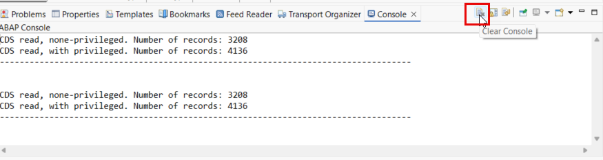
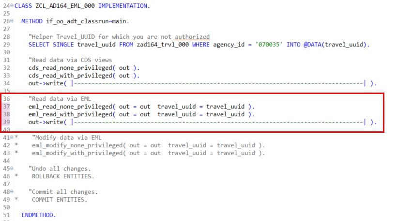
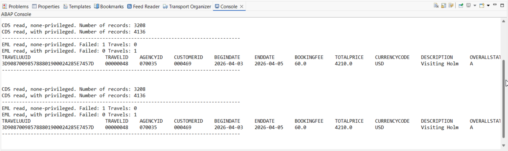
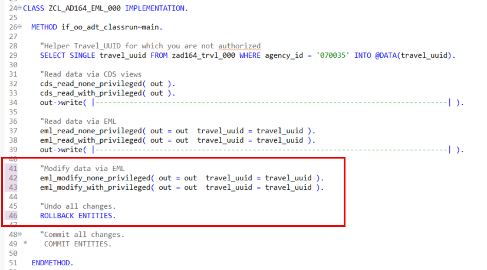
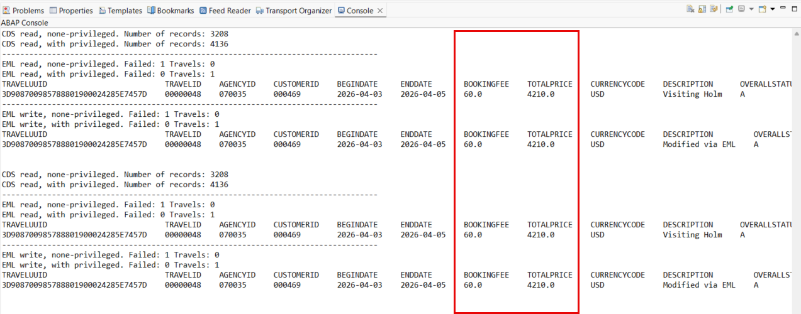
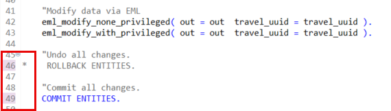
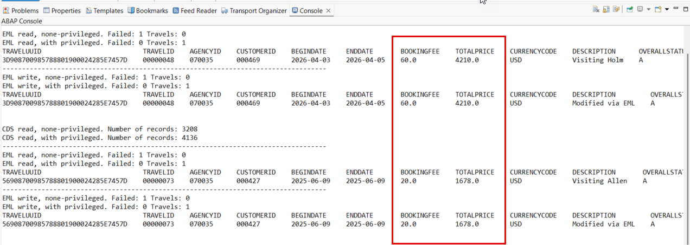

# \[Optional\] Exercise 10: Working with the Entity Manipulation Language (EML)

> [!NOTE] 
> **This exercise is optional.**

## Introduction

In the previous exercise, you've enhanced the Travel BO to support full transactional behavior – that is full create, update, and delete operations, and enable draft handling to temporarily store transient data until it is persisted in the database – [Exercise 9](../ex09/README.md). 

In this exercise, you will explore how to use the Entity Manipulation Language (EML) to consume – that is, read, update, create, and delete – instances of the _Travel_ BO via APIs from outside the RAP BO as well as outside of the RAP context. You will create the ABAP class `ZCL_AD164_EML_###` which contains sample access implementations via the EML APIs to the Travel BO is provided for the purpose. 

You will have the opportunity to test the _privileged mode_ enabled in [_Exercise 8_](../ex08/README.md).

**Exercise steps:**

- [Exercise 10.1: Create the EML playground class](#exercise-101-create-the-abap-class)
- [Exercise 10.2: Play around and get familiar with EML](#exercise-102-play-around-and-get-familiar-with-eml)
- [Summary](#summary)

> [!TIP]
> - Always replace all occurrences of the placeholder **`###`** in the provided code snippets with your personal suffix.
> - Use the ADT function _**Find and Replace All**_ (**Ctrl+F**) to quickly replace text in the source code.
> - Use the ADT function _**Quick Fix**_ (**Ctrl+1**), aka _Quick Assist_, on an erroneous element to get help with resolving the issue.
> - Use the **Show ABAP element info** view (**F2**) to inspect an element in ADT editors.
> - [Useful Keyboard Shortcuts for ABAP Development](https://help.sap.com/docs/ABAP_PLATFORM_NEW/c238d694b825421f940829321ffa326a/4ec299d16e391014adc9fffe4e204223.html?version=latest) (ADT shortcuts)

**ℹ️ About the Entity Manipulation Language (EML)**

  
Click to expand!

> The Entity Manipulation Language (EML) is an extension of the ABAP language which offers a type-safe, API-based access to RAP business objects directly by using ABAP. EML has an SQL-like syntax. 
> 
> EML is used to implement the transactional behavior of RAP BOs and also access existing RAP BOs from outside the RAP context.  
> EML interacts with business objects by triggering their operations for specified entities. An operation can only be triggered by EML if the operation is specified for the relevant entity in the behavior definition and if it implemented accordingly.
> 
> When consuming a RAP BO instance via EML, the consumer application is responsible for triggering the `COMMIT` operation after `MODIFY` statement to persist the changes temporary stored in the transactional buffer to the SAP HANA database.
> 
> The EML reference documentation is provided in the ABAP Keyword Documentation. You can use the classic **F1 Help** to get detailed information on each statement by pressing **F1** in the ABAP editors. 
>
> **Further reading**: [EML@RAP Development Guide](https://help.sap.com/docs/btp/sap-abap-restful-application-programming-model/entity-manipulation-language-eml?version=Cloud) | [EML@ABAP Keyword Documentation](https://help.sap.com/doc/abapdocu_cp_index_htm/CLOUD/en-US/abeneml.html)

## Exercise 10.1: Create the EML playground class

> In this step you will create the class `ZCL_AD164_EML_###` to explore the Entity Manipulation Language (EML).  

  
🔵Click to expand!
   
 
1. Right-click on your package **`ZAD164_EX_###`** and choose _**New > ABAP Class**_
      
2. Maintain the name and description provided below (where `###` is your group ID) and choose **Next >** to continue. Then assign a transport request if needed and choose **Finish** to confirm. 

   * Name: **`ZCL_AD164_EML_###`**
   * Description: _**`EML Playground`**_
  
   <!--
   * Interfaces: **`if_oo_adt_classrun`**   
       For that, press the _**Add**_ button, enter the interface name in the seach/filter field of the appearing dialog, choose the correct entry  ( `if_oo_adt_classrun`) in the _Matching items_ area, and confirm with **OK**.
   -->
     
   The ABAP class will be created and the source code skeleton will be displayed in the class editor.  
    
3. Delete the complete source code in the global class, replace it with the source code provided in the document (🟡📄) below, and replace all occurences of **`###`** with your personal suffix using the _Replace All_ function (**Ctrl+F**).

   > - 💡 Make use of the _Copy Raw Content_ () function to copy the source code.
   > - 🔍 Review the source code and feel free to ask the instructors if anything is unclear.           
     
   🟡📄 **Source code document**: [ABAP Class: ZCL_AD164_EML_###](images/EX10_CLASS_ZCL_AD164_EML.txt)

5. Save  (**Ctrl+S**) and activate  (**Ctrl+F3**) the class.

6. Brief explanation of the different methods in **`ZCL_AD164_EML_###`**

   
   
   | Method Name | Brief explanation |
   | ------------- |  -- |
   | **`IF_OO_ADT_CLASSRUN~MAIN`** | The `main` method of the interface `IF_OO_ADT_CLASSRUN` allows to run an ABAP class directly in ADT. The output is displayed in the *Console* view. |   
   | ◈ |   |
   | **`CDS_READ_NONE_PRIVILEGED`** | Method for fetching data via an ABAP SQL _read_ statement on a CDS view **without** _privileged_ mode.  |
   | **`CDS_READ_WITH_PRIVILEGED`** | Method for fetching data via an ABAP SQL _read_ statement on a CDS view **with** _privileged_ mode. |
   | ◈ |   |
   | **`EML_READ_NONE_PRIVILEGED`** | Method for fetching data via an EML _read_ operation **without** _privileged_ mode. |
   | **`EML_READ_WITH_PRIVILEGED`** | Method for fetching data via an EML _read_ operation **with** _privileged_ mode. |
   | ◈ |   |
   | **`EML_MODIFY_NONE_PRIVILEGED`** | Method for modifying data via an EML _modify_ operation **without** _privileged_ mode. |
   | **`EML_MODIFY_WITH_PRIVILEGED`** | Method for modifying data via an EML _modify_ operation **with** _privileged_ mode. |
	   

## Exercise 10.2: Play around and get familiar with EML 

### Exercise 10.2.1: Read data via CDS views

> Read data via CDS views with and without _privileged_ model. 

  
🔵Click to expand!
   

1. Review the implementation of the method **`if_oo_adt_classrun~main`**. At this stage only the methods **`cds_read_none_privileged`** and **`cds_read_with_privileged`** are called.
     
   To test the difference between the call with and without _privileged_ mode, **`070035`** is used as Agency ID. You are not authorized to access this data in _normal_ mode due to the authorizations defined in the PFCG role **`ZAD164`**.
   
   > 💡 You can navigate (**F3**) to the method implementations of **`cds_read_none_privileged`** and **`cds_read_with_privileged`** and take a closer look at it.

      

3. Press **F9** to run the class in the _**Console**_ view. 
   
   The result of the class run will appear. You can reapeat it. More data is retrieved with the _privileged_ mode.

   > 💡 You can always use the _**clear**_ button in _Console_ toolbar to clear it.

   

### Exercise 10.2.2: Read data via EML

> Read data via EML statements with and without _privileged_ model 

  
🔵Click to expand!
   

1. Go to the implementation of the method **`if_oo_adt_classrun~main`** and comment in by removing **`*`** at the beginning of the code lines below:

   <pre langu="ABAP"> 
    "Read data via EML
    eml_read_none_privileged( out = out  travel_uuid = travel_uuid ).
    eml_read_with_privileged( out = out  travel_uuid = travel_uuid ).
    out->write( |-----------------------------------------------------------------------------------| ).
   </pre>
   
   
   
2. Save  (**Ctrl+S**) and activate  (**Ctrl+F3**) the changes.

   > 💡 You can navigate (**F3**) to the method implementations of **`eml_read_none_privileged`** and **`eml_read_with_privileged`** and take a closer look at it.

3. Press **F9** to run the enhanced class in the _**Console**_ view. 
   
   The result of the class run will appear. You can re-run the class anytime with **F9**. Remember that you can always use the _clear_ button in _Console_ toolbar to clear it.

   The EML _read_ call without _privileged_ mode retrieved no data because of the unauthorized Agency ID used (**`070035`**). 

   <!--  -->
   

### Exercise 10.2.2: Modify data via EML

> Modify data via EML statements with and without _privileged_ model 

  
🔵Click to expand!
   

1. Go to the implementation of the method **`if_oo_adt_classrun~main`** and comment in by removing **`*`** at the beginning of the code lines below:

   <pre langu="ABAP"> 
    "Modify data via EML
    eml_modify_none_privileged( out = out  travel_uuid = travel_uuid ).
    eml_modify_with_privileged( out = out  travel_uuid = travel_uuid ).

    "Undo all changes.
    ROLLBACK ENTITIES.
   </pre>
   
   
   
2. Save  (**Ctrl+S**) and activate  (**Ctrl+F3**) the changes.

   > 💡 You can navigate (**F3**) to the method implementations of **`eml_modify_none_privileged`** and **`eml_modify_with_privileged`** and take a closer look at it.

3. Press **F9** to run the enhanced class in the _**Console**_ view. **Repeat** the class execution (**F9**).
   
   The result of the class run will appear. Re-run the class anytime with **F9**.

   The EML _modify_ call with or without _privileged_ mode provide the same result. 

   > 🟠 You may have noticed that the values of the fields **`BookingFee`** and **`TotalPrice`** remain unchanged, event after executing the EML _modify_ methods `EML_MODIFY_NONE_PRIVILEGED` and `EML_MODIFY_WITH_PRIVILEGED`. Let's address this issue in the next step.

   

4. To persits authorized data changes resulting von  EML modify statements, a **`COMMIT ENTITIES`** statement must be executed after the statements.
  
   Currently a **`ROLLBACK ENTITIES`** statement is called after the methods **`EML_MODIFY_NONE_PRIVILEGED`** and **`EML_MODIFY_WITH_PRIVILEGED`**.

   Do the following changes in the source code:
   - comment out the statement **`ROLLBACK ENTITIES.`** by adding **`*`** at the beginning of the code line or pressing **Ctrl+<**, and
   - comment in **`COMMIT ENTITIES.`** by removing **`*`** at the beginning of the code line or pressing **Ctrl+>** (or **Ctrl+Shift+<**.)

   
  
5. Save  (**Ctrl+S**) and activate  (**Ctrl+F3**) the changes.

6. Execute (**F9**) the updated class **at least two times** and check the results in the _**Console**_ view. 
   
   The result of the class run will appear. The EML _modify_ call with _privileged_ mode has now been executed and the value of the fields **`BookingFee`** and **`TotalPrice`** is now updated.

   

5. Go ahead and play around with class.
   
   💡 You can reset your changes at any time using the provided source code (🟡📄).
   
   🟡📄 **Source code document**: [ABAP Class: ZCL_AD164_EML_###](images/EX10_CLASS_ZCL_AD164_EML.txt)

 
## Summary

Congratulations!🎉 You've now completed the optional exercises of this hands-on workshop as well!

Return to **[Home - AD164](../README.md)**

---
